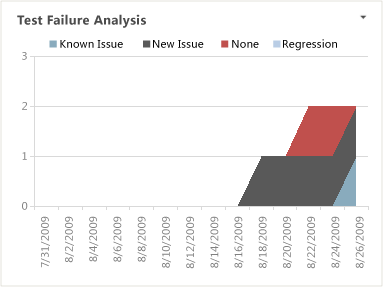

# Failure Analysis Excel report

[!INCLUDE [temp](../includes/tfs-sharepoint-version.md)]

You can use the Failure Analysis report to help monitor how many regressions the test team is finding. Regressions are bugs in the software that you are testing that did not appear in previous versions. A team that performs regression testing is specifically focused on finding bugs that have appeared only in a new version of the software. The Failure Analysis report shows how many distinct configurations for each Test Case previously passed and are now failing, for the most recent four weeks.  
  
 This report is available only when the team creates test plans and starts to run tests by using Microsoft Test Manager. For information about how to define test suites and test plans, see [Plan your tests](../../test/create-test-cases.md). For information about how to access this report, see [Excel reports](excel-reports.md).  
  
> [!NOTE]
>  You can view the Failure Analysis report from the Test dashboard. You can access this dashboard only if your team project portal has been enabled and is configured to use SharePoint Server Enterprise Edition.  
  
## Prerequisites  
  
 To view the report, you must be assigned or belong to a group that has been assigned the **Read** permissions in SharePoint Products for the team project.  
  
 To modify or customize the report, you must be a member of the **TfsWarehouseDataReaders** security role in SQL Server Analysis Services. You must also be assigned or belong to a group that has been assigned the **Members** permissions in SharePoint Products for the team project. For more information, see [Grant Access to the Databases of the Data Warehouse for Team System](../admin/grant-permissions-to-reports.md).  
  

## Data in the report  

 The Failure Analysis report provides a stacked area graph that shows the cumulative count of all failed outcome results for Test Cases for all configurations, during the most recent four weeks. Failure types include **New Issue**, **Known Issue**, or **Regression**.  
  
   
  
 This report is based on a PivotChart report that shows the most recent four weeks of test result data that is stored in the data warehouse.  
  
 The system examines each configuration on which the Test Case was executed and tries to identify the predecessor result for the same configuration for the Test Case. The failure type that is assigned to the Test Case/configuration is determined based on the following criteria:  
  
-   **Regression**: When the immediate predecessor result had an outcome of **Passed**.  
  
-   **New Issue**: When no immediate predecessor result can be found.  
  
-   **Known Issue**: When the immediate predecessor result had an outcome of **Failed**.  
  
### Required activities for monitoring regressions  

For the Failure Analysis report to be useful and accurate, the team must perform the following activities:  
  
-   Define Test Cases and Test Plans, and assign Test Cases to Test Plans.  
  
-   For manual tests, mark the results of each validation step in the Test Case as passed or failed.  
  
    > [!IMPORTANT]
    >  Testers must mark a test step with a status if it is a validation test step. The overall result for a Test Case reflects the status of all the test steps that the tester marked. Therefore, the Test Case will have a status of failed if the tester marked any test step as failed or not marked.  
  
     For automated tests, each Test Case is automatically marked as passed or failed.  
  
-   (Optional) To support filtering, assign **Iteration** and **Area** paths to each Test Case.  
  
 

## Interpret the report 

You should expect the Failure Analysis report to vary depending on where you are in your product development cycle. Early iterations should show little, if any, regression activity. Later in the development cycle, you should expect some regressions. Specifically, you should review the report to find answers to the following questions:  
  
- How many tests overall are regressing?  
  
- Is the team keeping the overall number of regressions or test failures within expected ranges or team goals?  
  
- Is the team addressing issues as they are identified? Are the known issues being addressed in a timely manner?  
  
  A healthy Failure Analysis report will show moderate numbers of new issues, known issues, and regressions. If spikes occur in one or more of these areas, the team might need to investigate further. Spikes may indicate problems in either the test activity or the quality of code that the team is checking in.  
  
  Also, you might want to check the status of recent builds, bug status, and code churn to determine whether the metrics for each of these factors can help explain the changes in the test activity lines.  
  
 

## Update and customize the report  

You can update the Failure Analysis report by opening it in Office Excel and changing the filter options for the PivotTable report. You can customize this report to support other views, the following table describes.  
  
|View|Action|  
|----------|------------|  
|Failure analysis for an iteration|Change the filter for **Iteration** (default=All)|  
|Failure analysis for a product area|Change the filter for **Area** (default=All)|  
|Failure analysis for a specific test plan or suite of test plans|Add the filter for **Test Plan** (default=All)|  
|Failure analysis for the most recent six, eight, or more weeks|In the Columns PivotTable Field List, replace **@@Last 4 weeks@@** with a different **Set**|  
  

## Related articles

- [Excel reports](excel-reports.md)
- [Design the layout and format of a PivotTable](https://support.office.com/article/design-the-layout-and-format-of-a-pivottable-a9600265-95bf-4900-868e-641133c05a80) 
