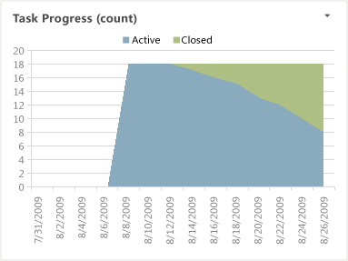

# Task Progress Excel Report

[!INCLUDE [temp](../_shared/tfs-sharepoint-version.md)]

You can use the Task Progress report to track how much work the team has completed and how much remains. This report shows the distribution of active and closed Tasks over time. For information about how to access this report, see [Excel reports](excel-reports.md).  
  
> [!NOTE]
>  You can view the Task Progress report from the Progress dashboard. You can access this dashboard only if your team project portal has been enabled and is provisioned to use Microsoft Office SharePoint Server 2007. For more information, see [Configure or redirect process guidance](../sharepoint-dashboards/configure-or-redirect-process-guidance.md).  
  
 **Required Permissions**  
  
 To view the report, you must be assigned or belong to a group that has been assigned the **Read** permissions in SharePoint Products for the team project.  
  
 To modify or customize the report, you must be a member of the **TfsWarehouseDataReaders** security role in SQL Server Analysis Services. You must also be assigned or belong to a group that has been assigned the **Members** permissions in SharePoint Products for the team project. For more information, see [Grant Access to the Databases of the Data Warehouse for Team System](../admin/grant-permissions-to-reports.md).  
  
##   Data in the Report  
 You can use the Task Progress report to track how much work remains to be completed. This report is based on a PivotChart report that shows the last four weeks of data that is captured for Tasks and that is stored in the data warehouse.  
  
   
  
### Required Activities for Tracking Tasks  
 For the Task Progress report to be useful and accurate, the team must perform the following activities:  
  
-   Define Tasks.  
  
-   Change the **State** of each Task to **Closed** as the team completes it.  
  
-   (optional) Specify the **Iteration** and **Area** paths of each Task if you want to filter by those fields.  
  
##   Interpreting the Report  
 You should expect the Task Progress report to vary based on where you are in your product development cycle. Early iterations should show a gradual increase in the number of active Tasks. Iterations that are near the end of a product cycle should show a wide band of closed Tasks.  
  
 You can review the report to determine the progress over time or during an iteration. Specifically, you can find answers to the following questions:  
  
- Is the team making progress toward closing Tasks?  
  
- Is the team adding work?  
  
  For information about healthy and unhealthy versions of the report, see [Remaining Work](../sql-reports/remaining-work-report.md).  
  
##   Updating and Customizing the Report  
 You can update the Task Progress report by opening the report in Office Excel and changing the filter options for the PivotTable report. You can customize this report to support other views as the following table describes.  
  
|View|Action|  
|----------|------------|  
|Burn down chart for Tasks during an iteration|Change the filter for **Iteration** (default=All)|  
|Burn down chart for Tasks in a product area|Change the filter for **Area** (default=All)|  
|Burn down chart for Tasks over the most recent six, eight, or more weeks|In the Columns PivotTable Field List, replace **@@Last 4 weeks@@** with a different **Set**|  
  
 For more information about how to work with and customize PivotTable and PivotChart reports, see the following pages on the Microsoft Web site:  
  
-   [Ways to customize PivotTable reports](http://go.microsoft.com/fwlink/?LinkId=165722)  
  
-   [Edit or remove a workbook from Excel Services](http://go.microsoft.com/fwlink/?LinkId=165723)  
  
-   [Publish a workbook to Excel Services](http://go.microsoft.com/fwlink/?LinkId=165724)  
  
-   [Save a file to a SharePoint library or another Web location](http://go.microsoft.com/fwlink/?LinkId=165725)  
  
## Related notes
 [Excel reports](excel-reports.md)