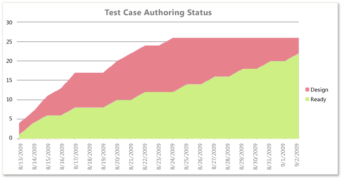
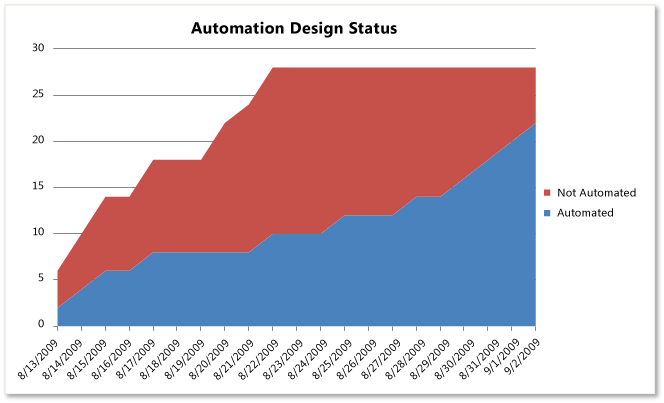
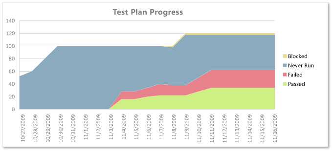
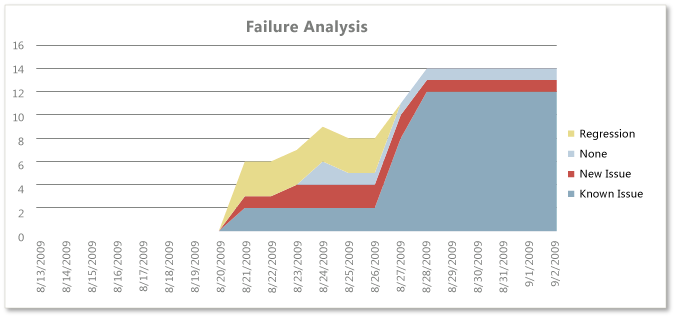

# Test Team Progress Excel Report

[!INCLUDE [temp](../_shared/tfs-sharepoint-version.md)]

Teams who are responsible for testing software can use the Test Team Progress report to help monitor test activities and report on the progress of the team in authoring and automating tests and performing regression testing. The Test Team Progress report provides the following six reports based on data that was collected for test cases that were defined for the team project and test results:  
  
-   **Test Plan Progress**: Helps the team determine how much testing the team has completed and whether it is likely to finish test activities on time.  
  
-   **Test Case Authoring Status**: Helps the team track the status of completing the definition of test cases so that they can be run.  
  
-   **Test Status by Suite**: Helps the team determine how much testing the team has completed within each test suite.  
  
-   **Test Status by Area**: Helps the team determine how much testing the team has completed within each product area.  
  
-   **Failure Analysis**: Helps the team monitor how many regressions they are finding.  
  
-   **Automation Design Status**: Supports the team in tracking the number of test cases that still must be automated.  
  
 This Test Team Progress report is available only when the team creates test plans and starts to run tests by using Microsoft Test Manager. For more information, see [Testing overview](../../test/index.md).  
  
> [!NOTE]
>  You can access the Test Team Progress report from the **Test Team Management** folder that is located under the **Excel Reports** folder for the team project in Team Explorer. You can access this folder only if your team project portal has been enabled and is configured to use SharePoint Products. For more information, see [Share information using the project portal](../sharepoint-dashboards/share-information-using-the-project-portal.md).  
  
 **Required permissions**  
  
 To view the report, you must be assigned or belong to a group that has been assigned the **Read** permissions in SharePoint Products for the team project.  
  
 To modify or customize the report, you must be a member of the **TfsWarehouseDataReaders** security role in SQL Server Analysis Services. You must also be assigned or belong to a group that has been assigned the **Members** permissions in SharePoint Products for the team project. For more information, see [Grant permissions to view or create reports](../admin/grant-permissions-to-reports.md).  
  
##   Data in the reports  
 The Test Team Project report presents data that is based on PivotTable reports that access data stored in the data warehouse. The data is derived from the results that are generated when members of the team define test cases and run tests by using Microsoft Test Manager. For more information, see [Run your tests](../../test/run-manual-tests.md) and [Track your test results](../../test/track-test-status.md).  
  
### Test case authoring and automation design status  
 The team can use the Test Case Authoring Status report to help monitor the progress that they make toward defining and designing test cases. This report shows a burndown chart of how many test cases were in the design and ready states for the most recent six weeks.  
  
   
  
 The team can use the Automation Design Status report to help monitor the progress that they make toward automating test cases. This report shows a burndown chart of how many test cases have moved into an automated state for the most recent six weeks.  
  
   
  
 The following table describes the report filters and fields that are used in the PivotTable reports that generate the Test Case Authoring Status and Automation Design Status reports.  
  
|Filters|Fields|  
|-------------|------------|  
|-   **Team Project - Team Project Hierarchy**: Includes work items that are defined for the selected team project. -   **Work Item - Work Item.Iteration Hierarchy**: Includes work items that are assigned to the selected iteration paths. -   **Work Item - Work Item.Area Hierarchy**: Includes work items that are assigned to the selected product areas. -   **Work Item - Work Item.Work Item Type**: Includes only the selected work items. For these reports, test case is selected.|-   **(Measure) Work Item- Work Item Count**: The count of work items. The report uses this field to count all work items in the specified states. -   **Date - Sets - Last 6 weeks**: The time span of activity to report.   **Field specific to the Test Case Authoring Status report**:   -   **Work Item- State**: The state of the test case. The report uses this field to define the column labels and to filter the test cases to include **Design** and **Ready**.   **Field specific to the Automation Design Status report**:   -   **Work Item- Microsoft.VSTS.TCM - Is Automated**: The automation status of a test case. The report uses this field to define the column labels as **Automated** and **Not Automated**.|  
  
### Test Plan Progress  
 The Test Plan Progress report provides a stacked area graph of the test results from all test cases. The report groups the test results into their most recently recorded outcome and plots the data for the most recent four weeks. Outcomes include **Never Run**, **Blocked**, **Failed**, or **Passed**.  
  
   
  
 The team can review this report to determine the progress in a sprint or iteration or over time. For example, the team can answer these questions:  
  
-   How much testing has the team completed?  
  
-   Is the team likely to finish the testing on time?  
  
-   How many tests are left to be run?  
  
-   How many tests are passing?  
  
-   How many tests are failing?  
  
-   How many tests are blocked?  
  
### Test results by test suite or product area  
 The Test Status by Suite and Test Status by Area reports list the count of all test results that were collected for all test cases that were based on recorded outcomes. The reports group the test results either by test suite or product area. The outcomes for test results include **Never Run**, **Blocked**, **Failed**, or **Passed**.  
  
 The team can use these reports to investigate test suites or product areas whose test results have high failure counts or test cases that have never run.  
  
### Regression testing  
 The test team can use the Failure Analysis report to help monitor how many regressions the test team finds. Regressions are bugs in the software that you test that did not appear in previous versions. A team that performs regression testing is specifically focused on finding bugs that have appeared only in a new version of the software.  
  
 The Failure Analysis report provides a stacked area graph that shows the cumulative count of all failed outcome test results. The report groups the results by failure type for all test cases and test configurations and plots the results for the most recent six weeks. Failure types include **Regression**, **None**, **New Issue**, and **Known Issue**.  
  
   
  
 The system examines each test configuration for which the test case was executed and tries to identify the predecessor result for the same configuration for the test case. The failure type that is assigned to the test case/configuration is determined based on the following criteria:  
  
-   **Regression**: When the immediate predecessor result had an outcome of **Passed**.  
  
-   **None**: When the immediate predecessor result had an outcome that was not **Passed** or **Failed**.  
  
-   **New Issue**: When no immediate predecessor result can be found.  
  
-   **Known Issue**: When the immediate predecessor result had an outcome of **Failed**.  
  
 The team can review the report to find answers to the following questions:  
  
-   How many tests overall are regressing?  
  
-   Is the team keeping the overall number of regressions or test failures within expected ranges or team goals?  
  
-   Is the team addressing issues as they are identified? Are the known issues addressed in a timely manner?  
  
 A healthy Failure Analysis report will show moderate numbers of new issues, known issues, and regressions. If spikes occur in one or more of these areas, the team might want to investigate this issue more. Spikes may indicate problems in either the test activity or the quality of code that the team checks in. Also, the team might want to check the status of recent builds, bug status, and code churn to determine whether the metrics for each of these factors can help explain the changes in the test activity lines.  
  
### Report filters and fields  
 The following table describes the report filters and fields that are used in the PivotTables that generate the Test Plan Progress, Test Status by Suite or Area, and the Failure Analysis reports.  
  
|Filters|Fields|  
|-------------|------------|  
|-   **Team Project - Team Project Hierarchy**: Includes test results that were collected for the selected team project. -   **Test Result - Iteration Hierarchy**: Includes test results that were run from test cases that are assigned to the selected iterations. -   **Test Plan - Test Plan Name**: Includes test results that were run from test cases that belong to the selected test plans.   **Filters specific to the Test Plan Progress report**:   -   **Test Result - Area Hierarchy**: Includes test results that were run from test cases that are assigned to the selected product areas. -   **Test Suite - Test Suite Hierarchy**: Includes test results that were run from test cases that belong to the selected test suites.   **Filter specific to the Test Status by Suite report**:   -   **Test Result - Area Hierarchy**: Includes test results that were run from test cases that are assigned to the selected product areas.   **Filters specific to the Failure Analysis report**:   -   **Test Result - Area Hierarchy**: Includes test results that were run from test cases that are assigned to the selected product areas. -   **Test Suite - Test Suite Hierarchy**: Includes test results that were run from test cases that belong to the selected test suites. -   **Test Result- Outcome**: Includes test results that have the selected outcome. The report uses this field to filter the count of test results to include only those that have an outcome of **Failed**.|-   **Test Result- Outcome**: The outcome of the test. The report uses this field to define the column labels and to filter the test results to include Passed, Failed, Blocked, or Never Run. -   **(Measure) Test - Point Count Trend**: Counts the latest version of each test result in a particular build. If a test is run multiple times against a build, the Point Count Trend counts the latest result for that test that uses that build. If a test case is not included in the build, then it is counted as "Never Run."   **Field specific to the Test Plan Progress report**:   -   **Date - Sets - Last 6 weeks**: The time span of activity to report.   **Field specific to the Test Status by Suite report**:   -   **Test Suite - Test Suite Hierarchy**: The test suites to list in the report.   **Field specific to the Test Status by Area report**:   -   **Test Result - Area Hierarchy**: The set of test results to include in the report that is based on the area paths that are assigned to the test cases that were run.   **Fields specific to the Failure Analysis report**:   -   **Test Result- Failure Type**: The report uses this field to build the columns in the report. -   **Date - Sets - Last 6 weeks**: The time span of activity to report.|  
  
##   Required activities for monitoring test team progress  
 For the Test Team Progress reports to be useful and accurate, the team must perform the following activities:  
  
-   [Define test cases and test plans](../../test/create-test-cases.md), and assign test cases to the test plans.  
  
-   [Run tests](../../test/run-manual-tests.md).  
  
-   For manual tests, mark the results of each validation step in the test case as passed or failed.  
  
    > [!IMPORTANT]
    >  Testers must mark a test step with a status if it is a validation test step. The overall result for a test case reflects the status of all the test steps that the tester marked. Therefore, the test case will have a status of failed if the tester marked any test step as failed or not marked.  
  
     For automated tests, each test case is automatically marked as passed or failed.  
  
-   (Optional) To filter the reports by product area and iteration, specify the **Area** and **Iteration** paths of each test case.  
  
 For the Testing Gaps reports to be useful and accurate, the team must perform the activities that are described in the following table:  
  
|Worksheet report|Required activities|  
|----------------------|-------------------------|  
|-   Test Case Authoring Status -   Automation Design Status|-   Define test cases, and update their **State** from **Design** to **Ready**.|  
|-   Automation Design Status|-   [Automate test cases](https://msdn.microsoft.com/en-us/library/dd380741.aspx).|  
|-   Test Plan Progress -   Test Status by Suite -   Test Status by Area -   Failure Analysis|-   Define test plans and test suites, and assign test cases to test plans and test suites. -   [Run tests](../../test/run-manual-tests.md), and, for manual tests, mark the results of each validation step in the test case as passed or failed.|  
|-   Test Case Authoring Status -   Automation Design Status -   Test Plan Progress -   Test Status by Suite -   Test Status by Area -   Failure Analysis|-   (Optional) To support filtering, assign **Iteration** and **Area** paths to each test case. The **Test Result - Iteration Hierarchy** and **Test Result - Area Hierarchy** fields get their values from the **Iteration** and **Area** paths that are assigned to their corresponding test cases.|  
  
##   Updating and Customizing the Reports  
 You can update the Test Team Progress report by opening it in Office Excel and changing the filter options for the Pivot-Table report for one of the worksheets. You can customize each report to support other views, as the following table describes.  
  
|View|Action|  
|----------|------------|  
|-   Authoring and automation status for an iteration -   Test plan progress and test results for an iteration -   Regression testing for an iteration|Change the filter for **Iteration** (default=All)|  
|-   Authoring and automation status for a product area -   Test plan progress and test results for a product area -   Regression testing for a product area|Change the filter for **Area** (default=All)|  
|-   Test plan progress and test results for selected test plans -   Regression testing for selected test plans -   Failure analysis for selected test plans|Change the filter for **Test Plan** (default=All)|  
|-   Authoring and automation status for the most recent eight, ten, or more weeks -   Test plan progress for the most recent eight, ten, or more weeks -   Regression testing for an iteration Failure Analysis for the most recent eight, ten, or more weeks|In the Columns PivotTable Field List, replace **@@Last 6 weeks@@** with a different **Set**|  
  
 For more information about how to work with and customize PivotTable and PivotChart reports, see the following pages on the Microsoft Web site:  
  
-   [Ways to customize PivotTable reports](http://go.microsoft.com/fwlink/?LinkId=165722)  
  
-   [Edit or remove a workbook from Excel Services](http://go.microsoft.com/fwlink/?LinkId=165723)  
  
-   [Publish a workbook to Excel Services](http://go.microsoft.com/fwlink/?LinkId=165724)  
  
-   [Save a file to a SharePoint library or another Web location](http://go.microsoft.com/fwlink/?LinkId=165725)  
  
## Related notes
 [Excel reports](excel-reports.md)
