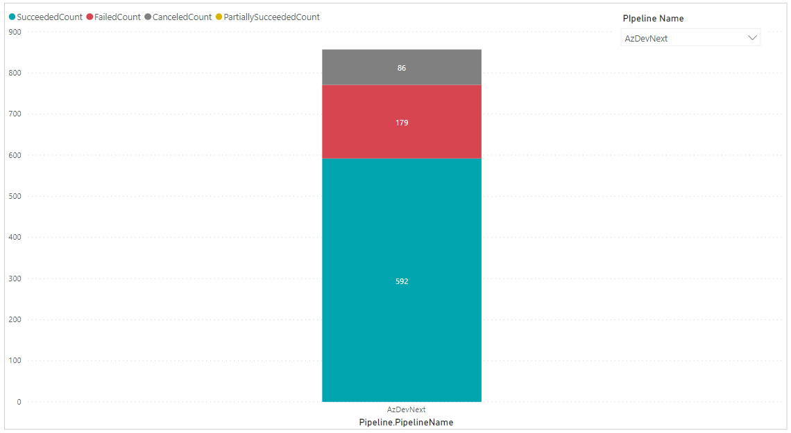
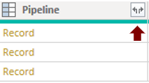
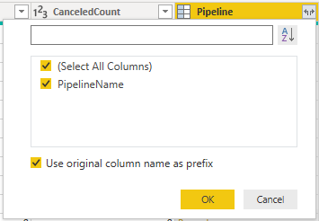
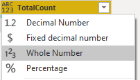
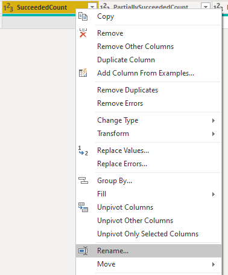
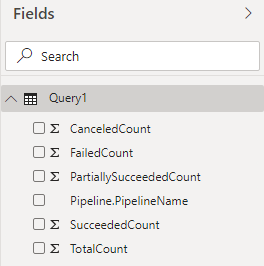

# Pipeline outcome summary for all pipelines sample report 

[!INCLUDE [temp](../includes/version-azure-devops-cloud.md)]

You may want to see pipeline metrics such as pass rate, number of failures, duration etc. for all the pipelines together, in a single report. This article shows you how to get pipeline outcome summary, for all the pipelines in a project. A similar approach can be taken to get other metrics like pipeline duration and number of failures for all pipelines of the project in a single report.

[!INCLUDE [temp](includes/preview-note.md)]

An example is shown in the following image.

> [!div class="mx-imgBorder"] 
> 

As shown in the above image, you can select any pipeline from the "Pipeline Name" drop down at top right and the report will show the outcome summary for the selected pipeline only

> [!div class="mx-imgBorder"] 
> 

[!INCLUDE [temp](includes/sample-required-reading.md)]


## Sample queries

#### [Power BI query](#tab/powerbi/)

[!INCLUDE [temp](includes/sample-powerbi-query.md)]

```
let
   Source = OData.Feed ("https://analytics.dev.azure.com/{organization}/{project}/_odata/v3.0-preview/PipelineRuns?"
               &"$apply=filter( "
	       &"CompletedDate ge {startdate} "
                &"/groupby( "
        &"(Pipeline/PipelineName), "
        &"aggregate( "
            &"$count as TotalCount, "
                &"SucceededCount with sum as SucceededCount, "
                &"FailedCount with sum as FailedCount, "
            &"PartiallySucceededCount with sum as PartiallySucceededCount, "
                &"CanceledCount with sum as CanceledCount "
            &")) "
    ,null, [Implementation="2.0",OmitValues = ODataOmitValues.Nulls,ODataVersion = 4]) 
in
    Source
```

#### [OData query](#tab/odata/)

[!INCLUDE [temp](includes/sample-odata-query.md)]

```
https://analytics.dev.azure.com/{organization}/{project}/_odata/v3.0-preview/PipelineRuns?%20
$apply=filter(
	CompletedDate ge {startdate}
/groupby(
(Pipeline/PipelineName), 
aggregate(
	$count as TotalCount,
	SucceededCount with sum as SucceededCount,
	FailedCount with sum as FailedCount,
	PartiallySucceededCount with sum as PartiallySucceededCount,
	CanceledCount with sum as CanceledCount
))

```

***

### Substitution strings

Each query contains the following strings that you must substitute with your values. Don't include brackets {} with your substitution. For example if your organization name is "Fabrikam", replace {organization} with **Fabrikam**, not {Fabrikam}.
 
- {organization} - Your organization name
- {project} - Your team project name
- {startdate} - The date to start your report. Format: YYYY-MM-DDZ. Example: **2019-09-04Z** represents September 4, 2019. Don't enclose in quotes or brackets and use two digits for both, month and date.

### Query breakdown

The following table describes each part of the query.

<table width="90%">
<tbody valign="top">
<tr><td width="25%"><b>Query part</b></td><td><b>Description</b></td><tr>
<tr><td><code>$apply=filter(</code></td>
<td>Start filter()</td>
<tr>
<tr>
<td><code>CompletedDate ge {startdate}</code></td>
<td>Return pipeline runs for date greater than specified date</td>
<tr>
<tr><td><code>)</code></td>
<td>Close filter()</td>
<tr>
<tr><td><code>/groupby(</code></td>
<td>Start groupby()</td>
<tr>
<tr><td><code>(Pipeline/PipelineName),</code></td>
<td>Group the below result by Pipeline Name</td>
<tr>
<tr><td><code>aggregate(</code></td>
<td>Start aggregate. For each Pipeline:</td>
<tr>
<tr><td><code>$count as TotalCount,</code></td>
<td>Count the total number of runs as TotalCount</td>
<tr>
<tr><td><code>SucceededCount with sum as SucceededCount ,</code></td>
<td>Count the number of successful runs as SucceededCount</td>
<tr>
<tr><td><code>FailedCount with sum as FailedCount,</code></td>
<td>Count the number of failed runs as FailedCount</td>
<tr>
<tr><td><code>PartiallySucceededCount with sum as PartiallySucceededCount,</code></td>
<td>Count the number of partially successful runs as PartiallySucceededCount</td>
<tr>
<tr><td><code>CanceledCount with sum as CanceledCount</code></td>
<td>Count the number of canceled runs as CanceledCount</td>
<tr>
<tr><td><code>))</code></td>
<td>Close aggregate() and groupby()</td>
<tr>
</tbody>
</table>


## Power BI transforms

### Expand Pipeline column

The query returns some columns that you need to expand and flatten into its fields before you can use them in Power BI. Here in this example, such an entity is Pipeline.

After closing the Advanced Editor and while remaining in the Power Query Editor, select the expand button on **Pipeline**.

1. Choose the expand button

    > [!div class="mx-imgBorder"] 
    > 
    
1. Select the checkbox "(Select All Columns)" to expand

    > [!div class="mx-imgBorder"] 
    > 

1. The table now contains the expanded entity **Pipeline.PipelineName**

    > [!div class="mx-imgBorder"] 
    > 
    

### Change column type

1. Change the type of column TotalCount to **Whole Number**.

    > [!div class="mx-imgBorder"] 
    > 

### Rename fields and query, then Close & Apply

When finished, you may choose to rename columns. 

1. Right-click a column header and select **Rename...**

	> [!div class="mx-imgBorder"] 
	> 

1. You also may want to rename the query from the default **Query1**, to something more meaningful. 

	> [!div class="mx-imgBorder"] 
	> 

1. Once done, choose **Close & Apply** to save the query and return to Power BI.

	> [!div class="mx-imgBorder"] 
	> 
  
  
## Create the report

Power BI shows you the fields you can report on. 

> [!NOTE]   
> The example below assumes that no one renamed any columns. 

> [!div class="mx-imgBorder"] 
> 

For a simple report, do the following steps:

1. Select Power BI Visualization **Stacked Column Chart**. 
1. Add the field "SucceededCount" to **Values**.
    - Right-click "SucceededCount" field and ensure **Sum** is selected.
1. Add the field "FailedCount" to **Values**.
	  - Right-click "FailedCount" field and ensure **Sum** is selected.
1. Add the field "CanceledCount" to **Values**.
	  - Right-click "CanceledCount" field and ensure **Sum** is selected.
1. Add the field "PartiallySucceededCount " to **Values**.
    - Right-click "PartiallySucceededCount " field and ensure **Sum** is selected.
1. Add the field "Pipeline.PipelineName" to **Axis**. 
1. Click somewhere outside the stacked column chart and select Power BI Visualization **Slider** to add a slicer.
1. Add the field "Pipeline.PipelineName" to **Field**.
1. Select the down-arrow of slicer to select the option Dropdown instead of List.

    
Your report should look like this. 

> [!div class="mx-imgBorder"] 
> 


## Full list of Pipelines sample reports 

[!INCLUDE [temp](includes/sample-full-list-pipelines.md)]

## Related articles

[!INCLUDE [temp](includes/sample-related-articles-pipelines.md)]
