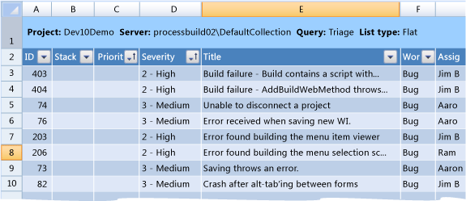

# Workbooks 

**TFS 2017 | TFS 2015 | TFS 2013**  

>[!IMPORTANT]  
>Excel workbooks, Excel reports, and SharePoint dashboards are only supported for on-premises TFS. For information on what is supported for VSTS, see [Dashboards, charts, & widgets](/vsts/report/overview).
> 
> TFS 2018 and later versions no longer support native integration with SharePoint products. If you're planning to upgrade to TFS 2018, read [About SharePoint integration](/vsts/report/sharepoint-dashboards/about-sharepoint-integration) to learn about the options available to you. 
  
You can open a workbook from the Documents page in Team Explorer. Or, you can open a query and use the [triage mode to update work items](../../work/track/triage-work-items.md). 
  
**Requirements**  
  
-   Your team project must be provisioned with SharePoint Products and the project portal enabled. For more information, see [Configure or redirect process guidance](../sharepoint-dashboards/configure-or-redirect-process-guidance.md).  
  
-   To open a workbook in Office Excel, you must have the Team Foundation Office Integration add-in installed on your client computer. This add-in is installed when you install any product in Visual Studio ALM.  
  
-   To view a shared query, you must be assigned or belong to a group that has been assigned **Read** permissions for the shared query folder for the team project. To modify a query, you must be assigned or belong to a group that has been assigned **Contribute** or **Full Control** permissions for the shared query. See [Set permissions on queries](../../work/track/set-query-permissions.md).  
  
-   To create or modify work items, you must be a member of the **Contributors** group or your **View work items in this node** and **Edit work items in this node** permissions must be set to **Allow**. See [Add users to team projects](../../organizations/security/add-users-team-project.md).  
  
> [!NOTE]
>  When you open the workbook, choose **Edit Workbook** next to **Server Workbook** so that you can modify the workbook. If the workbook is not available to you, open the Triage shared query by using Team Explorer or Microsoft Excel.  
  
## Bugs listed in the Triage (Agile) workbook  
 You can use the Triage workbook to review and update the priority and status of bugs. Triage is the process that a team uses to review newly reported or reopened bugs, assign a priority and iteration to them, and assign a team member to fix them. Triage is typically driven by the product owner or the scrum master, with input from the team.  
  
 For Agile team projects, the Triage worksheet references the Triage shared query, which is configured to find all active bugs for the team project.  
  
   
  
 For CMMI team projects, the Triage worksheet references the Untriaged Work Items shared query, which is configured to find all requirements, change requests, tasks, bugs, and issues whose **Triage** field is not set to **Triaged** for the team project.  
  
## Issues workbook  
 You can use the Issues workbook to review and rank problems that might block team progress. The Issues worksheet references the Issues shared query, which is configured to find all issues that are defined for the team project.  
  
   
  
## Q & A  
  
### Q: How can I create my own workbooks?  
 **A:** Yes. You can define your own queries and then open them in Excel. For details, see [Bulk add or modify work items with Excel](../../work/backlogs/office/bulk-add-modify-work-items-excel.md).