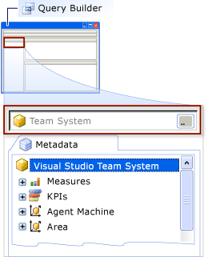
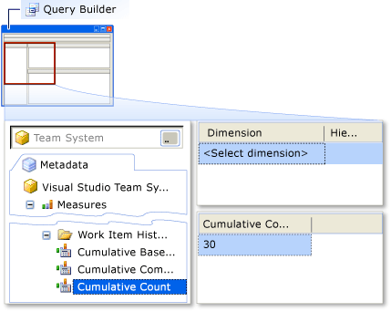
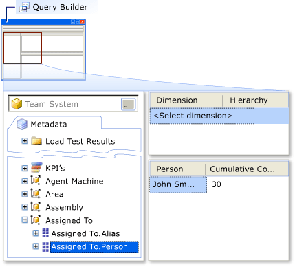

# Create an aggregate report using Report Designer and the Analysis Services Cube

[!INCLUDE [temp](../_shared/tfs-report-platform-version.md)]

You can track your team's progress more easily by creating reports that aggregate data from Visual Studio Application Lifecycle Management (ALM) (TFS) into charts and tables. For example, you can create a report that shows how many active work items are assigned to each person on the team. To create this type of report, you use Report Designer in SQL Server and the SQL Server Analysis Services cube for TFS.  
  
 After you create your first report, you might change it by experimenting with different measures, dimensions, and layouts. For example, you can change the chart from a simple column chart to a stacked-bar chart.  
  
 If you have not created reports for TFS before, see [Dashboards and reports](../admin/review-team-activities-for-useful-reports.md). If you have not used Report Designer before, see the following page on the Microsoft Web site: [Designing and Implementing Reports Using Report Designer](http://go.microsoft.com/fwlink/?LinkId=181954). For information about how to create reports that include line-item details (such as titles of work items), see [Create a Detailed Report using Report Designer](create-a-detailed-report-using-report-designer.md).  
  
 **Requirements**  
  
-   You must have Visual Studio and SQL Server Business Intelligence Development Studio installed on the same computer.  
  
     To install Business Intelligence Development Studio, run the Setup program for SQL Server, and select the **Client Components** check box when you specify the components to install. To install the most recent service pack for SQL Server, see the following page on the Microsoft Web site: [How to obtain the latest service pack for SQL Server 2008](http://go.microsoft.com/fwlink/?LinkID=182174).  
  
-   You must be a member of the **TfsWarehouseDataReaders** security role in the Analysis Services database on the data-tier server of Team Foundation Server. For more information, see [How to: Grant Access to the Databases of the Data Warehouse](../admin/grant-permissions-to-reports.md).  
  
-   You must be a member of  the **Team Foundation Content Manager** role in SQL Server Reporting Services. For more information, see [Add accounts to administer TFS](../../tfs-server/add-administrator-tfs.md).  
  
### To create a report  
  
1.  In Visual Studio, create or open a Report Server project. For more information, see [Create a Report Server Project](create-a-report-server-project.md).  
  
2.  On the **Project** menu, choose **Add New Item**.  
  
     The **Add New Item** dialog box appears.  
  
3.  Choose **Report Wizard**, and then choose **Add**.  
  
     The **Report Wizard** opens to the **Select Data Source** page.  
  
4.  Choose the **Tfs2010OlapReportDS** shared data source, and then choose **Next**.  
  
     Even though you might have installed or upgraded to TFS 2013, these names, which were assigned to the data sources for TFS 2010 are in use.  
  
     The wizard advances to the **Design the Query** page.  
  
    > [!NOTE]
    >  The data source that you specified connects to the analysis services database for TFS. For more information, see [Choose the source of data and authoring tool](https://msdn.microsoft.com/library/bb649557.aspx). If your project does not have this data source, create it. For more information, see [Create a Report Server Project](create-a-report-server-project.md).  
  
5.  Choose **Query Builder**.  
  
     The **Query Build** dialog box appears.  
  
### To create the query that will retrieve the data for the report  
  
1.  Choose the **Team System** cube, as the following illustration shows.  
  
       
  
    > [!NOTE]
    >  If your data warehouse is using SQL Server Enterprise Edition, the list of cubes will include Team System and a set of perspectives. The perspectives provide a focused view of the data so that you do not have to scroll through the dimensions and measures in the whole Team System cube. For this procedure, you can use the Work Item History perspective if it is available. For more information, see [Perspectives and measure groups provided in the Analysis Services cube](https://msdn.microsoft.com/en-us/library/ms244710.aspx).  
  
2.  Expand **Measures**, expand the **Work Item History** measure group, and then drag the **Cumulative Count** measure into the data area, as the following illustration shows.  
  
       
  
    > [!NOTE]
    >  Cumulative Count shows how many work items are selected. Because you have not yet applied any filters, the number that appears is the total number of work items. For more information about work item measures, see [Perspectives and measure groups provided in the Analysis Services cube](https://msdn.microsoft.com/en-us/library/ms244710.aspx).  
  
3.  Expand the **Assigned To** dimension, and then drag the **Person** property into the data area, as the following illustration shows.  
  
       
  
     The query now returns the number of work items that are assigned to each person.  
  
    > [!NOTE]
    >  The **Assigned To** field generally contains Windows accounts. For each Windows account, the **Person** property contains the display name of that account, and the **Alias** property contains the alias.  
  
4.  Expand the **Work Item** dimension, drag the **State** property into the data area, and then click **OK**.  
  
     The **Query Builder** is closed, and the **Design the Query** page of the **Report Wizard** reappears.  
  
### To design the initial report layout  
  
1.  Choose **Next**.  
  
     The wizard advances to the **Report Type** page.  
  
2.  Choose **Matrix**, and then choose **Next**.  
  
     The wizard advances to the **Design the Matrix** page.  
  
3.  Choose **Cumulative_Count**, and then choose **Details**.  
  
4.  Choose **State**, and then choose **Columns**.  
  
5.  Choose **Person**, choose **Rows**, and then click **Next**.  
  
     The wizard advances to the **Choose the Matrix Style** page.  
  
6.  Choose any style, and then choose **Next**.  
  
     The wizard advances to the **Completing the Report** page.  
  
7.  Type a name for the report, choose **Preview Report**, and then choose **Finish** to create the report.  
  
     The wizard closes, and the report document window appears with the **Preview** tab active.  
  
### To replace the table with a chart  
  
1.  In the report document window, choose the **Layout** tab.  
  
    > [!NOTE]
    >  Report Designer uses three tabs, as the following table describes briefly.  
  
    |Tab|Description|  
    |---------|-----------------|  
    |Data|Define the data sets that your report uses.|  
    |Layout|Design and arrange the visual elements of your report.|  
    |Preview|Run your report to see how it looks.|  
  
2.  Highlight the table, and then press **Delete**.  
  
    > [!NOTE]
    >  To highlight the whole table, choose anywhere in the table, and then choose the upper-left corner of the table.  
  
3.  From the **Toolbox** pane, drag a **Chart** element to the report's layout area, and then size the chart to meet your needs.  
  
    > [!NOTE]
    >  By default, the **Toolbox** and **Datasets** panes are tabs on the left of the Visual Studio surface.  
  
4.  Right-click the chart, and then choose **Properties**.  
  
     The **Chart Properties** dialog box appears.  
  
5.  Choose the **Data** tab, and then click the **TfsOlapReportDS** dataset name.  
  
6.  Under **Values**, choose the **Add** button.  
  
     The **Edit Chart Value** dialog box appears.  
  
7.  On the **Value** tab, in the **Value** list, choose**=Sum(Fields!Cumulative_Count.Value)**, and then choose **OK**.  
  
8.  Under **Category groups**, choose the **Add** button.  
  
     The **Grouping and Sorting Properties** dialog box appears.  
  
    > [!NOTE]
    >  The category groups appear on the x-axis of the chart.  
  
9. In the first row of the **Expression** table, choose**=Fields!Person.Value**, and then choose **OK**.  
  
10. Under **Series groups**, choose the **Add** button.  
  
     The **Grouping and Sorting Properties** dialog box appears.  
  
11. In the first row of the **Expression** table, choose**=Fields!State.Value**, choose **OK**, and then choose **OK**.  
  
12. Choose the **Preview** tab to display a chart that shows how many work items are assigned to each team member, organized by the work item state.  
  
### To deploy the report  
  
1.  In **Solution Explorer**, choose the report.  
  
2.  On the **Build** menu, click **Deploy** *ReportName*.  
  
    > [!IMPORTANT]
    >  To successfully deploy the report, your project settings must be set to appropriate values. For more information, see [Create a Report Server Project](create-a-report-server-project.md).  
  
## Related notes 
 [Perspectives and measure groups provided in the Analysis Services cube](https://msdn.microsoft.com/en-us/library/ms244710.aspx)