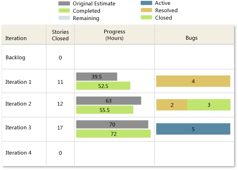
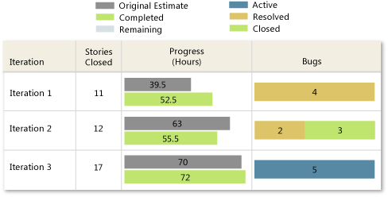
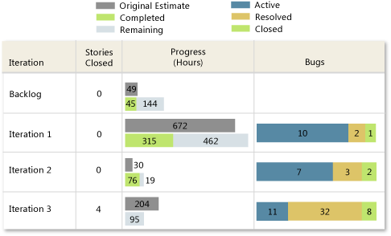

# Status on All Iterations Report
[!INCLUDE [temp](../_shared/tfs-report-platform-version.md)]

After work has progressed on several iterations, also known as sprints, you can view the team progress by viewing the Status on All Iterations report. This report helps you track the team's performance over successive iterations.  
  
 For information about how to access, refresh, or manage reports, see [Reporting Services Reports](reporting-services-reports.md).  
  
> [!NOTE]
>  This report requires that the team project collection that contains your team project was provisioned with SQL Server Reporting Services. This report is not available if  **Reports** does not appear when you open Team Explorer and expand your team project node.  
  

**You can use this report to answer the following questions**:   -   Is steady progress being made across all iterations? -   How many stories did the team complete for each iteration? -   How many hours did the team work for each iteration? -   For each iteration, how many bugs did the team find, resolve, or close?
  
 **Requirements**  
  
 To view this report, you must be assigned or belong to a group that has been assigned the **Browser** role in Reporting Services. For more information, see [Add users to team projects](../admin/grant-permissions-to-reports.md).  
  
##   Data in the report  
 The Status on All Iterations report presents a snapshot of work that the team accomplished across several iterations, as the following illustration shows. The data is derived from the data warehouse.  
  
   
  
 For each iteration that is defined for the product areas that you specify, this report displays the following information:  
  
-   **Stories Closed**: The number of user stories that have been closed. These values are derived from the current values specified for the iteration and the state of each user story.  
  
-   **Progress (Hours)**: A two-bar numeric and visual representation that represents the values for **Original Estimate** (grey), **Completed** (green) and **Remaining** (light blue) based on the rollup of hours that are defined for all tasks. These values are derived from the current values that are specified for the iteration and the hours for each task.  
  
-   **Bugs**: A numeric value and visual representation for all bugs, grouped by their current states of **Active** (blue), **Resolved** (gold) and **Closed** (green). These values are derived from the current values that are specified for the iteration and the state of each bug.  
  
 In addition, you can choose an iteration to access the Burndown and Burn Rate report for that iteration. For more information, see [Burndown and Burn Rate](burndown-and-burn-rate-report.md).  
  
### Required activities for tracking work items  
 For the Status on All Iterations report to be useful and accurate, the team must perform the following activities for tracking work items:  
  
-   Define user stories, tasks, and bugs, and specify the **Iteration** and **Area** paths for each.  
  
    > [!NOTE]
    >  For information about how to define iteration and area paths, see [Define area paths](../../work/customize/set-area-paths.md) or [Define iteration paths](../../work/customize/set-iteration-paths-sprints.md) .  
  
-   Specify the **Original Estimate**, **Completed**, and **Remaining** fields for each task or subtask, and update the **Completed** and **Remaining** fields during the iteration.  
  
    > [!IMPORTANT]
    >  If you subdivide a task into subtasks, specify hours only for the subtasks. These hours are rolled up as summary values for the parent task and the user story. For more information, see [Address inaccuracies published for summary values](address-inaccuracies-published-for-summary-values.md).  
  
-   Update the **State** of each story, task, and bug as it progresses from active to closed.  
  
##   Interpret the report  
 The Status on All Iterations report shows work progress across iterations that are defined for the product areas that you specify. For information about how to filter the report, see [Filtering the Report](#Changing) later in this topic.  
  
### Questions answered by the report  
 You can review the report to determine how many stories are ready to release and to better understand the rate of the team's progress. For example, you can find answers to the following questions:  
  
-   Did the scope of work for each iteration closely match the team capacity?  
  
-   Does the number of stories closed in each iteration correspond to your expectations?  
  
-   Is the team resolving and closing more bugs with successive iterations?  
  
-   How many stories can the team ship today?  
  
### Healthy version of report  
 A healthy Status on All Iterations report shows more progress with each successive iteration, as the following illustration shows.  
  
   
  
### Unhealthy version of report  
 An unhealthy Status on All Iterations report might show one or more of the following indicators:  
  
-   **No stories were closed in one or more iterations**.  
  
     You might want to review the story size and determine whether the team can define smaller stories.  
  
-   **The number of estimated and completed hours vary widely within or across iterations**.  
  
     You might want to review how well you are sizing your stories and how well the team is estimating work. When the estimated and completed hours match closely within an iteration, it indicates that the team is well positioned to progress at a known rate.  
  
-   **Inconsistent progress made across past iterations**.  
  
     You might want to determine whether any blocking issues have not been identified or tracked.  
  
-   **Number of bugs being found is not increasing with each successive iteration**.  
  
   
Unhealthy Version of a Status on All Iterations Report  
  
##   Filter the report  
 You can filter the Status on All Iterations report to show progress only for product areas that you specify.  
  
-   In the **Area** list, select the check box of each product area to include, and then choose **View Report**.  
  
## Related notes
 [Reporting Services Reports](reporting-services-reports.md)