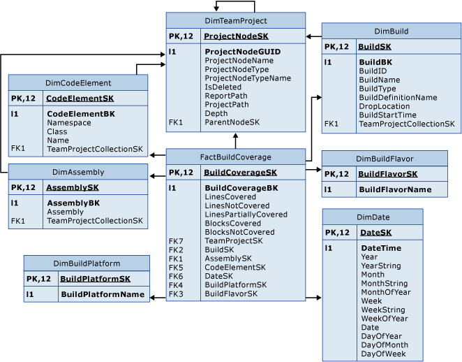

# Build Coverage tables

[!INCLUDE [temp](../includes/tfs-report-platform-version.md)]

You can query for data about how thoroughly source code was covered by the tests that use specific builds by using FactBuildCoverage and the associated dimension tables.   

> [!IMPORTANT]  
> Build tables are only applicable for XAML builds, which are deprecated for TFS 2018 and later versions. If your build process isn't based on XAML builds, these tables and the TFS Warehouse for builds won't yield any meaningful data.  

For information about the measures and dimensions that are associated with these tables in the SQL Server Analysis Services cube, see [Builds](perspective-build-analyze-report-build-details-coverage.md).  
  
   
  
 FactBuildCoverage is associated with the following dimension tables:  
  
-   DimAssembly   
-   DimBuild    
-   DimBuildFlavor    
-   DimBuildPlatform    
-   DimCodeElement    
-   DimDate  
-   DimTeamProject  
  
## Related notes
-  [Builds](perspective-build-analyze-report-build-details-coverage.md)   
-  [Code Churn](../excel/code-coverage-excel-report.md)   
-  [Run Coverage tables](run-coverage-tables.md)    
-  [Table reference for the relational warehouse database](table-reference-relational-warehouse-database.md) 
- [Continuous integration on any platform](../../pipelines/overview.md) 
