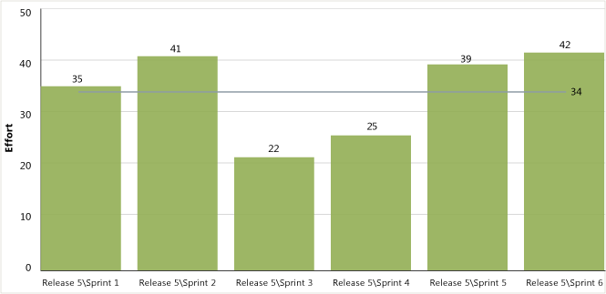

# Velocity
[!INCLUDE [temp](../includes/tfs-report-platform-version.md)]

If your team has completed multiple sprints, you can forecast release and product completion dates and plan future projects more accurately by reviewing the velocity report. Based on the velocity of previous sprints that the report illustrates, you can accomplish the following goals:  
  
- Track how much effort your team has reported as complete for each sprint.  
  
- Estimate how much backlog effort your team can handle in future sprints if your team composition and sprint duration stay constant.  
  
  You can access similar information from the [velocity chart](../guidance/team-velocity.md) provided in the web portal.  
  
> [!NOTE]
>  This report requires that the team project collection that contains your team project was provisioned with SQL Server Reporting Services. This report is not available if  **Reports** does not appear when you open Team Explorer and expand your team project node.  
  
 **Required permissions**  
  
 To view the report, you must be assigned or belong to a group that has been assigned the **Browser** role in SQL Server Reporting Services. For more information, see [Grant permissions to view or create reports in TFS](../admin/grant-permissions-to-reports.md).  
  
##   Data in the report  
 As the following illustration shows, a velocity graph shows the amount of effort that your team has reported as complete for each sprint. The source of the raw data is your product backlog. Each sprint that has been assigned to the team project or to the team appears along the horizontal axis. The vertical axis indicates the sum of all effort for all backlog items assigned to the indicated sprint that have been closed (State=Done).  The vertical axis shows effort in whatever unit your team uses (for example, story points, size, or hours).  
  
 The graph also displays a horizontal line that represents the average velocity across all the sprints.  
  
   
  
 You can filter the report by selecting the **Iteration** or **Area**.  
  
### Required activities for tracking velocity  
 For the velocity graph to be useful and accurate, your team must perform the following activities for tracking work items:  
  
-   [Define sprints](../../boards/sprints/define-sprints.md) for your team.  
  
-   Define product backlog items and bugs, and assign them to an **Iteration** and to your team's **Area** path.  
  
-   Specify and update the **Effort** for each product backlog item and each bug that is active.  
  
-   Update the **State** of each product backlog item and each bug as it progresses from **New** to **Done**.  
 
 
 
##  Interpreting the report  
 You can review the report to determine how much progress your team has made and to answer the following questions:  
  
-   How much effort has your team completed in each sprint?  
  
-   What is the maximum velocity of your team?  
  
-   What is the minimum velocity of your team?  
  
-   What is the average velocity of your team?  
  
## Related notes
 [Scrum process](../../boards/work-items/guidance/scrum-process.md)   
 [Define iteration paths (sprints)](../../organizations/settings/set-iteration-paths-sprints.md)   
 [Velocity chart and widget](../guidance/team-velocity.md)