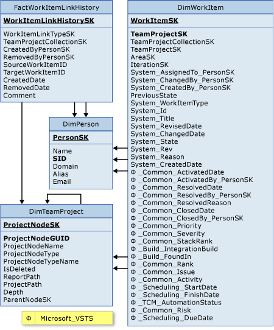

# Work Item Link History tables
[!INCLUDE [temp](../includes/tfs-report-platform-version.md)]

You can query for links between bugs, tasks, and other types of work items by using FactWorkItemLinkHistory and the associated dimension tables. To include details about the linked work items, you join SourceWorkItemID and TargetWorkItemID to Dim.System_ID.  
  
 For information about the measures and dimensions that are associated with these tables in the SQL Server Analysis Services cube, see [Test cases and work items](perspective-test-analyze-report-work.md).  
  
   
  
 FactWorkItemLinkHistory is associated with the following dimension tables:  
  
-   DimTeamProject  
  
-   DimPerson  
  
-   DimWorkItem  
  
> [!NOTE]
>  This table contains links that have been removed. Links that have not been removed have the RemovedDate set to Jan 1, 9999. When a link is removed, the removed date is set to the date and time when it was removed. You can use `RemovedDate > GetDate()` to filter out links that have been removed.  
  
 You can use the following sample query to find the following types of information:  
  
- total number of hours for completed work  
  
- original estimated work  
  
- remaining work  
  
- total story points for each user story in a team project under a specified area path  
  
  For information about the Coalesce function that is used in the sample query, see the following page on the Microsoft Web site: [COALESCE (Transact-SQL)](https://go.microsoft.com/fwlink/?LinkId=178080).  
  
> [!NOTE]
>  This query assumes that a user story is linked to other work items through Child links.  
  
```sql
declare @TeamProjectNodeSK int  
select @TeamProjectNodeSK = ProjectNodeSK from GetProjectNodeInfoFromReportFolder(N'/TfsReports/VSTSDF/ProcessDev10')  
-- This table-value function returns the ProjectNodeSK: the Surrogate Key of a team project under a certain area path.  
  
declare @TeamProjectCollectionGuid nvarchar(36)  
select @TeamProjectCollectionGuid = pc.ProjectNodeGUID from DimTeamProject p inner join DimTeamProject pc on p.ParentNodeSK = pc.ProjectNodeSK where p.ProjectNodeSK = @TeamProjectNodeSK  
-- This query finds the team project collection GUID by joining TeamProject.ParentNodeSK to TeamProject.ProjectNodeSK  
  
select   
     wi.System_Title  
    ,wi.System_Id  
    ,coalesce(sum(cwi_child.Microsoft_VSTS_Scheduling_CompletedWork), 0) as Total_CompletedWork -- Finds the total number of hours of completed work.  
   ,coalesce(sum(cwi_child.Microsoft_VSTS_Scheduling_OriginalEstimate), 0) as Total_OriginalEstimate --Finds the total number of hours of original estimate.  
    ,coalesce(sum(cwi_child.Microsoft_VSTS_Scheduling_RemainingWork), 0) as Total_RemainingWork --Finds the total number of hours of remaining work.  
    ,coalesce(sum(cwi_child.Microsoft_VSTS_Scheduling_StoryPoints), 0) as Total_StoryPoints --Finds the total story points.  
from  
    DimWorkItem wi  
cross apply  
    GetWorkItemsTree(@TeamProjectCollectionGuid, wi.System_Id, N'Child', DEFAULT) wit   
left join          
    FactCurrentWorkItem cwi_child  
        on cwi_child.WorkItemSK = wit.ChildWorkItemSK  
where  
    wi.TeamProjectSK = @TeamProjectNodeSK   
    and wi.System_WorkItemType = N'User Story'  
    and wi.System_RevisedDate = CONVERT(datetime, '9999', 126)--The revised date of the work item is equal to today.  
    and wi.System_State = N'Active'  
group by wi.System_Id, wi.System_Title  
order by wi.System_Id  
```  
  
## Related notes 
 [Test cases and work items](perspective-test-analyze-report-work.md)   
 [Define a custom link type](../../reference/xml/define-custom-link-type.md)   
 [Table reference for the relational warehouse database](table-reference-relational-warehouse-database.md)