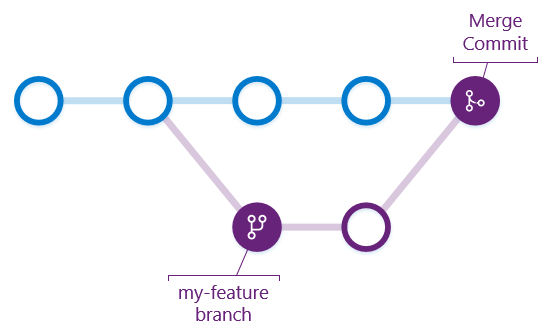

# Squash merge pull requests

#### Azure Repos | Azure DevOps Server 2019 | TFS 2018 | TFS 2017

## Pull requests and Git history

When you complete a [pull request](pull-requests.md), you merge the topic branch into your default branch, usually `master`. 
This merge adds the commits of the topic branch to your main branch and creates a merge commit to reconcile any conflicts between the default and topic branch. 
The comments and discussion in the pull request give additional context for the changes made in the topic branch. 

The [commit](commits.md) history on your `master` branch (or other default branch) does not follow a straight line because of the related topic branch history. 
As the project grows larger, the number of topic branches worked on at the same time increases, making the default branch history increasingly more difficult to follow.     

This default branch is an accurate representation of the history of each topic branch, but it is difficult to use to answer broader questions about your project's development. 

## What is a squash merge?

Squash merging is a merge option that allows you to condense the Git history of topic branches when you complete a pull request. Instead of each commit on the topic branch
being added to the history of the default branch, a squash merge takes all the file changes and adds them to a single new commit on the default branch. 

A simple way to think about this is that squash merge gives you just the file changes, and a regular merge gives you the file changes and the commit history. 

## How is a squash merge helpful?

Squash merging keeps your default branch histories clean and easy to follow without demanding any workflow changes on your team. Contributors to the topic branch work how they want in 
the topic branch, and the default branches keep a linear history through the use of squash merges. The commit history of a `master` branch updated with squash merges will have one commit 
for each merged branch. You can step through this history commit by commit to find out exactly when work was done.

## Considerations when squash merging

Squash merging condenses the history of changes in your default branch, so it is important to work with your team to decide when you should squash merge and when you want to 
keep the full commit history of a topic branch. When squash merging, it's a good practice to delete the source branch. This prevents confusion as the topic branch itself does not have a commit merging it into the default branch.

## Completing pull requests with squash merge

You can choose to squash merge when completing a pull request in Azure Repos. 
Choose **Squash changes when merging** on the **Complete pull request** dialog to squash merge the topic branch.

 

