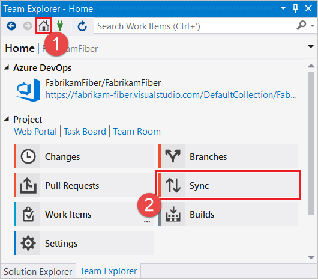
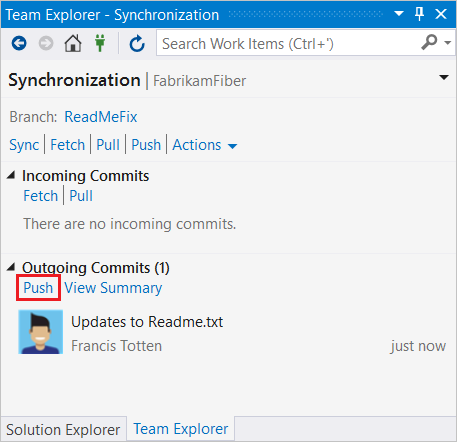

# Share code with push

#### Azure Repos | Azure DevOps Server 2019 | TFS 2018 | TFS 2017 | TFS 2015 | VS 2017 | VS 2015

Share changes made in [commits](commits.md) and [branches](branches.md) using the `push` command.
Push your branches to the remote repository. Git adds your commits to an existing branch on the remote or creates a new branch with the same commits as your local branch.

Git makes sure that pushed changes are consistent with the remote branch. Others can [pull](pulling.md) your commits and merge them into their own local copy of the branch.
Pushed branches that have finished work are reviewed and merged into the main branch of your repo through a [pull request](pullrequest.md).

In this tutorial you learn how to:

> [!div class="checklist"]
> * Share your code with push

## Video overview

<iframe src="https://channel9.msdn.com/series/Team-Services-Git-Tutorial/Git-Tutorial-Push/player" width="640" height="360" allowFullScreen frameBorder="0"></iframe>

<a name="share-your-code-with-push"></a>

## Share your code with push

#### [Visual Studio](#tab/visual-studio/)
1. In Team Explorer, select **Home** and then choose **Sync** to open **Synchronization**.

   

   You can also go to **Synchronization** from the **Changes** view by choosing **Sync** immediately after making a commit.

   

1. Select **Push** to share your commit with the remote repository.

   

   During your first push to the repository, you'll see the following message in place of the outgoing commits list: `The current branch does not track a remote branch. Push your changes to a new branch on the origin remote and set the upstream branch.` Select **Push** to push your changes to a new branch on the remote repository and set the upstream branch. The next time you push changes you'll see the list of commits.

   > [!NOTE]
   > Go to **Team Explorer** > **Settings** > **Repository Settings**. Make sure that you've entered the correct **User**, **Email**, **Remotes**, and other settings.

#### [Command Line](#tab/command-line/)
The `push` command updates the remote branch on `origin` with the commits from your local branch.

```cmd
git push
```

When you run `git push`, you'll see output similar to the following example:

```cmd
Counting objects: 3, done.
Delta compression using up to 8 threads.
Compressing objects: 100% (2/2), done.
Writing objects: 100% (3/3), 861 bytes | 0 bytes/s, done.
Total 3 (delta 1), reused 0 (delta 0)
remote: Analyzing objects... (3/3) (114 ms)
remote: Storing packfile... done (62 ms)
remote: Storing index... done (53 ms)
```

If the remote branch doesn't exist, run the following command to create a remote branch on `origin`.

```cmd
git push -u origin users/frank/bugfix
```

The command adds your commits from your local branch to the branch on `origin`. This command sets up an upstream tracking relationship in
Git so that next time you `push` or `pull` from this local branch, you won't have to specify the remote branch name.

* * *
### Resolve merge conflicts before pushing

If there are [conflicts](merging.md) between your local commits and the remote branch, you must resolve these conflicts before you can push your changes.
[Pull](pulling.md) the changes from others first. You can resolve the conflicts and commit the changes, then try the `push` command again.

## Next steps

> [!div class="nextstepaction"]
> [Review code with pull requests](pullrequest.md) or [update code with fetch and pull](pulling.md)
