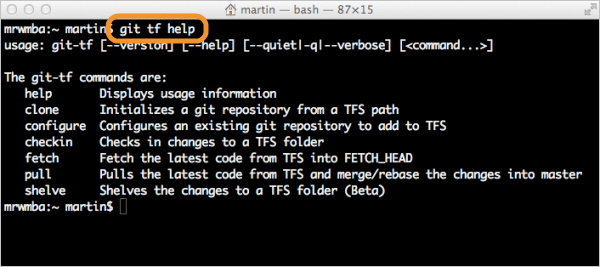
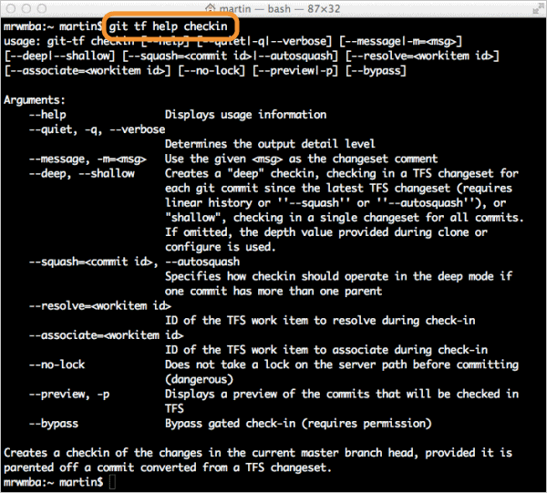

# Share your code in TFVC using Xcode

#### Azure Repos | TFS 2018 | TFS 2017 | TFS 2015 | VS 2017 | VS 2015 | VS 2013

Share your Xcode projects using a TFVC repository by using the Git-tf command line tool to push your changes from the local Git repository to TFVC.

## Download and configure Git-tf

1. Download and extract [Git-tf](http://go.microsoft.com/fwlink/p/?LinkId=261658).

2. Add Git-tf and the Java runtime to your path.

    ```
    export JAVA_HOME=/Library/Java/Home 
    export PATH=$PATH:$JAVA_HOME/bin:/git_tf
    ```

3. Go to the root of your local repository.

    ```
    pushd /ws/FabrikamFiber
    ```

4. To share your Git repository in Azure Repos, configure the connection and check in your code. You'll be prompted for credentials. 

    ```
    git tf configure https://fabrikamfiber.visualstudio.com $/FabrikamFiber 
    git tf checkin
    ```

    Or, if your team's code is already in Azure Repos, you can clone a local repository using Git-tf.

    ```
    git tf clone https://fabrikamfiber.visualstudio.com $/FabrikamFiber
    ```

5. If you don't want to be prompted for credentials every time you run Git-tf, you can store your credentials in your Git configuration.

    ```
    git config git-tf.server.username fabrikamfiber4@hotmail.com 
    git config git-tf.server.password mypassword
    ```

## Share your code


1. After you commit changes to your local Git repository, and you're ready to share them in Azure Repos, check them in.

    ```
    git commit -a 
    git tf checkin
    ```

    If you've committed multiple changes locally, you'll still get just one changeset in Azure Repos.

2. Resolve a bug or close a task when you check in by providing the work item ID with the resolve flag.

    ```
    git tf checkin --resolve=21972
    ```

    The changeset and the work item are linked, and you'll be able to see which bugs are resolved and which tasks were completed in the build reports.

3. You can make sure you're working with your team's latest code by pulling from Azure Repos.

    ```
    git tf pull
    ```

    Use git tf help to learn about the Git-tf commands.

    
    


## Additional information

* [Should I use Git or TFVC for my project?](#should-i-use-git-or-tfvc-for-my-project)
* [If my project uses Git Version control, can I still share my Xcode projects in Azure DevOps Services?](#if-my-project-uses-git-version-control-can-i-still-share-my-xcode-projects-in-azure-devops-services)

### Should I use Git or TFVC for my project?

That depends on a number of factors, like the size of your codebase and the size and distribution of your team. 
Learn which version control ([Git](../../repos/git/overview.md) or [Team Foundation Version Control](overview.md)) 
works best for you.

### If my project uses Git Version control, can I still share my Xcode projects in Azure DevOps Services?

Yes, see [Share your code in Git using Xcode](../../repos/git/share-your-code-in-git-xcode.md).

## Next steps

> [!div class="nextstepaction"]
> [Choosing the right version control for your project](comparison-git-tfvc.md)

