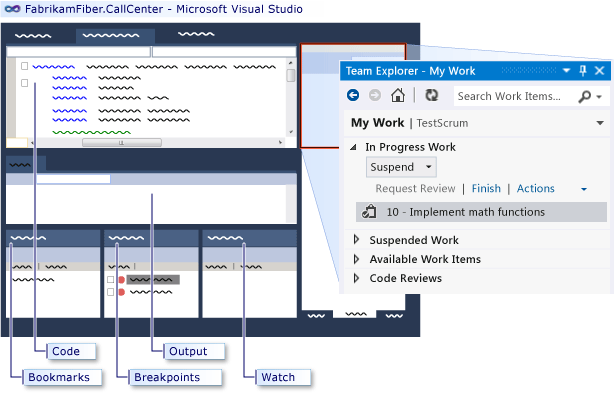
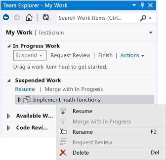
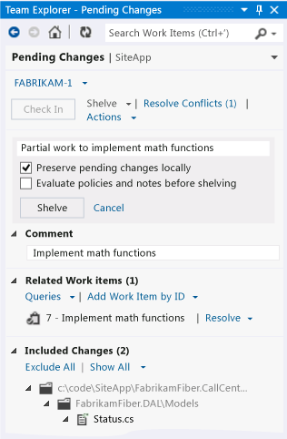
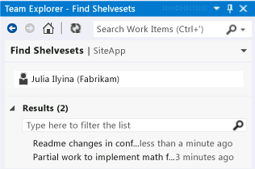
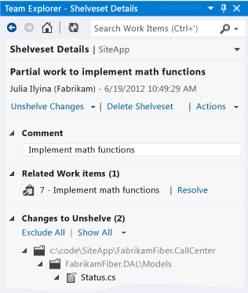

# Suspend your work and manage your shelvesets

#### Azure Repos | Azure DevOps Server 2019 | TFS 2018 | TFS 2017 | TFS 2015 | VS 2017 | VS 2015 | VS 2013

For a variety of reasons, sometimes you need to set aside some or all of your work in progress. Shelvesets are useful when you want to stop work for:

-   **Interruption:** You have pending changes that are not ready for check in, but you need to work on a different task.

-   **Collaboration:** You have pending changes that are not ready for check in but you need to share them with another team member.

-   **Code Review:** You want another team member to perform a code review of your pending changes.

	>**Tip:**  
	>If you are using Visual Studio Premium or a more powerful edition, you can use the [Code Review](day-life-alm-developer-write-new-code-user-story.md) feature.

-   **Private Build:** Before you check in your changes, you can use your automated build system to build and test your code.

-   **Backup:** You have work in progress that you cannot finish now so you want a backup copy that is stored on your server and available to other team members who might need to access it.

-   **Handoff:** You have work in progress that you want to hand off to another team member.

You can move your [pending changes](develop-code-manage-pending-changes.md) to a shelveset on the server and then clean your [workspace](create-work-workspaces.md). The shelveset saves and stores not only your file revisions, but also the Comment, the list of Related Work Items, and check-in notes (if you evaluate policies before shelving).

**Required permissions**

You must be one of the **Contributors** for your project. See [Team Foundation Server default groups, permissions, and roles](https://msdn.microsoft.com/library/ms253077).

## Suspend and resume your work from the My Work page

>**Note:**  
>The My Work feature is available only in Visual Studio Premium and Visual Studio Ultimate.

From the **My Work** page you can save and then restore not only your file changes and related work items, but also the position of your open windows, breakpoints, and other important cues.

In Team Explorer, choose  **Home**, and then choose **My Work**. On the **My Work** page, choose **Suspend & Shelve**, and then type a description of the suspended work.

When you are ready to resume the work, go the **Suspended & Shelved Work** section of the **My Work** page, select a set of suspended work, and choose **Resume**.

## Shelve your changes

>**Tip:**
In either Solution Explorer or Source Control Explorer, you can shelve a specific subset of the files that you are working with: select them, open their context menu, and then choose **Shelve Pending Changes**. The **Pending Changes** page appears, ready to shelve only the files you selected.

### To shelve your changes

1.  In Team Explorer, choose  **Home**, and then choose **Pending Changes**.

2.  In the **Pending Changes** page, make sure that the changes you want to shelve are listed in the **Included Changes** section. You can drag files between **Included Changes** and **Excluded Changes** (Keyboard shortcut: open the context menu of an item, and then choose **Include** or **Exclude**.

3.  Choose the **Shelve** link.

4.  Type a name for the shelveset.

    

5.  (Optional) Select either of the following check boxes:

    -   **Preserve pending change locally**

        By default, this check box is selected. When this check box is selected, your pending changes (including the comment and the Related Work Items list) are not removed from your workspace. If you want to clean your workspace to work on another task, you should clear this check box.

    -   **Evaluate Policies and check-in notes before shelving**

        When you select this check box, all check-in policies are evaluated before the shelveset is created. For more information about check-in policies, see [Set and Enforce Quality Gates](set-enforce-quality-gates.md).

6.  Choose the **Shelve** button.

## Find a shelveset

### To find a shelveset

1.  In Team Explorer, choose  **Home**, and then choose **Pending Changes**.

2.  Choose the **Actions** link, and then choose **Find Shelvesets**.

3.  On the **Find Shelvesets** page, enter the name or alias of a project team member in the box, and then choose the **Enter** key.

    

	>**Tip:**  
	>If you don't know the name of the owner, you can type ***** to list shelvesets for all users.

4.  A list of shelvesets appears in the **Results** list. You can type a filter to reduce the size of the list.

## View and work with a shelveset

After you have a list of shelvesets (explained in "To find a shelveset") in the **Find Shelvesets** page, double-click the shelveset to view it.

The **Shelveset Details** page appears.

-   You can toggle between list and tree view from the **Actions** menu.

-   To get more information about a change to a file, open its context menu, and then choose **Open**, **View History**, or one of the **Compare** options.

-   Choose **Unshelve Changes** if you want to retrieve the changes in the shelveset into your workspace:

    1.  For any file changes that you do not want to unshelve, open the context menu of the file, and then choose **Exclude**.

    2.  If you want to delete the shelveset, clear the **Preserve shelveset on server** check box.

    3.  If you do not want to restore the work item list and check-in notes that are stored in the shelveset clear the **Restore work items and check-in notes** check box.

    4.  Choose the **Unshelve** button.

    If there are conflicts between changes in the shelveset and the file versions in your workspace, the system will prompt you to [resolve them](resolve-team-foundation-version-control-conflicts.md).

-   Choose **Delete Shelveset** if you want to delete the shelveset.

    >**Caution:**  
    >Be sure you do not need any of the work stored in a shelveset before you delete it. There is no way to recover a deleted shelveset.

## Work from the command prompt

-    [Shelve Command](shelve-command.md) : Create or delete a shelveset.

-    [Shelvesets Command](shelvesets-command.md) : List shelvesets.

-    [Unshelve Command](unshelve-command.md) : Unshelve a shelveset.

-    [Difference Command](difference-command.md) : Compare the changes to a file in a shelveset with another version.

## Tips

-    Unlike a changeset, a shelveset is a non-versioned entity. If you or another user unshelve the items of which a shelveset consists, edit several files, and then later reshelve the shelveset, the system does not create a new version of the items for future comparison and maintains no record of who revised the items, when, or in what manner. The original shelveset is completely replaced.

-    Conflicts can occur and prevent you from resuming suspended work. If this happens, see [Resolve Team Foundation Version Control conflicts](resolve-team-foundation-version-control-conflicts.md).
