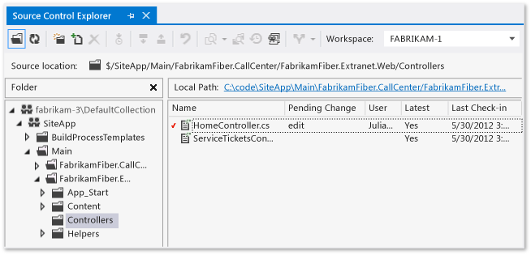

---
title: Use Source Control Explorer to manage files
titleSuffix: Azure Repos
description: Use Source Control Explorer to manage files under version control
ms.assetid: 2781688e-ac66-4ea5-acd3-f045ba757f13
ms.technology: devops-code-tfvc
ms.author: sdanie
author: apawast
ms.topic: conceptual
ms.date: 12/05/2016
monikerRange: '>= tfs-2015'
---

# Use Source Control Explorer to manage files in TFVC 

#### Azure Repos | Azure DevOps Server 2019 | TFS 2018 | TFS 2017 | TFS 2015 | VS 2017 | VS 2015 | VS 2013

Use Source Control Explorer to browse file versions and work with your codebase under Team Foundation version control (TFVC). 

> [!NOTE]
> If you're using Git for version control, manage your Visual Studio project files in [Team Explorer](../../user-guide/work-team-explorer.md) and [Solution Explorer](/visualstudio/ide/solutions-and-projects-in-visual-studio#solution-explorer). Learn more about using Git with Visual Studio in the [Azure Repos Git tutorial](../../repos/git/gitworkflow.md). 

> [!TIP]
> If you need to work with your Visual Studio solution files outside of version control, use [Solution Explorer](/visualstudio/ide/solutions-and-projects-in-visual-studio#solution-explorer).
> Source Code Explorer is for managing changes made in your project when using TFVC.

## Open Source Control Explorer

Source Control Explorer is available in both Visual Studio 2013 and 2015, but isn't opened by default when working with a project managed in TFVC. You can open the Source Control Explorer window:

-   From the Team Explorer home page (Keyboard: Ctrl + 0, H), choose **Source Control Explorer**.

-   From the menu bar. Select **View**, **Other Windows**, **Source Control Explorer**.

## Use the command prompt

You can also use the command prompt to manage your files in TFVC. See [Use Team Foundation version control commands](use-team-foundation-version-control-commands.md).

## Q & A

### Q: Why do I see the Not mapped link?

**A:** If the **Not mapped** link appears next to **Local Path** in a folder that contains files you need to work with, you can choose the link to map the folder. See [Create and work with workspaces](create-work-workspaces.md).

### Q: How do I change the local path?

     
See [Create and work with workspaces](create-work-workspaces.md)

### Q: How do I toggle the folders pane?

**A:** To toggle the folders pane, choose **Close** in the upper-right corner of its title bar, or, in the Source Control Explorer toolbar, choose **Folders**.

### Q: I don't see the latest data in the window. How can I fix this?

**A:** If Source Control Explorer is not showing the latest data on the server, from the menu bar, choose **File**, **Source Control**, **Refresh Status**.

### Q: How can the Pending Change column help me?

**A:** The **Pending Change** column displays your [pending changes](develop-code-manage-pending-changes.md) to an item. It also displays the pending changes of other team members who are using [server workspaces](decide-between-using-local-server-workspace.md) and identifies their names in the **User** column. If an ellipsis (**...**) appears, you can view a list of the users and their pending changes:

1.  Open the context menu of the item in the **Name** column and choose **Properties**.

2.  In the **Properties** dialog box, choose the **Status** tab, which displays a list of users (in the **User** column) and their associated pending changes (in the **Change Type** column).

### Q: Why do I see this error message: "Team Foundation Server is not your current Source Control plug-in. Click here to set the current Source Control plug-in"?

**A:** You might have connected to a Git repository in your project. Use [Team Explorer](../../user-guide/work-team-explorer.md) and [Solution Explorer](/visualstudio/ide/solutions-and-projects-in-visual-studio#solution-explorer) to manage your files in Git repos.
