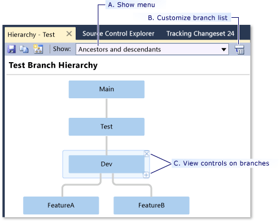

# View the branch hierarchy of a project

#### VSTS | TFS 2018 | TFS 2017 | TFS 2015 | VS 2017 | VS 2015 | VS 2013

As a project grows, typically the branch structure also grows and becomes more complex. Your team members, especially those who are new, will require answers to simple questions such as the following:

-   What branches are in our project?

-   How are these branches related to each other?

-   If I need changes from another feature team, which branches will those changes have to go through to get back to me? Who owns these branches?

The following procedures explain how to use Team Foundation version control to answer these types of questions.

## To View and Work with Your Branches

You can use the **Hierarchy** window to perform the following tasks:

-   View a subset, or all, of your branches in a hierarchical view.

-   View properties of a specific branch.

-   Complete tasks for a specific branch.

<table>
<thead>
<tr>
<th> <strong>Important</strong></th>
</tr>
</thead>
<tbody>
<tr>
<td>
This procedure can be performed on a branch and not on a folder. For example, in the following illustration you can see which objects are branches and which are folders.

For more information, see <a href="branch-folders-files.md">Branch folders and files</a>.
</td>
</tr>
</tbody>
</table>

### Display the Hierarchy Window from Source Control Explorer

1.  In **Source Control Explorer**, click the branch from which you want to begin to explore your branch structure.

2.  Click the **File** menu, point to **Source Control**, point to **Branching and Merging**, and then click **View Hierarchy**.

### Adjust the View to Show the Data You Need

When you first display the **Hierarchy** window, by default, the branch that is shown is the branch from which you started the window, including its ancestors and its descendants.

For example, the following illustration shows the **Hierarchy** window for the DinnerNow **Test** branch.

**Hierarchy window showing DinnerNow Test branch with ancestors and descendants**

The options that you can use to modify the view in this window are explained in the following list:

-   **A. Show menu **You can select a typical view from the **Show** menu: **All hierarchies**, **Full hierarchy**, **Ancestors and descendants**, **Ancestors**, **Parent and children**, **Children**, or **Customized**.

    >**Tip:**
    >  If you want to see the full hierarchy for every version control path in your project, including those that are outside the scope of the active project in Source Control Explorer, select **All hierarchies**.

-   **B. Customize branch list button **Click this button to individually select the specific branches that you want to show.

    The **Select Branches** dialog box appears.

    -   In the Branches list, select or clear the check boxes for the branches that you want to show or hide.

    -   As you select or clear check boxes, a preview of your selections appears on the right-hand side of the dialog box.

    -   If your team has many branches, you can more easily specify the branches that you want by clicking the buttons above the preview. You can point to each button to display information about what the button does.

-   **C. View controls on branches**-If you want to fine tune details of your diagram, you can click a specific branch and then click one of the following controls:

    -   Click X to hide the branch (or press DELETE while the branch is selected).

    -   Click the plus (+) symbol (or press INSERT while the branch is selected) to select or de-select which child branches you want to display.

### View Properties and Take Actions

After you view the branch hierarchy, you may need more information, or you may be ready to take some action. You can right-click any branch in the **Hierarchy** window and perform any one of the following steps:

-   Select **Properties** to display the **Properties** dialog box, which you can use to view additional information about the branch, including its path, who owns it, and who has permissions to work with it.

    The Owner field is only for information. Being named in the Owner field conveys no additional permissions.

-   Select an action such as: **Branch**, **Merge**, **Compare**, or **Open in Source Control Explorer**.
