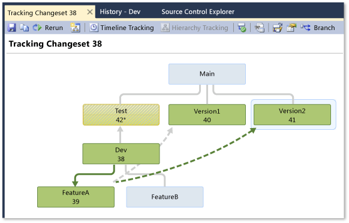
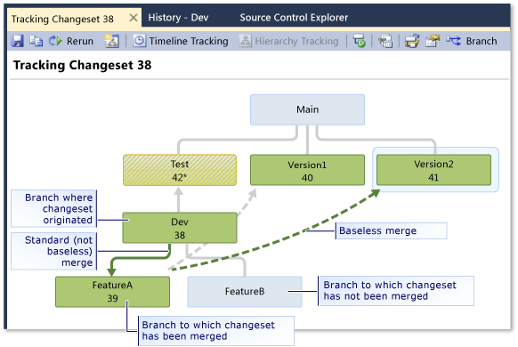
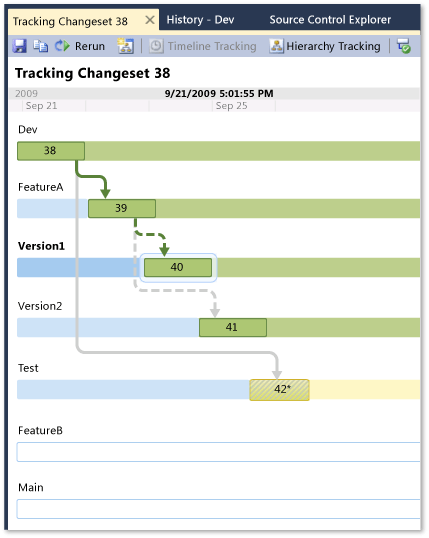

# View where and when changesets have been merged

#### Azure Repos | TFS 2018 | TFS 2017 | TFS 2015 | VS 2017 | VS 2015 | VS 2013

Branching your code base can be a useful way to isolate concurrent development efforts and to take snapshots. However, when your team members are working in a branched code base, they may have trouble finding information about which branches have received a particular set of changes and when those changes were merged.

For example, your team (Feature Team B) waits for a fix to a bug in some code on which your code depends. You receive an e-mail message that states that the bug has been fixed, but you can still reproduce the bug in the builds that come from your branch.

By opening the **Tracking Changeset** window, you can determine which branches have and have not received a set of changes. For example, in the following illustration, the **Tracking Changeset** window shows how changeset 38 was merged from the **Dev** branch to a child branch and then baselessly merged to two other branches.

Tracking Changeset window shows branches to which a changeset has merged

**Required Permissions**

To perform these procedures, your **Read** permission must be set to **Allow** for the branches with which you are working. For more information about permissions, see [Permissions and groups reference](../../organizations/security/permissions.md).

## View the Tracking Changeset Window

>**Important:**  
>These procedures can be performed only on a branch, not on a folder.  
>  
>For more information about how to branch, see [Branch folders and files](branch-folders-files.md).

### To view the Tracking Changeset Window from the History window of a branch or file

1.  In **Source Control Explorer**, click a branch or a folder or file that is contained by a branch.

2.  Click the **File** menu, point to **Source Control**, and then click **View History**.

3.  In the **History** window, right-click the changeset that you want to view, and click **Track Changeset**.

    The **Select Branches** dialog box appears.

4.  (Optional) In the **Branches** list, select or clear the check boxes for the branches that you want to show or hide.

    As you select or clear check boxes, a preview of your selections appears on the right-hand side of the dialog box.

5.  (Optional) If your team has a lot of branches, click the buttons above the preview to select the branches that you want more easily.

    You can move the pointer over each button to get information about what the button does.

6.  Click **Visualize**.

### To view the Tracking Changeset window from a work item that is linked to a changeset

1.  Open a work item that is linked to one or more changesets, and then click  **Track Work Item**.

    The **Select Branches** dialog box appears.

2.  (Optional) In the **Branches** list, select or clear the check boxes for the branches that you want to show or hide.

    As you select or clear check boxes, a preview of your selections appears on the right-hand side of the dialog box.

3.  (Optional) If your team has lots of branches, click the buttons above the preview to select the branches that you want more easily.

    You can move the pointer over each button to show information about what the button does.

4.  Click **Visualize**.

### Overview of the Tracking Changeset Window

-   The following illustration shows an example of a changeset in the DinnerNow project.

Tracking Changeset window elements

The previous example illustrates how you can use the **Tracking Changeset** window to visualize the following information:

-   The branches to which the changeset has been merged (displayed in green), including the numbers of changesets in which the merge was implemented.

	>**Tip:**  
	>You can click one of these branches (for example, **Version2** in the previous example) to highlight all the merges that were required for the changeset to reach that branch.

-   Whether the merge was a standard merge (solid line) or a baseless merge (dashed line).

-   If a branch has received some (but not all) of the changes in a changeset, the branch is filled with a pattern, and an asterisk follows the changeset numbers within that branch. For example, the previous illustration shows that only some of the changes in changeset 38 were merged to the **Test** branch.

-   The branches to which the changeset has not been merged (displayed in light blue).

## Switch to Timeline View

You can get information about when a changeset was merged to one or more branches by switching to the Timeline View. This view shows not only the sources and targets of each merge but also when the merge occurred.

**Required Permissions**

To perform these procedures, your **Manage branch object** permission must be set to **Allow**. For more information about permissions, see [Permissions and groups reference](../../organizations/security/permissions.md).

### To display the Timeline View of a changeset

-   Open the **Tracking Changeset** or **Tracking Work Item** window, and then click  **Timeline Tracking**.

### Example: Using Timeline View

The previous illustration shows that two baseless merges and one standard merge occurred. When you click  **Track on Timeline View**, the **Tracking Changeset** window switches to a view that shows the sequence of the merges.

Timeline View provides detailed chronological data

The branches that have received the changeset appear at the top of the view. In the previous example, the user has clicked the **Version1** branch to show the date and time when the merge occurred.

The branches to which the changeset has not been merged (for example, **FeatureB** and **Main** in the previous illustration) appear in white at the bottom of the view.

## Use the Drag and Drop Operation to Merge Branches

You can use the drag and drop feature to merge a changeset or a branch to another branch. For more information, see [Merge folders and files](merge-folders-files.md).
