# Collect diagnostic data while testing

[!INCLUDE [version-header-tfs17](_shared/version-header-tfs17.md)] 

Collect diagnostic data while testing your apps.
This data will be included in the bugs you file 
during the test. You can collect diagnostic data from
web apps and from desktop apps, web apps and from desktop apps,
and view it in Azure Test Plans or Team Foundation Server.

[!INCLUDE [feature-availability](_shared/feature-availability.md)] 

## Collect diagnostic data from web and desktop apps

For web apps under test, you can use web-based Microsoft Test Runner. 
For desktop apps, download and install the [Test Runner desktop client](https://aka.ms/ATPTestRunnerDownload) to collect the following data on demand:

* [Screen captures](#web-screenshot)
* [Image action log](#web-log)
* [Screen recordings](#web-recording)

> See [Exploratory test and submit feedback directly from your browser](perform-exploratory-tests.md).

### Screen capture

Capture annotated screenshots from your app: 

1. Open Test Runner and choose the **Capture screenshot** icon. 
   Ensure that the app from which you want to capture data is selected.

    

1. Drag to select the area of the screen you want to 
   capture, or just capture the full screen.
 
   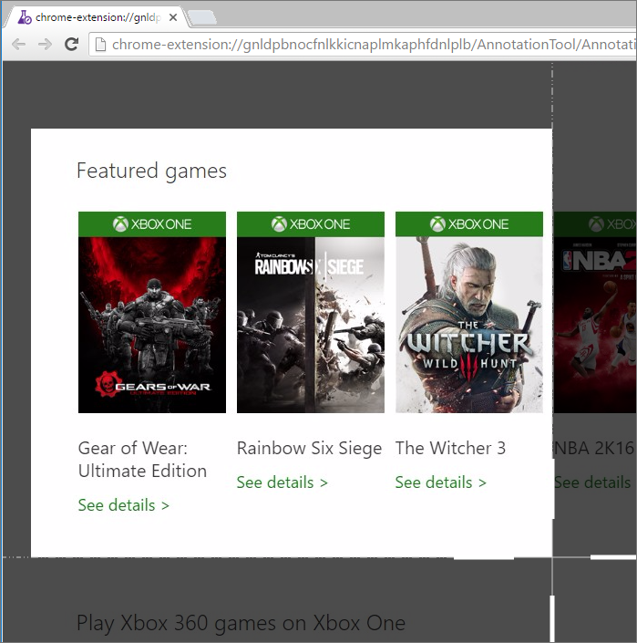 

1. If required, edit the title of the screenshot and add 
   annotations and text to it using the icons in the toolbar.

   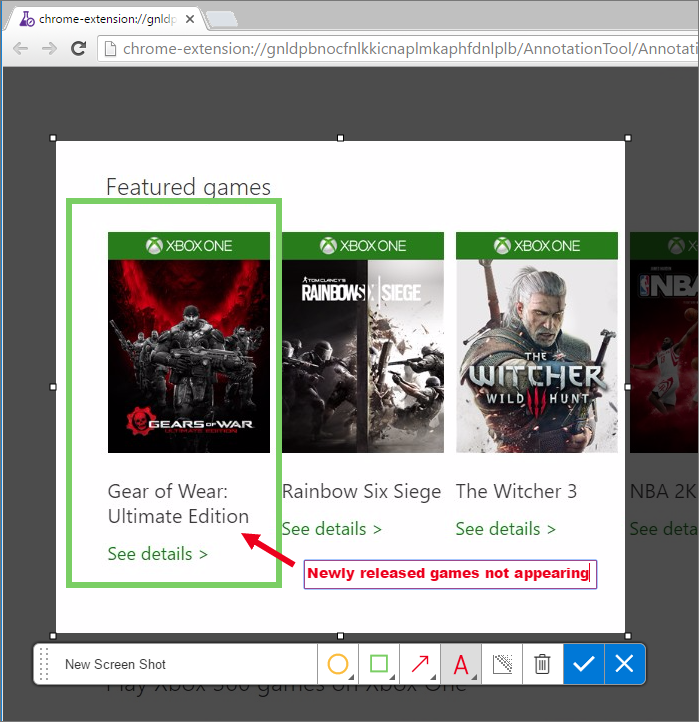 
 
1. Save your screenshot.  

   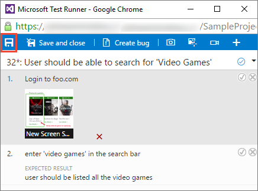 
 

### Image action log

Capture your interactions with the web or desktop app as an image action log that provides context:

1. Open or switch to the Test Runner and choose the **Capture user actions...** icon. 
   Ensure that the app from which you want to capture data is selected.

   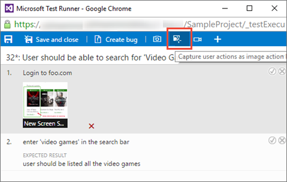 

1. The Test Runner will now record all the actions you take
   on the app's browser tab or in the desktop app.
 
   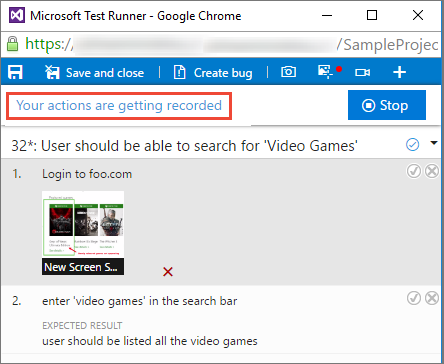 

   If you create a bug while recording your actions, all the 
   data collected up to that point will be included in the bug. 

1. Finish capturing your actions by choosing
   the **Stop** button. The action log is added to the test results 
   as an attachment.

   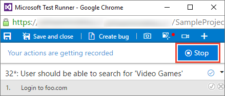 

1. Choose the **ActionLog...** link at the bottom of the window
   to view the data captured in the action log.

   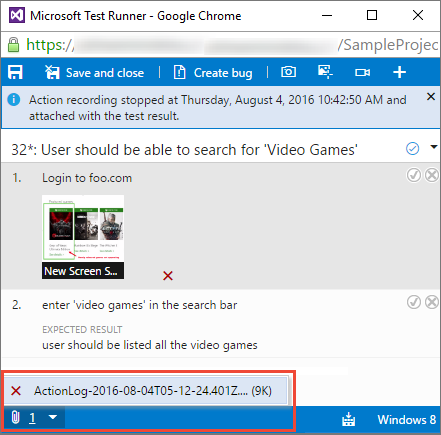 

   The log opens in your web browser.

   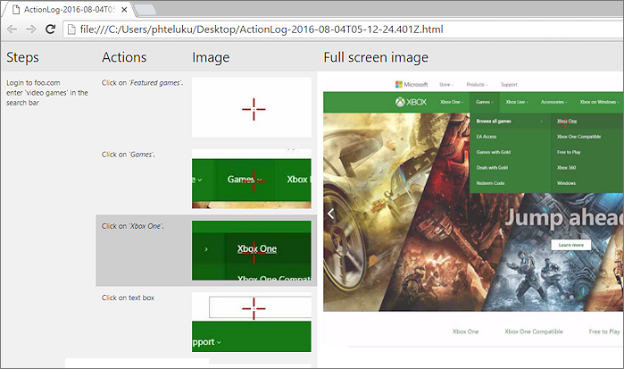 

### Screen recording

Capture screen recordings from your apps:

1. Open or switch to the Test Runner and choose the **Record screen** icon. 
 
   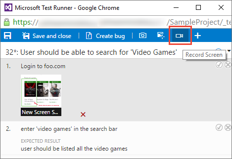 

1. Choose the entire screen, or choose an app to start recording.
 
   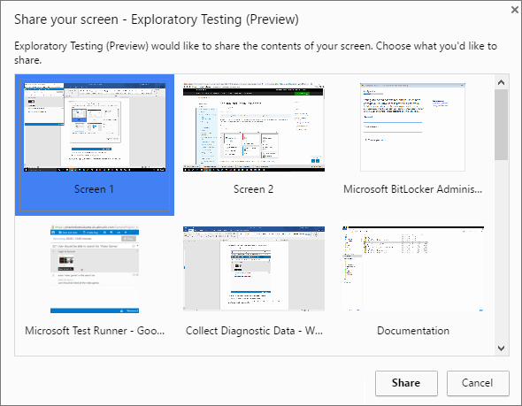 

   If you create a bug while recording your screen, the 
   recording automatically stops and is added to the bug. 

1. Finish recording your actions by choosing
   the **Stop** button. The recording is added to the test results 
   as an attachment.
 
   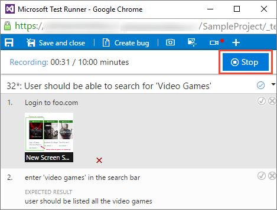 

   If you do not stop the recording after ten minutes, it stops
   automatically and is saved as an attachment to your test results.
   Restart the recording the **Record screen** icon if required. 

1. Choose the **ScreenRecording...** link at the bottom of the window
   to view the captured recording.

   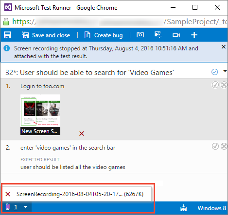 

### View the diagnostic data
 
When you create a bug while capturing diagnostic data, all the data captured 
up to that point is included in the bug that is created. You can
view it before you save the bug.

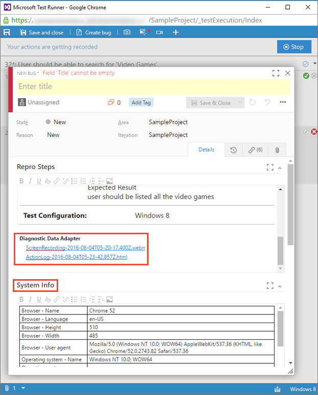 

[How do I play the video recordings I created with the extension?](reference-qa.md#recording-playback)

If you want to collect advanced diagnostic data such as code coverage, 
IntelliTrace, and Test Impact data in addition to the data items listed above,
you must [configure the data collectors](mtm/collect-more-diagnostic-data-in-manual-tests.md)
and other run settings in Microsoft Test Manager and run your 
tests using Microsoft Test Manager. For more details, see 
[Run manual tests with Microsoft Test Manager](mtm/run-manual-tests-with-microsoft-test-manager.md).

> [!NOTE]
> If you have an older version of Microsoft Test Manager, we recommend you upgrade to the latest version.
> However, if you have Microsoft Test Manager 2015 or an earlier version installed, you can choose **Microsoft Test Runner 2015 and earlier** when you launch the test runner using **Run with options**.
> You must [configure the data collectors](mtm/collect-more-diagnostic-data-in-manual-tests.md) and other run settings in Microsoft Test Manager and specify these as the default settings for the test plan.
> For more details, see [Run manual tests with Microsoft Test Manager](mtm/run-manual-tests-with-microsoft-test-manager.md).

## See also

* [Exploratory test and submit feedback directly from your browser](perform-exploratory-tests.md)
* [Overview of manual and exploratory testing](index.md)

[!INCLUDE [help-and-support-footer](_shared/help-and-support-footer.md)] 
