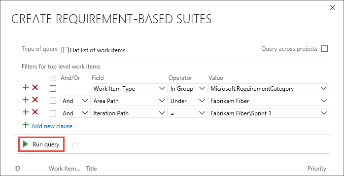

# Create test plans and test suites

[!INCLUDE [version-header](_shared/version-header.md)] 

Create test plans and test suites for your teams to use to track manual testing for sprints or milestones.
That way, you can see when the testing for a specific sprint or milestone is complete.
For more information about manual testing, see [Planned manual testing](overview.md#planned-manual-testing)
and [Automated and Manual Testing with Azure Test Plans](https://www.youtube.com/watch?v=LF0hmSysWCg).

**Test plans** are used to group together test suites and individual test cases.
This includes static test suites, requirement-based suites, and
[query-based suites](reference-qa.md#query-based-suites). 

**Test suites** are used to group test cases into separate testing scenarios within a single test plan.
This makes it easier to see which scenarios are complete.

**Test cases** are used to validate individual parts of your code or app deployment to ensure it performs correctly, has no errors, and
meets business and customer requirements. You can add individual test cases to a test plan without creating
a test suite if you wish.

You can export and share the test plans and test suites with your team.
Test plans and test cases are stored in your Azure DevOps or TFS organization as special types of work items.
Also see the [FAQs for manual testing](reference-qa.md#testplans).

[!INCLUDE [feature-availability](_shared/feature-availability.md)] 

**Note**: Stakeholders cannot create or manage test plans. You must have at least Basic access.
See [Default manual testing permissions and access](manual-test-permissions.md).

## Create a test plan

1. If you want to use Azure DevOps, and haven't done so already, 
   [sign up for Azure DevOps](https://visualstudio.microsoft.com/products/visual-studio-team-services-vs), 
   [create your project](../organizations/accounts/organization-management.md), 
   and [create your backlog](../boards/backlogs/create-your-backlog.md). 

1. In Azure DevOps or TFS, open your project and go to [!INCLUDE [test-hub-include](_shared/test-hub-include.md)].
   If you already have a test plan, choose the **Test Plans** breadcrumb to go to the page that lists all test plans.

   

1. In the **Test Plans** list page, choose **+ New Test Plan** to create a test plan for your current sprint.
 
   

1. In the **New Test Plan** dialog, enter a name for the test plan.
   Check the area path and iteration are set as you require. Then choose **Create**.

    

## Add a requirement-based test suite and select backlog items to test

1. Now add test suites for the backlog items that need manual tests 
   (these could be user stories, requirements, or other work items based on the setup of your project).
   To add a suite to a test plan, open the **+** (New) list and chose the type of suite you require.

    

   You use requirement-based suites to group your test cases together. 
   That way, you can track the testing status of a backlog item. 
   Each test case that you add to a requirement-based test suite is 
   automatically linked to the backlog item.

1. In the **Create requirement-based suites** dialog, add one or more clauses to filter
   your work items by the iteration path for the sprint. Run the query to view the matching backlog items.

   

1. In the list of work items returned by the query, select the backlog items you want to
   test in this sprint. Choose **Create suites** to create a requirement-based suite for each one.

   

## Find a test case in a test plan

* In the **Test Plans** page for your test plan, use the
   filter icon (**1**) to
  show the search and filter lists (**2**) that help you find the tests you want
  to work with. Or filter the list of tests using the **Outcome**, **Tester**,
  and **Configuration** drop-downs (**3**). 

  
  
## See also

* [FAQs for manual testing](reference-qa.md#testplans)
* [Link test cases to work items](../boards/queries/link-work-items-support-traceability.md)

##  Next step

> [!div class="nextstepaction"]
> [Create manual test cases](create-test-cases.md#test-cases) 
