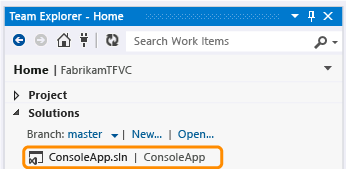
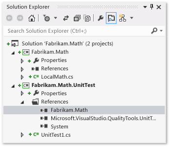
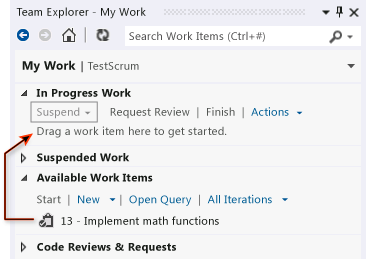
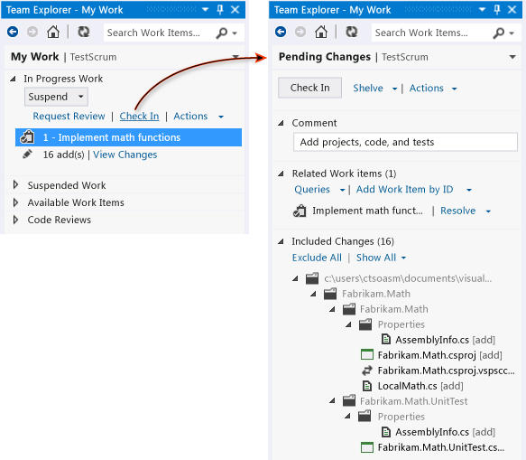

# Develop code and manage pending changes

#### VSTS | TFS 2018 | TFS 2017 | TFS 2015 | VS 2017 | VS 2015 | VS 2013

Most changes that you make to your files are queued as pending changes. As you work, you can organize, manage, and get details about what you’ve changed.

## Work in Solution Explorer

From the team explorer home page (Keyboard: Ctrl + 0, H), you can begin coding in a new or in an existing solution.

  
After you open your solution, open the solution explorer (Keyboard: Ctrl + Alt + L).

  
When you open and modify a file from the solution explorer, the file is automatically checked out for you. Icons appear to indicate which files you have not changed , those you have checked out , and those you have added to the solution .

If you’re working in a solution that contains a lot of files, you’ll probably find it convenient to filter the solution explorer to show only the files you have changed  (Keyboard: Ctrl + [, P).

## Use the My Work page to manage your work

If you’re using Visual Studio Premium or Visual Studio Ultimate, you can use the My Work (Keyboard: Ctrl + 0, M) page in the team explorer to manage your work.

  
You can use My Work to:  
-   Track your work against [work items](../work/track/link-work-items-support-traceability.md)    
-   Suspend and later resume your work (including file changes, associated work items, and Visual Studio state such as window positions and breakpoints)  
-   Request a code review

For a step-by-step example, see [Day in the life of an devops Developer: Write new code for a user story](day-life-alm-developer-write-new-code-user-story.md), and [Day in the life of a devops Developer: Suspend work, fix a bug, and conduct a code review](day-life-alm-developer-suspend-work-fix-bug-conduct-code-review.md).

### Tips

-   You can control the kinds of work items that appear in the **Available Work Items** section. Choose one of the default options or any of your personal queries that are contained in the root **My Queries** folder. To work with these queries, in the team explorer choose  **Home**, and then choose **Work Items**.  
-   When you move a work item to **Available**, **In Progress**, or **Suspended**, the work item state or comments are updated so that your team is automatically advised on the status of your work. For example, the task board for your team is updated to show your status. See [Collaborate [redirected]](https://msdn.microsoft.com/library/hh500404).  
-   If your team project contains customized work item type definitions, you might have problems using My Work, unless an Administrator for your team project has taken certain steps. See [Configure and customize Agile planning tools for a team project](../work/work-items/guidance/agile-process.md) and [Update a customized process template to access new features](https://msdn.microsoft.com/library/ms194972).

## Use the Pending Changes page to manage your work

You can use the Pending Changes page (Keyboard: Ctrl + 0, P) in the team explorer to manage your work.

>**Tip:**  
>-  You can  undock the Pending Changes page from the team explorer and open it in a new window.  
>-  You can toggle between list and tree view from the actions menu.

Almost every change that you make to the files on your dev machine is stored in your workspace as a pending change until you check it in:  
-   [add](add-files-server.md)  
-   [branch](branch-folders-files.md)  
-   [delete](delete-restore-files-folders.md)  
-   [edit](check-out-edit-files.md)  
-   [rename](rename-move-files-folders.md) (includes moving items)  
-   property  
-   [rollback](roll-back-changesets.md)  
-   [type](../tfs-server/admin/manage-file-types.md#config-file-encodings) (file encoding)  
-   [undelete](delete-restore-files-folders.md)

### Work with automatically detected changes

If you are working in a [local workspace](decide-between-using-local-server-workspace.md), Visual Studio can detect changes that you make outside the system. If you edit a file outside Visual Studio (for example, in Notepad) the change automatically appears in your **Included Changes**.

If you add or remove a file outside Visual Studio, for example, in Windows Explorer (File Explorer in Windows 8), the **Detected changes** link appears in the **Excluded Changes** section. Choose this link if you want to include these changes. The **Promote Candidate Changes** dialog box appears. You can open the context menu of added items and choose **Browse in Windows Explorer** to display them or **Delete from disk** to delete them.

>**Note:**  Empty folders will not appear.

If items that you don’t need to check in appear regularly in the **Promote Candidate Changes** dialog box, you can select one of them, open its context menu, and choose **Ignore this local item** to ignore the item. You can also choose **Ignore by extension** or **Ignore by file name** to create a file that will cause Visual Studio to systematically ignore this kind of file. For more information on .tfignore files, see [Add files to the server](add-files-server.md).

### Associate work items

It’s a best practice to associate [work items](../work/track/link-work-items-support-traceability.md) (such as tasks or bugs) with your changes. Under Related Work Items, drag work items from a [query](https://msdn.microsoft.com/library/dd286705) or add it by ID.

### Exclude changes

See [Specify the files you want to check in](check-your-work-team-codebase.md#include_exclude)

## See what you changed

You can remind yourself about what you’ve changed in a file.

### Use Pending Changes to view what you changed

-   On the Pending Changes page, open the context menu for the item and choose:  
    -   **Compare with Workspace Version** to see what you’ve changed to the version in your workspace  
    -   **Compare with Latest Version** to see how your changes compare to the latest version of the file in your team’s codebase

### Use Solution Explorer or Source Control Explorer to view what you changed

1.  Locate and select the item in Solution Explorer or in Source Control Explorer.  
2.  Open the context menu for the item, and then choose **Compare**.  
3.  On the **Compare** dialog box, from the **Type** menu, choose:  
    -   **Workspace Version** to see what you’ve changed in the version in your workspace  
    -   **Latest Version** to see how your changes compare to the latest version of the file in your team’s codebase  
    -   One of the other options: **Changeset**, **Date**, or **Label**.  
4.  Choose **OK**.

The Diff window appears. See [Compare files](compare-files.md).

## Undo your pending changes

You can discard one, a few, or all of the pending changes in your workspace.

>**Note:**  
>A few other options:  
>-  You can first [put the changes away in a shelveset on your server](suspend-your-work-manage-your-shelvesets.md) before removing them from your workspace.  
>- If you have already checked in the change and want to revert it, see [Roll back changesets](roll-back-changesets.md).

### To undo a few of your pending changes

1.  In Solution Explorer, the Pending Changes Window, or Source Control Explorer, select one or more items, open their context menu and choose **Undo** or **Undo Pending Changes**.

    >**Tip:**  
    >To undo all changes you have made in your solution or a code project, open the context menu, and then choose **Undo Pending Change**.

2.  In the **Undo Pending Changes** dialog box, make sure the changes you want to undo are selected, and then choose **Undo Changes**.

### To undo all your pending changes

-   On the **Pending Changes** page, choose the **Actions** link, and then choose **Undo All**.

## Use the command prompt

-    [Status command](status-command.md) : Display pending changes in the command prompt.  
-    [Checkin command](checkin-command.md) : View pending changes in the **Check In** dialog box.  
-    [Undo command](undo-command.md) : Undo pending changes.

    >**Tip:**  
    >You can use this command to undo another user’s check-out if you have sufficient permissions.

-    [Difference Command](difference-command.md) : See what you have changed in a file.

## Next steps

When you’re ready:  
-   To request a code review of your pending changes, on the **Pending Changes** page, choose Request Review. See [Day in the life of an devops Developer: Suspend work, fix a bug, and conduct a code review](day-life-alm-developer-suspend-work-fix-bug-conduct-code-review.md).  
-   If you need to set aside your changes, see [Suspend your work and manage your shelvesets](suspend-your-work-manage-your-shelvesets.md).  
-   Check in and add your changes to the team’s codebase, see [Check in your work to the team's codebase](check-your-work-team-codebase.md).

## Tips

-   If you are new to developing an app with Visual Studio and Team Foundation Server: [Walk step by step with an agile team as they collaborate to develop an app](day-life-alm-developer-write-new-code-user-story.md).  
-   When you begin a new work item, it is probably a good idea for you to [download the latest files from the server](download-get-files-from-server.md) before you check out files and begin your work.  
-   Use [Source Control Explorer](use-source-control-explorer-manage-files-under-version-control.md) to manage your files in version control.
