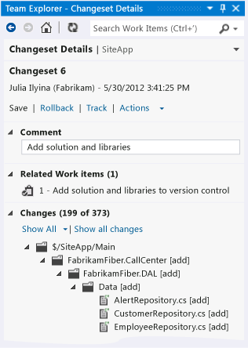
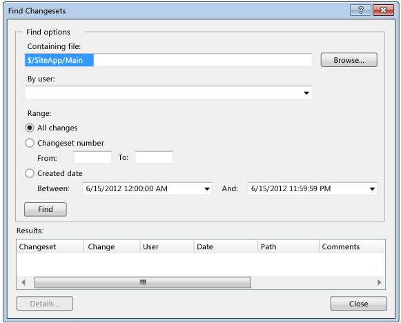
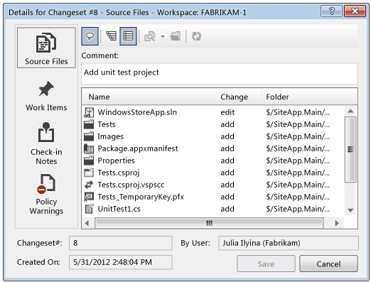

# Find and view changesets

#### VSTS | TFS 2018 | TFS 2017 | TFS 2015 | VS 2017 | VS 2015 | VS 2013

When you [check in your changes](check-your-work-team-codebase.md), they are stored on the server as a changeset. Changesets contain the history of each item in version control.

   

You can view a changeset to see what the exact file changes were, discover the owner's comments, find linked work items, and see if any policy warnings were triggered.

**Required Permissions**

You must be one of the **Contributors** for your team project. See [Team Foundation Server default groups, permissions, and roles](https://msdn.microsoft.com/library/ms253077).

## Find a changeset by ID

-   In [Source Control Explorer](use-source-control-explorer-manage-files-under-version-control.md), press Ctrl + G.

    The **Go to Changeset** dialog box appears.

    

    Type the number of the changeset and choose **OK**.

    If you don’t know the number, choose **Find**. See [Find a changeset](find-view-changesets.md#find).

## List changesets that update a specific file or folder

1.  In Solution Explorer or [Source Control Explorer](use-source-control-explorer-manage-files-under-version-control.md), browse to the folder or file, open its shortcut menu, and choose **View History**.

2.  In the [History window](get-history-item.md), select the row that contains the changeset for which you want to view details, open its shortcut menu, and then choose **Changeset Details**.

    The **Changeset Details** page appears in Team Explorer.   
    
    
<table>
<thead>
<tr>
<th> <strong>Tip</strong></th>
</tr>
</thead>
<tbody>
<tr>
<td><ul>
<li>
You can  undock the <strong>Pending Changes</strong> page from Team Explorer and open it in a new window.
</li>
<li>
You can toggle between tree and list view from the <strong>Actions</strong> menu (Visual Studio 2013) or <strong>View Options</strong> menu (Visual Studio 2015).
</li>
</ul></td>
</tr>
</tbody>
</table>

## Search for changesets

1.  In [Source Control Explorer](use-source-control-explorer-manage-files-under-version-control.md), on the menu bar, choose **File**, **Source Control**, **Find**, **Find Changesets**.

    The **Find Changesets** dialog box appears.

    

2.  (Optional) Next to the **Containing File **box, choose **Browse**.

3.  (Optional) In the **By User** box, type the alias or the name of the team project team member who is associated with the changeset.

4.  (Optional) In the **Range** section, choose one of the following options:

    -   **All changes**   Retrieves all changesets that were applied to that file or folder.

    -   **Changeset number**   Retrieves changesets from a range of numbers. In the **from** and **to** boxes, type the range.

    -   **Created date**   Retrieves changesets from a range of dates. In the **between** and **and** boxes, use the calendars to specify start and end dates.

5.  Choose **Find**.

    Changesets that match your criteria appear in the **Results** list.

6.  Right-click the changeset for which you want information, and select **Changeset Details...**

    The **Details for Changeset** dialog box appears.

    

7.  In the **Details for Changeset** dialog box, view the change types that were added and any comments, work items, check-in notes, and policy warnings that are associated with the changeset.

8.  Close the **Details for Changeset** dialog box.

9.  Choose **OK**.

## Work with changesets

The **Changeset Details** view in Team Explorer has links to perform the following tasks:

-   **Rollback** to remove the effects of the changeset. See [Roll back changesets](roll-back-changesets.md).

-   **Track** to determine which branches have and have not received a set of changes. See [View where and when changesets have been merged](view-where-when-changesets-have-been-merged.md).

-   **Actions**, **Request Review** to request a code review.

-   **Actions**, **Open in Browser** to view the changeset in your browser (for example, if you want to copy the URL into an email to discuss the change with your team).

## Work from the command prompt

To find a changeset from the [command prompt](use-team-foundation-version-control-commands.md):

    c:\users\jamal\workspaces\fabrikam>tf changeset

To view or modify changesets and to learn about other options, see [Changeset Command](changeset-command.md).

## Tips

-    You can download the version of a file in a changeset. See [Download (get) files from the Server](download-get-files-from-server.md).

-    You can add a link between a changeset and one or more work items. See [Manage dependencies, link work items to support traceability](../work/track/link-work-items-support-traceability.md).
