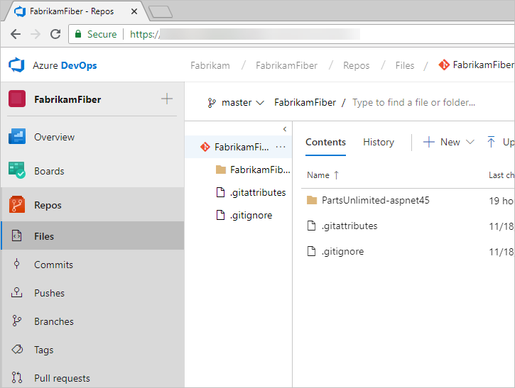

# What is source control in Azure DevOps?

[!INCLUDE [temp](../_shared/version-vsts-tfs-all-versions.md)]

A source control system (also called a *version control* system) allows developers to collaborate on code and track changes made to the code base. Source control is an essential tool for multi-developer projects.  

Our systems support two types of source control: Git (distributed) and Team Foundation Version Control (TFVC). TFVC is a centralized, client-server system. In both Git and TFVC, you can check in files and organize files in folders, branches, and repositories.

You manage your repos, branches, and other code development operations from **Azure Repos**.

With Git, each developer has a copy of the source repository, including all branch and history information, on their dev machine. Each developer works directly with their own local repository. Changes are shared between repositories as a separate step.

Developers can commit each set of changes and perform version control operations, such as history and compare without a network connection. Branches are lightweight. When developers need to switch contexts, they create a private local branch. Developers can quickly switch from one branch to another to pivot among different variations of the code base. Later, developers can merge, publish, or dispose of the branch.

> [!NOTE]
> Git in Visual Studio, Azure DevOps Services, and TFS is standard Git. You can use Visual Studio with third-party Git services. You can also use third-party Git clients with TFS.

With TFVC, developers have only one version of each file on their dev machines. Historical data is maintained only on the server. Branches are path-based and are created on the server.

## Try this next  

Start sharing your code or get your code by using source control.  

> [!div class="nextstepaction"]
> [Code with Git](code-with-git.md)

## Related articles

* [Azure Repos documentation](../repos/index.md)
* [Git repositories documentation](../repos/git/index.md)
