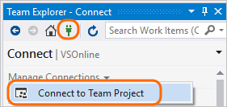
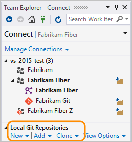
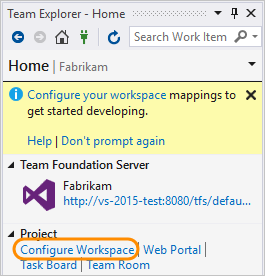

# Navigate in Visual Studio Team Explorer

[!INCLUDE [temp](../_shared/version-vsts-tfs-all-versions.md)]

You use Team Explorer to manage work that is assigned to you, your team, or your projects, and to coordinate your efforts with other team members to develop a project. Team Explorer is a plug-in that installs with Visual Studio or Eclipse. Working from different platforms, developers and stakeholders can effectively collaborate using Team Explorer connected to projects hosted on Azure DevOps Services or on-premises Team Foundation Server (TFS).

>[!TIP]  
>You can access the latest version of Visual Studio clients from the [Visual Studio Downloads page](https://visualstudio.microsoft.com/downloads/). Additional options for connecting to Azure DevOps Services or TFS include:

> - [Team Explorer Everywhere](/../java/download-eclipse-plug-in.md)
> - [Azure DevOps Plugin for Android Studio](/../java/download-android-studio-plug-in.md)  
> - [Azure DevOps Plugin for IntelliJ](/../java/download-intellij-plug-in.md)
> - [Visual Studio Code](/../java/vscode-extension.md)
>For information about compatibility among client and server versions, see [Requirements and compatibility](/tfs/server/requirements).

The operations available to you depend on which source control option-Team Foundation version control (TFVC) or Git-was selected to manage source code when the project was created.

**Team Explorer plug-in for Visual Studio**

Team Explorer connects Visual Studio to projects. You can manage source code, work items, and builds. Or, create a project.

> [!TIP]  
> If you open Visual Studio and the Team Explorer pane doesn't appear, choose the **View/Team Explorer** menu option.

> [!div class="mx-tdBreakAll"]  
> |Home page with Git  |Home page with TFVC  |
> |-------------|----------|
> |||

>[!NOTE]  
>Some pages, such as **Reports** and **Documents**, only appear when an on-premises TFS is configured with the required resources, such as SQL Server Reporting Services and SharePoint.

If you don't need Visual Studio, but do want to connect to Azure DevOps Services or TFS or get one or more Team Foundation add-ins, you can install the free [Visual Studio Community](https://visualstudio.microsoft.com/downloads/download-visual-studio-vs).

**Team Explorer plug-in for Eclipse**

If you work in Eclipse or on a non-Windows platform, you can [install the Team Explorer plug-in for Eclipse](/../java/download-eclipse-plug-in#_install-the-tee-plugin-for-eclipse). Once installed, you can share your Eclipse projects by adding them to Azure DevOps Services or TFS using [Git](../repos/git/share-your-code-in-git-eclipse.md) or [TFVC](../repos/tfvc/share-your-code-in-tfvc-eclipse.md).

> [!div class="mx-tdBreakAll"]  
> |Home page with Git (Eclipse) |Home page with TFVC (Eclipse) |
> |-------------|----------|
> | | |

> [!NOTE]  
> Some pages, such as **Reports** and **Documents**, only appear when TFS is configured with the required resources, such as SQL Server Reporting Services and SharePoint.

## Choose the page to access the task you want

Based on the page you select and the options configured for your project.

### Connect page

From the **Connect** page, you can select the projects you want to connect to and quickly switch context between projects.

> [!div class="mx-tdBreakAll"]  
> |Git: Local Git repo |TFVC: Map workspace |
> |-------------|----------|
> |If you connect to a Git repo, you also can [create, add, or clone repositories](../repos/git/creatingrepo.md).  |If you connect to a TFVC repo, you'll be prompted to [Configure your workspace (TFVC)](../pipelines/build/options.md) on first connect. |

> [!IMPORTANT]  
> From the Visual Studio plug-in, you can [Create a project](../organizations/projects/create-project.md). The ability to create projects is not supported from the Eclipse plug-in. You can, however, create projects from the web portal/collection administration context. 

### Home 

Open [Web portal](../project/navigation/index.md) 
Open [Task Board](../boards/sprints/task-board.md)  

### Source control: Git and TFVC

The Git and TFVC repos support different pages and functions. You'll see one or the other pages depending on the project and repro you connect to. For a comparison of the two repos, see [Choosing the right version control for your project](../repos/tfvc/comparison-git-tfvc.md). 

#### Git

- [Create a new repo](../repos/git/creatingrepo.md)  
- [Clone an existing repo](../repos/git/clone.md)  
- **Changes**: [Save work with commits](../repos/git/commits.md)
- **Branches**: [Create work in branches](../repos/git/branches.md)
- **Pull Requests**: [Review code with pull requests](../repos/git/pullrequest.md)
- **Sync**: [Update code with fetch and pull](../repos/git/pulling.md)

#### TFVC

- [Configure workspace](../repos/tfvc/share-your-code-in-tfvc-vs.md#configure-your-workspace)  
- **My Work**: [Suspend/resume work](../repos/tfvc/suspend-your-work-manage-your-shelvesets.md)  &#124; [Code review](../repos/tfvc/day-life-alm-developer-suspend-work-fix-bug-conduct-code-review.md)
- **Pending Changes**: [Manage pending changes](../repos/tfvc/develop-code-manage-pending-changes.md) &#124; [Find shelvesets](../repos/tfvc/suspend-your-work-manage-your-shelvesets.md) &#124; [Resolve conflicts](../repos/tfvc/resolve-team-foundation-version-control-conflicts.md)
- **Source Control Explorer**: [Add/view files and folders](../repos/tfvc/add-files-server.md)

### Work items

- [Add work items](../boards/backlogs/add-work-items.md)
- [Use the query editor to list and manage queries](../boards/queries/using-queries.md)
- [Organize query folders and set query permissions](../boards/queries/set-query-permissions.md)
- [Open query in Excel](../boards/backlogs/office/bulk-add-modify-work-items-excel.md)
- [Open query in Project](../boards/backlogs/office/create-your-backlog-tasks-using-project.md)
- [Email query results list using Outlook](../boards/queries/share-plans.md)
- [Create reports from query in Excel](../report/excel/create-status-and-trend-excel-reports.md) (TFS only)

### Builds

- [Create build pipelines](../pipelines/tasks/index.md)
- [View and manage builds](../pipelines/overview.md)
- [Manage the build queue](../pipelines/agents/pools-queues.md)

> [!NOTE]  
> If inline images aren't displaying correctly, see [Resolve images that don't display in Team Explorer](#images-missing-te).

::: moniker range=">= tfs-2013 <= tfs-2018"

### Report and Document pages 

The **Report** page opens the [Reporting Services report site](../report/sql-reports/reporting-services-reports.md). This page appears only when your project has been configured with SQL Server Analysis Services and Reporting Services. Also, the option to **Create Report in Microsoft Excel** appears only when reporting has been configured for the project.

From the **Document** page, you can [open project portal](../report/sharepoint-dashboards/share-information-using-the-project-portal.md) and [manage documents and document libraries](../report/sharepoint-dashboards/manage-documents-and-document-libraries.md). This page appears only if your project has been configured with a SharePoint Products portal.
  
If your project is missing one or more pages, you may be able to [add functionality to your on premises TFS deployment](/tfs/server/admin/config-tfs-resources).

::: moniker-end

### Settings page 

From the **Settings** page, you can configure administrative features for either a project or project collection. Configuring features in these areas requires you to be a member of a an administrator group or have the required permissions.

Most of the links open to a web portal administration page. Not all settings are available from the Team Explorer plug-in for Eclipse.

To learn more about settings, see [About team, project, and organizational-level settings](../organizations/settings/about-settings.md).

## Clients that connect to Azure DevOps Services and TFS

In addition to connecting through Team Explorer, you can connect to a project from the following clients:

- [Web portal](../project/navigation/index.md?toc=/azure/devops/user-guide/toc.json&bc=/azure/devops/user-guide/breadcrumb/toc.json)
- [Visual Studio Code](https://code.visualstudio.com/docs)
- [Visual Studio Community](https://visualstudio.microsoft.com/products/visual-studio-community-vs.aspx)
- [Eclipse: Team Explorer Everywhere](/../java/download-eclipse-plug-in.md)
- [Office Excel](../boards/backlogs/office/bulk-add-modify-work-items-excel.md?toc=/azure/devops/boards/backlogs/toc.json&bc=/azure/devops/boards/backlogs/breadcrumb/toc.json)
- [Office Project](../boards/backlogs/office/create-your-backlog-tasks-using-project.md?toc=/azure/devops/boards/backlogs/toc.json&bc=/azure/devops/boards/backlogs/breadcrumb/toc.json)
- [PowerPoint Storyboarding](../boards/backlogs/office/storyboard-your-ideas-using-powerpoint.md?toc=/azure/devops/boards/backlogs/toc.json&bc=/azure/devops/boards/backlogs/breadcrumb/toc.json)
- [Microsoft Test Manager](https://msdn.microsoft.com/library/jj635157.aspx)
- [Microsoft Feedback Client](../project/feedback/give-feedback.md?toc=/azure/devops/project/feedback/toc.json&bc=/azure/devops/project/feedback/breadcrumb/toc.json)

## Related articles

- [Troubleshoot connection](troubleshoot-connection.md?toc=/azure/devops/user-guide/toc.json&bc=/azure/devops/user-guide/breadcrumb/toc.json)  

## Refresh Team Explorer 

If data doesn't appear as expected, the first thing to try is to refresh your client. Refreshing your client updates the local cache with changes that were made in another client or in TFS. To refresh Team Explorer, do one of the following actions:

- To refresh a page that you are currently viewing, choose  **Refresh** icon in the menu bar (or choose the F5 key).
- To refresh the project you currently have selected, choose  **Home**, and then choose  **Refresh** icon (or choose the F5 key).
- To refresh the set of teams defined for the project that you currently have selected, choose the Connect icon, and then choose  **Refresh** icon (or choose the F5 key).

[!INCLUDE [temp](_shared/when-to-refresh-client.md)]

[!INCLUDE [temp](../_shared/images-not-appearing-vs.md)] 

### Additional tools provided with TFS Power Tools 

By installing [TFS Power Tools](https://marketplace.visualstudio.com/items?itemName=TFSPowerToolsTeam.MicrosoftVisualStudioTeamFoundationServer2015Power), you gain access to these additional tools through the Team Explorer plug-in for Visual Studio:

-   Process Template Editor
-   Additional check-in policies for Team Foundation Version Control
-   Team Explorer enhancements including Team Members
-   Team Foundation Power Tool Command Line
-   Test Attachment Cleaner
-   Work Item Templates

Additional requirements may apply.
