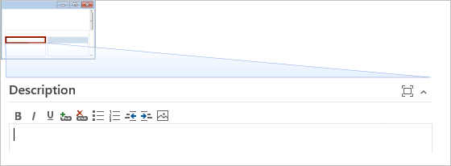

### Rich text format  

To improve the readability of your work items and convey detailed information, you can format text and insert images inline within their description and history fields, or within any field of type HTML. You can use this feature to capture information within a work item that you might previously have attached as a file.

The formatting toolbar appears above each text box that can be formatted. It only becomes active when you click within the text box. 

You can format text in HTML data fields, such as the Description, Accepted Criteria, and History. Available fields depend on the work item type and if you've [customized the process](../../organizations/settings/work/customize-process.md). 

You can format text and insert images inline using the web portal or Team Explorer. The specific set of formatting features differs between the two clients. 

**Rich text formatting toolbar - Web portal**  

   

**Rich text formatting toolbar - Team Explorer**  

For example, using Team Explorer you can choose the font, font size, and text and background colors in addition to applying formats of bold, italics, underline, lists, and hyperlinks that are available with web portal.

You can copy and paste HTML text or an image from another application directly into the text box using Ctrl+C and Ctrl+V shortcuts.

You can also use the following shortcut keys to format your text:
- Bold Ctrl+B  
- Italic Ctrl+I  
- Underline Ctrl+U  
- Hyperlink Ctrl+K  (Team Explorer only)