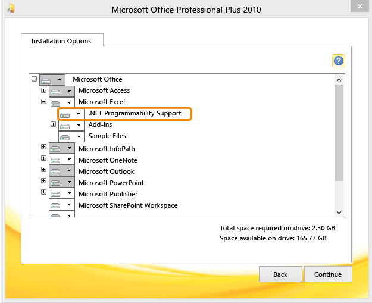

# TF237002: Cannot open the document because Microsoft Excel 2007 or later, or one of its components is not installed

[!INCLUDE [temp](../../../_shared/dev15-version-header.md)]

Error message TF237002 or TF400593 appears when a Team Foundation add-in has been disabled in an Office client, or Office Primary Interop Assemblies are not installed or were damaged after they were installed.  
  
 The **Team** menu or **Team** ribbon appears when you install Visual Studio. You can install Visual Studio Community for free [from the Visual Studio download page](http://www.visualstudio.com/downloads/download-visual-studio-vs).  
  
 If the **Team** menu or **Team** ribbon doesn't appear in your Office client, try re-enabling the Team Foundation add-in. If you continue to have problems, verify that the .NET Programmability Support option is configured correctly. As a final solution, try repairing your Office client.  
  
### To re-enable the Team Foundation Add-in in an Office client  
  
See [How to: Re-enable an Add-in That Has Been Disabled](http://msdn.microsoft.com/library/ms268871.aspx).  
  
> [!TIP]
>  Usually you re-enable an add-in by choosing **COM add-ins**. However, if you don't see it there, choose the **Disabled Items** option.  
  
### To add a missing component in an Office client  
  
1.  See [Install or remove individual Office programs and components](http://office.microsoft.com/access-help/install-or-remove-individual-office-programs-and-components-HA010354261.aspx?CTT=1).  
  
2.  Verify or configure the .NET Programmability Support option to **Run from My Computer**.  
  
     Locate the .NET Programmability Support option under Microsoft Excel or other client in the Office suite.  
  
       
  
### To repair your Office client  
  
-   See [How to use the repair process in the 2007 Office programs](http://support.microsoft.com/kb/924614).