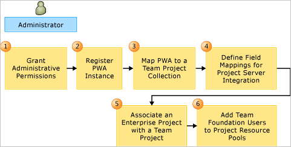
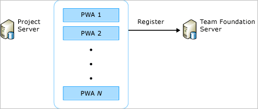
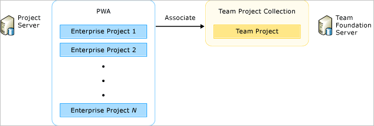

# Configure TFS-Project Server integration

[!INCLUDE [temp](../_shared/tfs-ps-sync-header.md)]

<a name="Top"></a> Before you can synchronize data between Visual Studio Team Foundation Server (TFS) and Microsoft Project Server, you must first configure several points of integration between them.  
  
 As the following illustration shows, you integrate these products in six steps.  
  
   
Configuring the Integration of Team Foundation Server and Project Server  
  
> [!NOTE]
>  To ask a question of the community, see the following forum post on the Microsoft website: [Team Foundation Server and Project Server Integration](http://go.microsoft.com/fwlink/?LinkId=207282).  
  
 **Requirements**  
  
 To perform the procedures in this topic, you must belong to the following groups or have the following permissions:  
  
-   Before you can configure the integration of the two server products, you must install the Team Foundation Server Extensions for Project Server. Before you install the extensions, make sure that all [prerequisite software has been installed and configured](system-and-setup-requirements.md).  
  
-   To grant permissions in Team Foundation: **Team Foundation Administrators** group or your **View instance-level information** and **Edit instance-level information** permissions must be set to **Allow**. You must also have access to the **Team Foundation Administration Console** or the **Group Membership** dialog box for a team project collection by using Team Explorer.  
  
-   To grant permissions in Project Server: **Manage users and groups global permission** for an instance of Project Web Access or Project Web App (PWA). You must also have access to Project Server through PWA.  
  
-   To grant SSP permissions: the **Farm Administrators** group, the administrators group for the Web application that supports Project Server, or the **SharePoint Administration** group. Group membership will depend on the security architecture of your deployment.  
  
-   To use `stsadm.exe`: you must be an administrator on the local computer.  
  
##  <a name="CollectInformation"></a> Collect information  
 The following table summarizes the information that you need to configure synchronization of data in enterprise project plans with team projects.  
  
|Parameter or information|Example|Notes|  
|------------------------------|-------------|-----------|  
|Uniform Resource Locator (URL) for the application-tier server for Team Foundation Server|**http**://*ServerName:Port/VirtualDirectoryName*<br /><br /> If you do not specify a virtual directory, specify the URL in the following format:<br /><br /> **http**://*ServerName:Port*|You register an instance of PWA with a TFS application-tier server with Visual Studio Team Foundation Server 2013 installed. For more information, see [System and setup requirements](system-and-setup-requirements.md).|  
|URL for each instance of PWA that supports an enterprise project plan that contains data to synchronize.|**http**://*PWAServerName/PWA*<br /><br /> To determine the URL for a PWA:<br /><br /> 1.  Open SharePoint Central Administration on the server that hosts the instance.<br />2.  Under **Application Management**, choose **Manage service applications**.<br />3.  On the Service Applications page, choose **Project Server Service Applications**.<br />4.  Choose the URL that corresponds to the instance that you want to access.|You must register each instance of PWA with the application-tier server that hosts the team project collection and team projects that have data that you want to synchronize. Also, you can register an instance of PWA only if Team Foundation Server Extensions for Project Server is installed on the App Tiers for Project Server.|  
|URL for each team project collection that hosts team projects that contain data to synchronize.|**http**://*ServerName:Port/VirtualDirectoryName/CollectionName*<br /><br /> If you do not specify a virtual directory, specify the URL in the following format:<br /><br /> **http**://*ServerName:Port/CollectionName*|You must map each team project collection that hosts team projects that contain data that you want to synchronize with an enterprise project.|  
|Names of the enterprise project plans to synchronize.|MyEnterpriseProject or "My Enterprise Project"|You must associate each enterprise project plan with a team project.|  
|Names of the team projects that contain work items to synchronize with an enterprise project plan.|MyTeamProject or "My Team Project"|You may associate multiple enterprise project plans with the same team project.|  
|Names of the types of work items to synchronize.|You can specify any type of work item that is defined in your team project to synchronize with tasks in the project plan. If you have customized any field that is required to support synchronization, you must customize the field mappings to reflect your changes. For more information, see [Field mapping reference](field-mapping-xml-element-reference.md).<br /><br /> User stories and tasks are most often synchronized in team projects that are based on the process template for agile projects from the Microsoft Solutions Framework (MSF). Requirements and tasks are most often synchronized in team projects that are based on the process template for Capability Maturity Model Integration (CMMI) from MSF.|For each enterprise project plan that you map to a team project, you can specify the types of work items to synchronize. Tasks in Project Server are synchronized with types of work items in Team Foundation.<br /><br /> After you have made your initial configuration, you can change the types that are mapped. For more information, see [Specify work item types](specify-wits-to-synchronize.md).|  
|(Optional) Name of the field in PWA to display the name of the work item type.|pjTaskText10|The default value is pjTaskText30. You can specify a different field to display the name of the work item type.|  
|(Optional) Support for fixed work.|`/noFixedWork` option|When you associate an enterprise project plan with a team project, you can allow or restrict the assignment of **Fixed Work** to tasks in Project Professional that are synchronized to Team Foundation. Fixed work is one of three types of tasks that you can use in Project. For more information, see [Change the task type Project uses to calculate task duration](http://go.microsoft.com/fwlink/?LinkId=203354).|  
|(Optional) Additional fields to synchronize.|For example, you can add fields such a cost center, team name, or health status.|By default, the following seven fields in Team Foundation are synchronized:<br /><br /> 1.  Title<br />2.  Assigned To<br />3.  Completed Work<br />4.  Remaining Work<br />5.  Original Estimate<br />6.  Start Date<br />7.  Finish Date<br /><br /> Only mapped fields are synchronized. To synchronize additional fields, you must customize the field mappings.  For more information, see [Field mapping reference](field-mapping-xml-element-reference.md).|  
|Accounts to grant administrative permissions|Names of administrators who will synchronize data from their plans with data in team projects|You must grant **Administer Project Server integration** permissions to administrators who will use the `TFSAdmin` command-line tool to manage the mappings of enterprise project plans to team projects.|  
|Team Foundation users|User names or security distribution groups|You must add members of team projects who are assigned to tasks in Team Foundation to the enterprise resource pool and to the resource pool of each enterprise project plan. You must also grant these users permission to log on to Project Server.|  
  
###  <a name="DeterminePWAURL"></a>  
  
##  <a name="GrantPermissions"></a> Grant permissions  
 After you have installed the Team Foundation Server Extensions for Project Server, you must grant permissions to service accounts and user accounts.  
  
-   See [Assign permissions](assign-permissions-support-tfs-project-server-integration.md).  
  
##  <a name="RegisteringPWA"></a> Register an instance of PWA  
  
> [!IMPORTANT]
>  If you are integrating Team Foundation Server with Project Server 2010, make sure that you have first installed all cumulative updates and then run the SharePoint Configuration Wizard. If you skip these steps, the integration between Team Foundation Server and Project Server 2010 will fail. For more information, see [Prerequisite software](configuration-quick-reference.md#prerequisites).  
  
 As the first step in configuring integration, you must register each instance of PWA that supports the project plans with the application-tier server that hosts the project collection that hosts the team project. You should register all instances of PWA that are used by enterprise projects that must synchronize their data with TFS. As the following illustration shows, you can register multiple instances of PWA to the same server that is running TFS.  
  
   
  
#### To register an instance of PWA  
  
1.  Open a Command Prompt window where either Visual Studio or Team Explorer is installed and enter:  
  
    ```  
    cd %programfiles%\Microsoft Visual Studio 11.0\Common7\IDE  
    ```  
  
     On a 64-bit edition of Windows, replace **%programfiles%** with **%programfiles(x86)%**.  
  
2.  Enter the following command, and then choose the ENTER key:  
  
    ```  
    TfsAdmin ProjectServer /RegisterPWA /pwa:pwaUrl /tfs:tfsUrl  
    ```  
  
     Replace *pwaUrl* with the URL of the instance of PWA and *tfsUrl* with the URL of the application-tier server.  
  
     Wait until the following messages appear:  
  
     **Registering PWA** *pwaUrl*.  
  
     **You have successfully registered PWA** *pwaUrl*.  
  
3.  Repeat step 2 for each instance of PWA that supports enterprise project plans that you want to synchronize with Team Foundation.  
  
##  <a name="MapCollection"></a> Map a team project collection to an instance of PWA  
 As the second step in configuring integration, you must map each instance of PWA that supports an enterprise project plan. You should map all instances of PWA that are used by enterprise projects that must synchronize data with team projects.  
  
#### To map an instance of PWA to a team project collection  
  
-   At a command prompt, enter the following command, and then choose the ENTER key:  
  
    ```  
    TfsAdmin ProjectServer /MapPWAtoCollection /pwa:pwaUrl /collection:tpcUrl  
    ```  
  
     Replace *pwaUrl* with the URL of the instance of PWA and *tpcUrl* with the URI of the team project collection.  
  
     Wait until the following messages appear:  
  
     **Mapping team project collection** *tpcUrl* **to PWA** *pwaUrl*.  
  
     **You have successfully mapped team project collection** *tpcUrl* **to PWA** *pwaUrl*.  
  
##  <a name="FieldMapping"></a> Map TFS fields to Project Server fields  
 You must map fields for each team project collection that you have mapped to an instance of PWA. You can use the default mappings, or you can customize and upload a mapping file. For more information about the default mappings, see [Field mapping reference](field-mapping-xml-element-reference.md).  
  
 You can define additional fields whose data you want to synchronize. You can add Project fields to data that Team Foundation stores, and you can add Team Foundation fields to data that Project Server stores and displays in an enterprise project plan.  
  
#### To use the default mappings  
  
1.  At a command prompt, enter the following command, and then choose the ENTER key:  
  
    ```  
    TfsAdmin ProjectServer /UploadFieldMappings /collection:tpcUrl /useDefaultFieldMappings  
    ```  
  
     Replace *tpcUrl* with the URL of the team project collection.  
  
2.  Wait until the following messages appear:  
  
     **Uploading field mappings to team project collection** *tpcUrl*.  
  
     **You have uploaded field mappings to team project collection** *tpcUrl*.  
  
3.  Repeat steps 1 and 2 for each collection that you have mapped to an instance of PWA.  
  
#### To customize the mapping  
  
1.  Identify the fields in Project Server and their reference field names to add to the data store in Team Foundation.  
  
2.  Identify the fields in Team Foundation and their reference field names to add to Project Server.  
  
     For more information, see [Index of work item fields](../work-items/guidance/work-item-field.md).  
  
3.  Modify the file that maps fields in Project Server.  
  
     For more information, see [Customize the field mapping](customize-field-mapping-tfs-project-server.md).  
  
4.  (Optional) Add a column to display the fields in the enterprise project plan.  
  
##  <a name="EnterpriseProject"></a> Associate an enterprise project with a team project  
 As the third step in configuring integration, you must map each enterprise project to the team project that contains data that you want to synchronize. As the following illustration shows, you can associate multiple enterprise projects with the same team project.  
  
   
  
#### To associate an enterprise project plan with a team project  
  
1.  At a command prompt, enter the following command, and then choose the ENTER key:  
  
    ```  
    TfsAdmin ProjectServer /MapPlanToTeamProject /collection:tpcUrl /enterpriseProject:EnterpriseProjectName /teamproject:TeamProjectName /workItemTypes:ListOfWorkItemTypes /projectFieldForWorkItemType:ProjectFieldName  
    ```  
  
     Replace *tpcUrl* with the URL of the team project collection, *EnterpriseProjectName* with the name of the enterprise project plan, *TeamProjectName* with the name of the team project, and *ListOfWorkItemTypes* with the names of the types of work items. For example, you can specify the following types of work items to support an agile process as “*User Story,Task* or *“User Story,Task*. Do not include a space after the comma.  
  
     Specify **/nofixedWork** if you want to prohibit fixed task type assignments. You can also specify the **/projectFieldForWorkItemType** argument and the name of a field in Project to store the type of work item.  
  
     Wait until the following messages appear:  
  
     **Mapping enterprise project** *EnterpriseProjectName* **to team project** *TeamProjectName*.  
  
     **You have successfully mapped enterprise project** *EnterpriseProjectName* **to team project** *TeamProjectName*.  
  
2.  Repeat step 1 for each enterprise project that you want to associate with a team project.  
  
 If you mapped your project plan while it was open, you should close and re-open it for the changes to register. When you open the plan, you should verify whether the **Publish to Team Project** and **Work Item Type** (Text30) columns appear. The presence of these fields indicates that the project plan has been mapped to a team project.  
  
> [!NOTE]
>  After you map your enterprise project plan with a team project, you can change the types of work items that are mapped. For more information, see [Specify work item types](specify-wits-to-synchronize.md).  
  
##  <a name="ResourcePool"></a> Add Team Foundation users to the enterprise resource pool  
 To assign and manage Team Foundation users as resources in Project, you must add them to the enterprise resource pool. To make this process easier, you can configure PWA to automatically synchronize the security groups with groups of the same name in Active Directory. Also, you can synchronize users and resources in Project Server with the users in Active Directory across multiple domains and forests.  
  
#### For information about how to add users to the enterprise resource pool, see the following pages on the Microsoft website:  
  
-   **For Project Server 2013**:  
  
    -   [Manage Active Directory Resource Pool synchronization in Project Server 2013](http://go.microsoft.com/fwlink/?LinkId=262115)  
  
    -   [Manage security group synchronization with Active Directory in Project Server 2013](http://go.microsoft.com/fwlink/?LinkId=262113)  
  
    -   [Manage users in Project Server 2013](http://go.microsoft.com/fwlink/?LinkId=262114)  
  
-   **For Project Server 2010**:  
  
    -   [Active Directory Resource Pool Synchronization (Project Server 2010 settings)](http://technet.microsoft.com/library/gg982985.aspx)  
  
    -   [Manage Enterprise Resource Pool synchronization with Active Directory in Project Server 2010](http://go.microsoft.com/fwlink/?LinkId=203359)  
  
    -   [Add resources to the enterprise resource pool](http://go.microsoft.com/fwlink/?LinkId=203356) (Project Server 2010)  
  
## Related notes  
 [Map integration components](map-integration-components.md)   
 [Administer TFS-Project Server integration](administrate-integration-tfs-project-server.md)