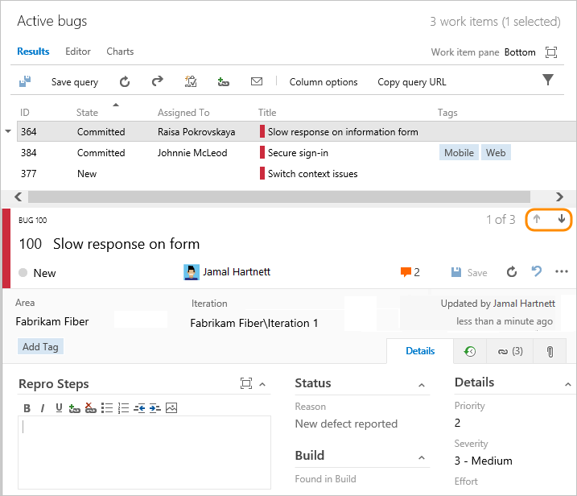
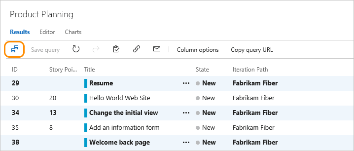

# Triage work items  

[!INCLUDE [temp](../_shared/version-vsts-tfs-all-versions.md)]

Using a work item query you can quickly review and update work items. Oftentimes team use the triage mode for a query to perform the following tasks: 
- Set the priority of a bug or work item 
- Assign a work item to a sprint or team member 
- Add details to the description, acceptance criteria, or repo steps 
- Link related work items 
- Update the status of work items 

In this topic you'll learn how to:

>[!div class="checklist"]      
> * Use triage query mode to update a list of work items   
> * Bulk save work items that you've updated  

[!INCLUDE [temp](../_shared/prerequisites.md)]

## Open Queries 

[!INCLUDE [temp](../_shared/new-agile-hubs-feature.md)] 

[!INCLUDE [temp](../_shared/open-queries.md)] 

::: moniker range="vsts"

The buttons to move up or down within the query results list are outside the work item form. Click Bottom to cycle through the choices for where the work item form appears: Bottom, Right, or Off. 

::: moniker-end

::: moniker range=">= tfs-2013 <= tfs-2018"

The buttons to move up or down within the query results list are inside the work item form. Click Bottom to cycle through the choices for where the work item form appears: Bottom, Right, or Off.

::: moniker-end

 
## Save bulk changes made to work items 

You can update several work items through the triage process, and then do a bulk save when you're finished. Work items shown in bold text indicate that local changes have not yet been saved to the data store.   

::: moniker range="vsts"
Choose **Save items** to save all work items you've modified. 

 

::: moniker-end

::: moniker range=">= tfs-2013 <= tfs-2018"

Choose the  double-save icon to save all work items you've modified.

  

::: moniker-end

## Related articles

- [Manage bugs](../backlogs/manage-bugs.md) 
- [Create a query](using-queries.md) 

