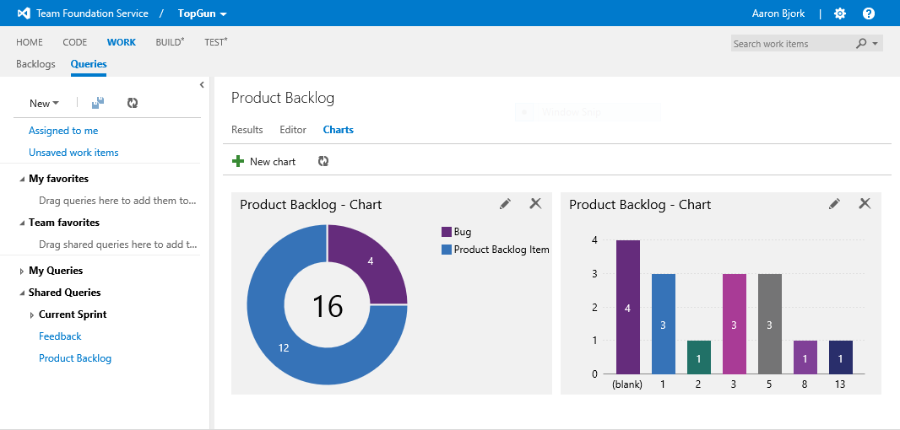
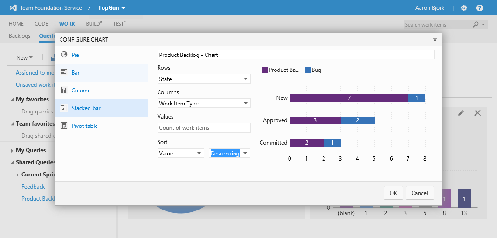
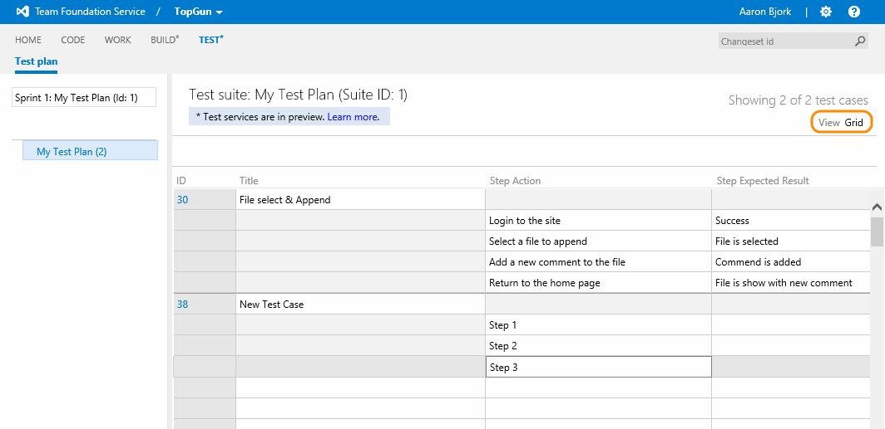
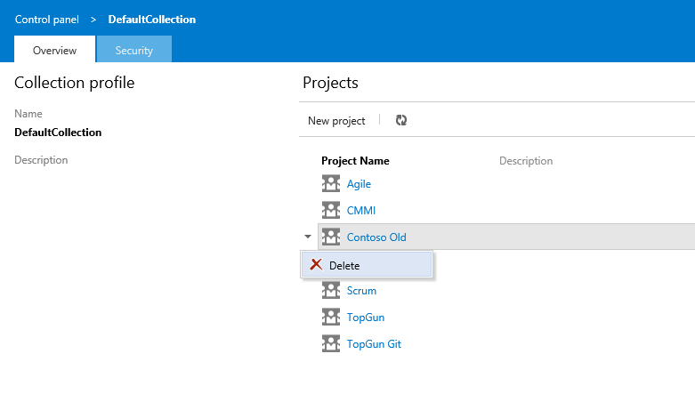
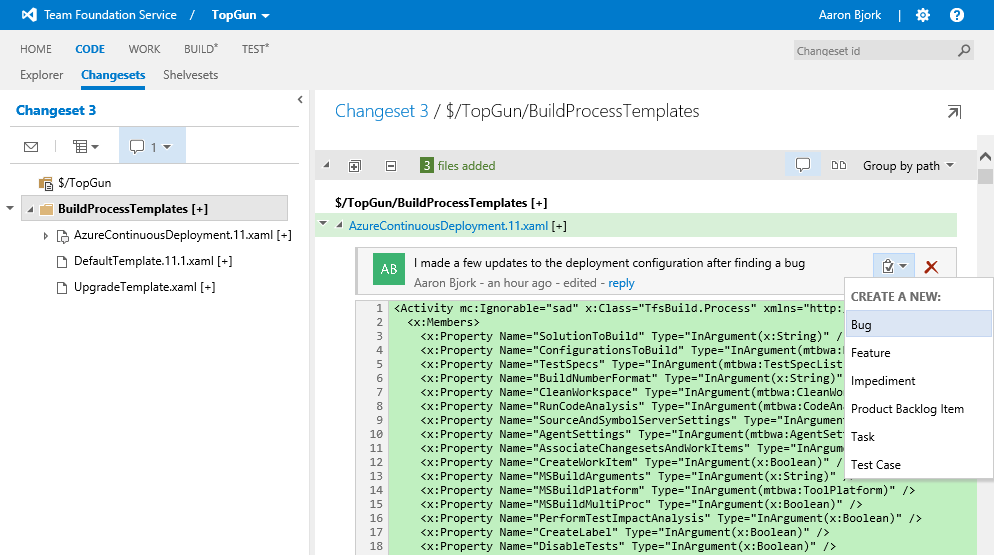

#Team Foundation Service updates - Sep 9

We’ve got lots to share with you in today’s deployment. Buckle up…

##Work Item Charts

Today we turned on a new feature that allows you to create charts from your work item query results. Each query now has a new Charts view. From that view you can create charts based on the data returned by the query.

If you’re familiar with our on-premises reporting the first question you’re probably going to ask is “How often is this data refreshed?” The answer is “instantly”. There’s no warehouse or cube involved in this feature. It’s simply a visualization of the data returned by the query result. Today we have these chart types: pie, bar, column, stacked bar, and a pivot table.

This is an area that is a clear priority for us as we move forward. We’ve known since the service launched that our reporting story needed to start improving. Consider this our first step. There are some clear limitations today including no support for hierarchical or linked queries, no trend charts, and no viewing experience outside of the charts tab.

You can expect us to talk about reporting more and more as we move through the remainder of this year. Stay tuned! Our immediate next steps will be to include trend charts as well as enabling the ability to pin charts to your project & team home pages.

##Bulk Edit of Test Cases

Editing test steps is often a tedious process. To make that task easier we created a new grid style view for fast editing. Simply select the new grid view option on the list of test cases and from a single screen you can bulk add & edit test cases and their test steps. You can also paste directly into and from Excel for easy editing outside the browser. This new view should drastically reduce the number of clicks needed to manage test cases. Let us know what you think.

##Deleting Team Projects

Today’s update brings the ability to delete team projects directly from the administration control panel (no more having to use a command line tool). Navigate to your project administration page and move up a level to the DefaultCollection. From there you can choose to delete the team project from the context menu on the project. **WARNING** – please tread carefully here!! There’s no “undo” with this scenario, so if you’re ready to delete a team project, please make sure you’re REALLY ready to delete it.

##Portfolio Backlog Sorting

If you’ve been using the [new portfolio backlogs](https://www.visualstudio.com/en-us/articles/news/2013/jun-19-team-services), you may have noticed some annoying behavior around sorting when using the Scrum process template. If you pivoted up to view features mapped to backlog items or bugs on your backlog, all the unmapped bugs were sorted to the top of the backlog. That gave a view that didn’t reflect the actual order of the backlog. Argh! I’m happy to report that this has been fixed. As you pivot up or down your backlog, order now always reflects the order of the backlog.

##Work Items from Code Discussion

You can now create work items directly from [code comments](https://www.visualstudio.com/en-us/articles/news/2013/jun-03-team-services). Just click the new work item button on the right side of the comment and you’re off and running. As you would expect, work items created through this experience are automatically linked to the changeset you’re working from.

That’s it for this sprint 53! As always let us know how we're doing on [User Voice](https://visualstudio.uservoice.com/forums/330519-vso), the [MSDN Forums](http://social.msdn.microsoft.com/Forums/en-US/TFService/threads), and [Twitter](http://twitter.com/search?q=%23tfservice).

Thanks,

Aaron Bjork

