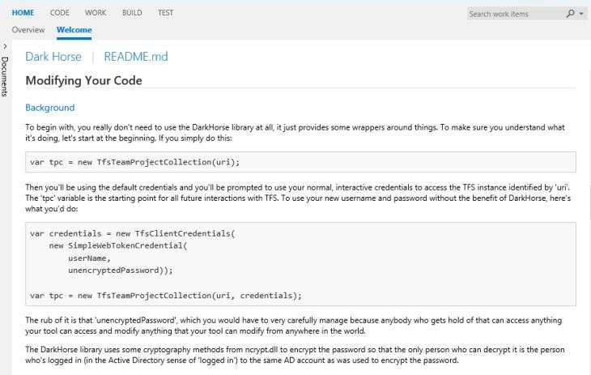

# Project Welcome pages - Aug 18

Following up on last sprint’s support for [using corporate identities with existing accounts](jul-21-team-services.md), we’ve now enabled auto-approval for the preview, enabling anyone to link their existing Visual Studio Online account to Azure Active Directory.

## Project Welcome pages

This sprint, we’re releasing Project Welcome pages. Welcome pages enable you to easily provide documentation for project visitors and participants about what the project is, how to participate, who to contact, other resources, and so on. Welcome pages are simple. They are just markdown files checked into the root of your Team Foundation Version Control project tree (for example, $/Dark Horse/README.md) or into the root of any Git repo in your project. The default welcome page will be “README.md”, but you can have as many as you like covering different aspects of your project and they will appear in a panel to the left of the welcome page. Here’s an example from one of our projects.

We are using GitHub Flavored Markdown (GFM) as implemented in the [Marked](https://github.com/chjj/marked) library by Chris Jeffrey. It’s really easy to write and quite flexible. If you want to learn more about how to use project welcome pages, check out [Martin’s blog post](https://aka.ms/ProjectHomepage) for more details.

  
  
## Tagging support in the Test Hub

We’ve now enabled support for tags on test cases in the Test Hub. You can see the tags in the test list and easily filter down to the test cases you are most interested in. It’s another nice usability improvement for test case management.

  
## Lots of little things

There are lots of other nice little improvements—bug fixes, performance improvements, usability improvements, and more. One that’s worth giving a minor mention to is that we are working on improving the experience of managing hierarchical backlogs. This sprint we added the ability to assign work to iterations by dragging the work item and dropping it on the iteration. We’ll have more improvements in this area next sprint.

Enjoy!

Thanks,

Brian Harry
