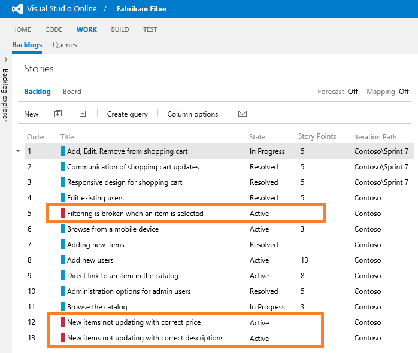
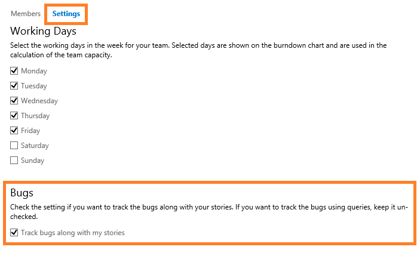
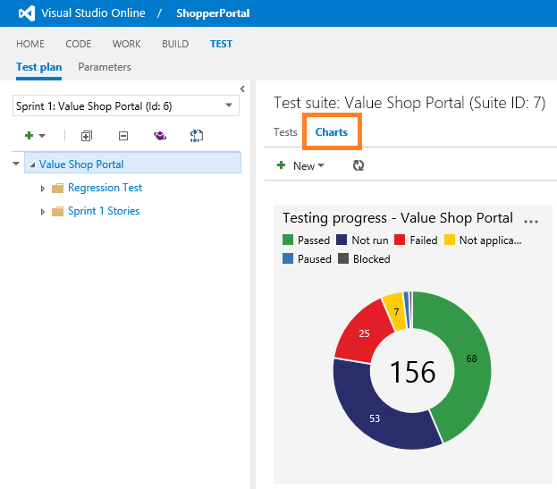
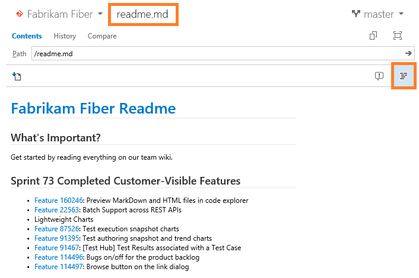
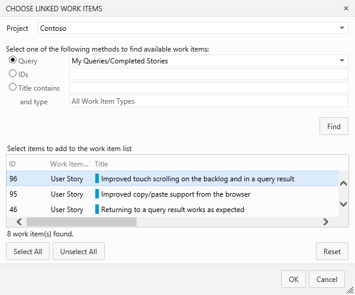
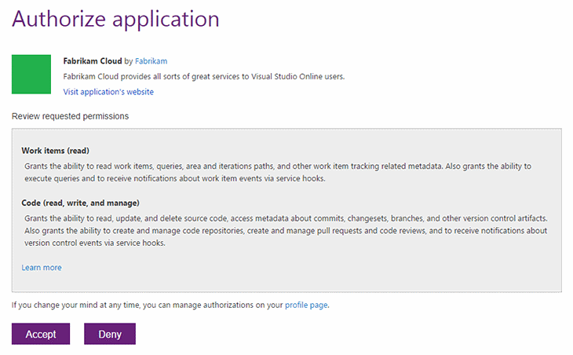

# Turn bugs on/off on your backlog – Nov 4

Lots to cover this sprint, so let’s jump right in…

## Bugs on the backlog

This one has been a long time coming, but you can now configure (per team) whether or not you want bugs to appear on your backlog. This setting was previously available through process template configuration (XML files) and only supported on-premises at the Team Project level. Today’s update brings this ability to **all** team projects and **all** teams regardless of process. If bugs are turned on, they’ll show up in your backlog alongside your User Stories, PBIs, and Requirements where they can be prioritized and assigned to sprints for decomposition.

Click the admin gear icon and navigate to the settings view for each team in your project to toggle bugs on or off. 

In future updates you can expect more configurations like these, including configuring how bugs appear on your sprint taskboards. Stay tuned.

## Test execution charts

We’ve extended our charting capability to include test artifacts in the Test hub. Each test plan now includes a prepackaged chart showing the progress of all tests in the plan, and of course you can create as many snapshot and trend charts as necessary to monitor and track your test authoring activity. Like all charts, test charts can be pinned to your team and project home pages for visibility and sharing. And in case you’re wondering, yes: even Stakeholders can view test charts pinned to the home page. We’ve got a detailed walkthrough in our [Get Started](/azure/devops/manual-test/getting-started/track-test-status?view=azure-devops) section where you can learn more.

## Recent test results

When a test fails, it’s usually helpful to understand when it last passed, and possibly, on what configuration. With the **Recent test results** pane, you can browse the most recent test results associated with a test case for all configurations, across all test suites and test plans. Toggle on the **Test details** pane and pick **Test results** as your view.

## Preview Markdown and HTML files in Code Explorer

When browsing Markdown files or HTML files in source control, it's often useful to see the rendered contents of those files rather than the raw source code. In this sprint we added the ability to show a preview of those files directly from the **Code Explorer**. Simply browse to any \*.md file and the contents will be rendered as Markdown; or browse to any \*.htm or \*.html file to see a preview of the file. If you want to see the raw source code, you still can. Simply click on the new **Show raw content** button on the right of the toolbar.

## Browse link dialog

We’ve added a new dialog to all work item forms to aid in creating link relationships between existing work items. Prior to this change, you were forced to know the ID of the item you wanted to link to. Now you can select a query to browse, specify the ID(s), or search by title across the work item domain.

## REST batch support

The new batch endpoint for [REST APIs](/azure/devops/integrate/) lets you create and update multiple work items in a single call. For example, you can now change the states of a large number of work items or even create multiple work items and link them together, all in a single call.

## Third-party OAuth scopes

We’ve enhanced our third-party authorization support by adding new OAuth scope options. OAuth is an industry standard approach for authorizing third-party apps and services to access resources on a user’s behalf. Scopes control which resources and operations a third-party app or service has access to. Until now, Visual Studio Online supported just a single scope. This scope granted full read and write access to all resources and operations available via our REST APIs; this was overkill for many scenarios. We now offer 12 scopes. Each scope represents a logical bucket of capability. For example, **Work items (read)** provides read-only access to the work items and queries that the user has access to. Developers pick the scope(s) their app requires when they register their app with Visual Studio Online. These scopes are then presented to the user when authorization to that app is requested.

To learn more about Visual Studio Online authorization for third-party apps and services, see [Authorize access with OAuth 2.0](/azure/devops/integrate/get-started/authentication/oauth?view=azure-devops).

That’s it for Sprint 73.

Thanks,

Aaron Bjork
