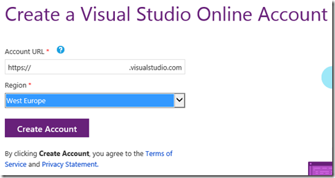

# European Datacenter & REST 1.0 - Oct 28

## European Datacenter

By popular demand, with today’s update, you can now create VS Online accounts in the Azure “West Europe” region, based in the Netherlands. You can get started by going to [https://visualstudio.com](https://visualstudio.com/) and creating a new account. The account creation page will auto detect the data center that’s nearest to you, or you can click the “change options” link to override the choice.

When you locate an account in a region, all of the “account data” is limited to that region and does not leave. There is some data that is not limited to the region: our directory of accounts, user directory information, and some diagnostic and operational data are examples of things that are “global data” and not restricted only to the selected region. However, your source, work items, builds, and other data all will only exist in the selected region. There is currently no way to move an existing account from one region to another. Enabling this is the next thing on our list, but is likely to take a few months.

Application Insights, which is still in preview, is not available in Europe, but will be by the time it officially releases.

We plan to add additional regions around the world, but have not finalized the roadmap. Feel free to use [http://visualstudio.uservoice.com](http://visualstudio.uservoice.com/) to tell us where the next region should be.

## Visual Studio Online REST API version 1.0 is here

In May, we announced the public preview of a new set of REST APIs for Visual Studio Online. Today, we are happy to announce that these APIs have graduated to 1.0 release status. This marks an important milestone in our journey to support easier integration between Visual Studio Online and other services, including your own custom tools and services.

The 1.0 designation means we have locked these APIs from any breaking changes going forward. As a developer, this means you can bind your app to the 1.0 API version and sleep well at night knowing future Visual Studio Online deployments won’t break your app.

Although the 1.0 set is locked from a breaking change standpoint, it is not locked from a feature standpoint. New APIs can be added to the 1.0 set and nonbreaking enhancements may even be introduced to APIs already released. A few existing preview APIs (like Git Pull Requests) remain in preview today, but will eventually graduate into the 1.0 set (this is mainly due to significant changes coming soon).

To learn more about how to use the APIs, check out [Get started with the REST APIs](/rest/api/vsts/?view=vsts-rest-4.1).

To explore the available APIs, see the [Visual Studio Online REST API Reference](/azure/devops/integrate/).

**Developers with existing apps using the 1.0 preview APIs:** you should start migrating to the release 1.0 APIs as soon as possible. Graduated preview APIs (any API in the 1.0 set) are subject to stop working in 12 weeks from today. To learn more about versioning and migrating, see the [versioning and migration](/rest/api/vsts/?view=vsts-rest-4.1) page.

## Service hooks is out of preview

I am also happy to announce that the service hooks features is out of preview and is a fully supported feature of Visual Studio Online. Service hooks let your app or service get notified instantly when an event happens in Visual Studio Online. With service hooks your app or service can avoid continuously polling to check for changes, such as completed builds, commits or check-ins, or work item changes.

Visual Studio Online supports 14 services out of the box, including Trello, UserVoice, HipChat, AppVeyor, MyGet, Flowdock, Zendesk, Kato, Zapier, Campfire, Azure, and more. You can also use service hooks with your own custom solutions, enabling your solutions to react efficiently when events happen in your Visual Studio Online projects.

To learn more about service hooks and the services with which you can integrate out of the box, visit [Integrate with other services](/azure/devops/service-hooks/index?view=azure-devops).

Keep all the great feedback coming on [Twitter](https://twitter.com/VisualStudio) and [UserVoice](http://visualstudio.uservoice.com/forums/330519-vso).

Thanks,

Jamie Cool