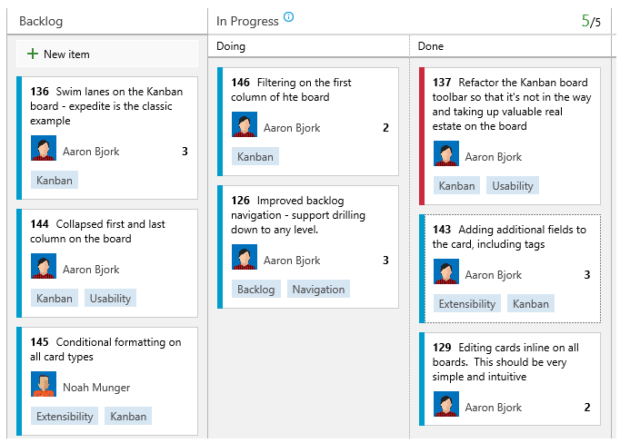
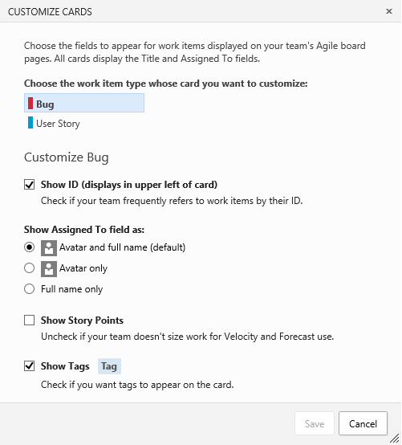
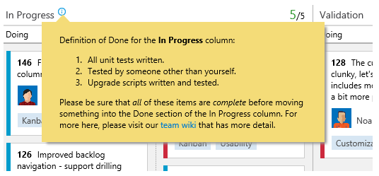
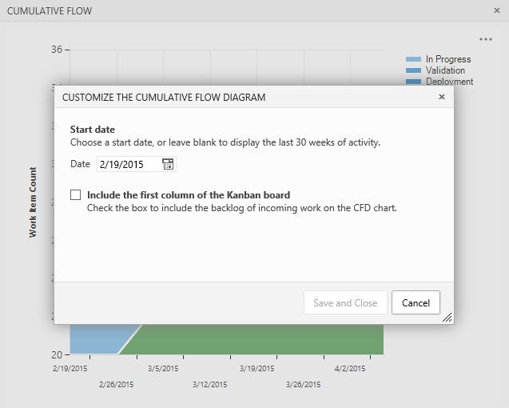
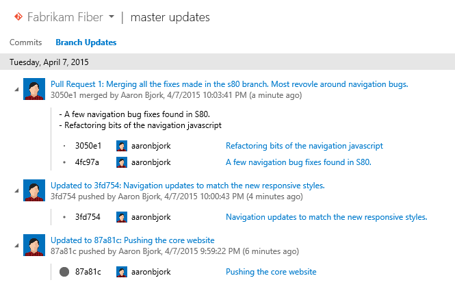

# Card configuration options – Apr 10

## Configure cards

The first thing I’ll highlight is that you now have configuration options for the data showing up on your cards—for both the Kanban board and the Taskboard. The picture below shows the new dialog for customizing how cards look on your Kanban board. You can turn the ID on or off, select how the assigned to field is displayed, and choose to show tags directly on your cards. These options are per team (or backlog) and per work item so that you have maximum flexibility. With regards to customizing cards, this is just the beginning of a bunch of work we have planned in this area. Stay tuned.

**Note:** The option to show tags on your cards is only available on Kanban boards. We'll be turning this feature on for Taskboards in our next deployment.

## Markdown editing for definition of done

Last sprint we turned on a feature called Definition of Done giving you the ability to specify a shared definition of done for each column on your board. This sprint we’ve added [Markdown](http://daringfireball.net/projects/markdown/syntax) support to give you a great experience for formatted text (bullets, numbering, links, etc.) in your definitions.

## CFD options

If you’re familiar with the cumulative flow diagram (CFD) that shows up above your backlogs and Kanban boards, you’re probably aware that the light grey area representing new items on your backlog often dwarfs other information on this chart. We’ve introduced a new option to turn off this series on the CFD, making the chart much more usable and useful. Open the CFD chart and click the gear in the top right to access the options available.

## Web history view for Git projects

This sprint we also made a change to the code history hub by introducing a new view: **Branch Updates**. This view (only available for Git projects) shows all updates for a given branch, grouping commits by push and pull request activity. This view provides developers new insight into how their Git repo is being updated over time, and provides traceability from history to pull requests.

## Cloud load testing support for 100 cores

Finally, we enabled last week [support for up to 100 cores](http://blogs.msdn.com/b/visualstudioalm/archive/2015/03/23/announcing-100-core-support-for-vso-cloud-load-testing-and-more.aspx) (from the earlier limit of 20 cores) for the Cloud Load Testing service. This means that customers can now simulate five times the user load they were able to simulate earlier.

If you have questions, feel free to reach out on [Twitter](https://twitter.com/AzureDevOps). And if you’ve got ideas on what you’d like to see prioritized, head over to UserVoice to add either an idea or your support to an existing idea.

Thanks,

Aaron Bjork

