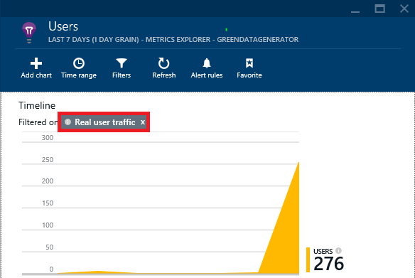
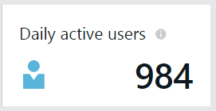

#Application Insights – Synthetic Data Filtering, New Usage Experience for ASP.NET, and Daily Active User Calculations – Apr 22

##Synthetic data is filtered out of request metrics

Search robots or web tests that monitor availability generate some of the traffic received by your web app. This synthetic traffic might invalidate various metrics in Application Insights so that it does not accurately reflect the numbers of real users and the performance they experience.

Beginning from this release Application Insights differentiates telemetry collected from real end-users from telemetry originated by various synthetic sources. By using filtering and grouping in Diagnostic Search and Metrics Explorer, you can now choose to see data only from real end-users, only from synthetic traffic, or both:

You’ll now see these labels:

- In Overview: ‘Usage analytics (excluding synthetic traffic)’
- In Usage analytics: ‘(Excluding synthetic traffic)’
- In drill-in experiences, the filter is turned on by default:

##New Usage experience for ASP.NET, Java and other applications

The ASP.NET Overview Lens in the Applications Insights portal has a new and improved look – this helps you get a 360 view of the state of your application without scrolling.

Usage content and drill-in experiences are designed to support two main scenarios:

1. Daily review of activity, adoption and interaction.

The four controls under Usage analytics show counts over 24 hours, and the trend in comparison to the previous 24 hours. Clicking these controls provides more detail:

2. Deeper analysis of activity and trends over a longer time period (7 days default). From the Overview blade, click Usage:

	This takes you to the Usage analytics blade, which answers questions about adoption, engagement, interaction and environment.

##Usage Reports Calculation for Daily Active Users

A new calculation for Daily Active Users (DAU) has been added to the usage reports. DAU presents the average number of the daily active users over the time period you have set. The calculation uses data from complete days only.

##Feedback please!

That’s a wrap for Sprint 81. Next update immediately after [Build 2015](http://www.buildwindows.com/). If you want to let us know how we are doing, please submit bugs questions and issues to [Forums](https://social.msdn.microsoft.com/Forums/vstudio/en-US/home?forum=ApplicationInsights), bugs to [Connect](http://connect.microsoft.com/VisualStudio) (select Application Insights), and suggestions to [User Voice](http://visualstudio.uservoice.com/forums/121579-visual-studio/category/77108-application-insights).

Thanks,

David Lubash

