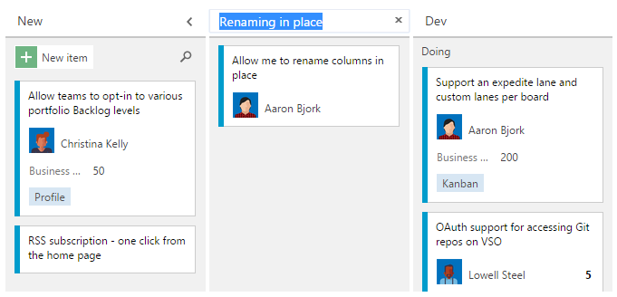
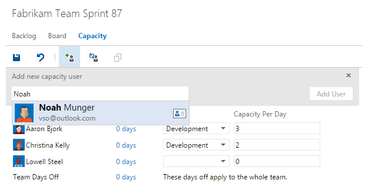
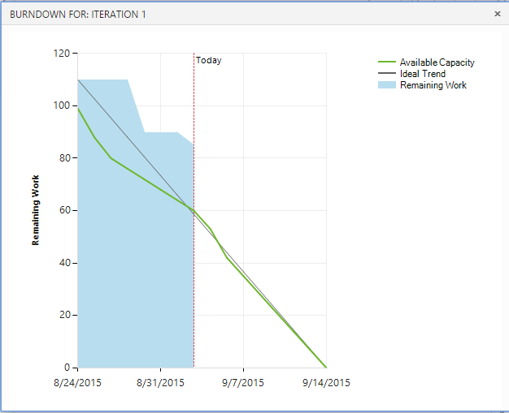
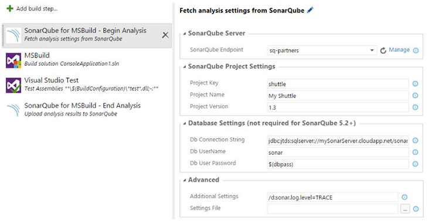

# Sprint planning improvements and SonarQube analysis build tasks – Aug 26

**Renaming columns in place

You can now rename columns on your Kanban board in place, without having to jump into the configuration dialog. Over time, we’ll be adding more functionality inline, including adding, deleting, and reordering columns.

## Choosing users for capacity planning

This sprint we tweaked the capacity planning experience to give you complete control over who participates. You now have two new buttons on the toolbar that allow you to add any member to your sprint plan (including those outside your team), as well as adding any missing team members. As you can see in the screenshot below, I’m searching for Noah and adding him directly into my plan for Sprint 87.

## Burndown with available capacity

The burndown chart now has a line showing available capacity during a sprint, in addition to the existing ideal trend line. This view provides you and your team with a better idea of whether you're on track to finish all your work during the sprint. This line is built on the capacity data described above, including individual and team days off. We’ve marked the suggestion on UserVoice as completed.

## SonarQube analysis build tasks

Finally, you can now execute a SonarQube analysis in conjunction with MSBuild. Before your build steps that execute the actual MsBuild, insert a **SonarQube for MSBuild - Begin Analysis** task to specify the SonarQube project parameters, the connection to the SonarQube server, and (until SonarQube 5.2 ships) the connection to the SonarQube database. After the build and any test tasks, simply append a **SonarQube for MSBuild - End Analysis** task to complete the analysis and send the data off to SonarQube. You can learn more about SonarQube analysis in this [blog post](https://devblogs.microsoft.com/devops/build-tasks-for-sonarqube-analysis/).

That’s a wrap for our deployment this week. As always, please reach out on [Twitter](https://twitter.com/AzureDevOps). If you have ideas on what you’d like to see us do next, head over to [Azure DevOps Developer Community](https://developercommunity.visualstudio.com/spaces/21/index.html) to add your idea or vote for an existing one.

Thanks,

Aaron Bjork
