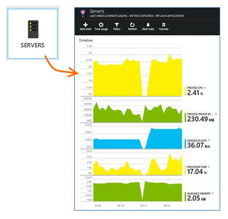
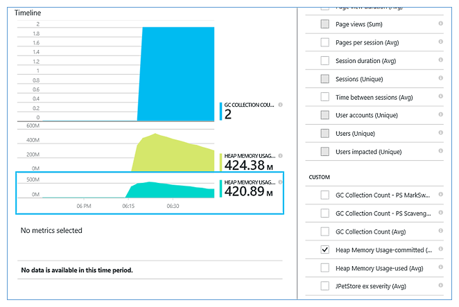
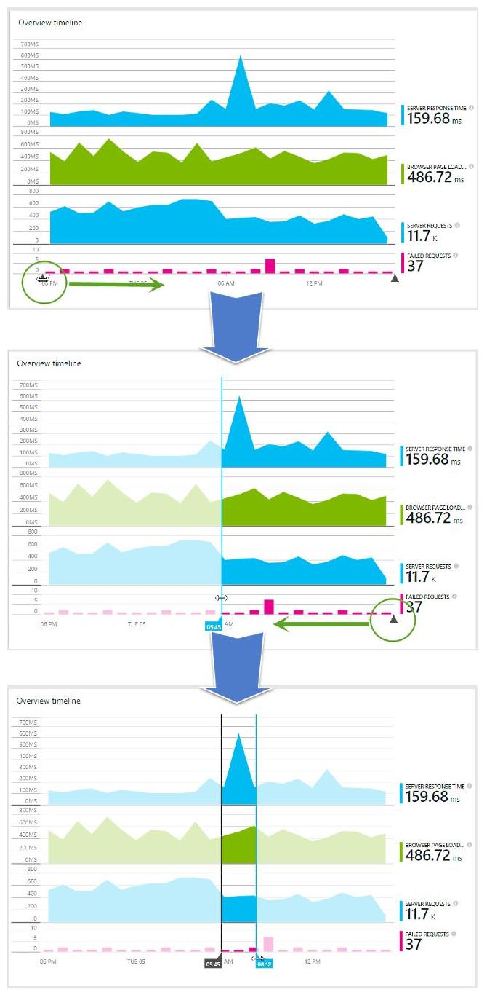

# Application Insights: Public Preview; iOS and Android; performance counters and unhandled exceptions for Java apps; and time range selection

Application Insights is now in Public Preview, and what a journey it has been getting here. [Public Preview was announced](https://azure.microsoft.com/blog/2015/04/29/announcing-application-insights-public-preview-2/) at //Build/, along with our [Pricing Plans](https://azure.microsoft.com/pricing/details/application-insights/).

During the last sprint we wrapped up some features, while preparing for conference season and the announcement of Public Preview. The new release of Visual Studio 2015 RC has some improvements in how we integrate with the NuGet package manager. It supports additional project types, including Windows 10.

## iOS and Android support

Our [iOS](https://azure.microsoft.com/documentation/articles/app-insights-ios/) and [Android](https://azure.microsoft.com/documentation/articles/app-insights-android/) SDKs are now released, together with supporting overview pages in the portal. They provide usage insights and crash diagnostics, thanks to the powerful capabilities we are integrating from [HockeyApp](http://blogs.msdn.com/b/somasegar/archive/2014/12/11/microsoft-acquires-hockeyapp-leading-mobile-crash-analytics-and-beta-distribution-service-for-ios-android-and-windows-phone.aspx).

## Performance counters for Java applications

The latest release of the SDK for Java (version 0.9.3) collects performance counters and unhandled exceptions.

From the Overview blade, click Servers to see performance counters.

If you want to see other performance counters, you can edit the Application Insights configuration file and choose from any counters exposed by the JMV or Windows. The information about these performance counters will be visible as custom metrics in Metric Explorer.

## Unhandled exceptions in Java apps

Unhandled exceptions are displayed in the same way as custom exceptions. To see them, click Failures on the Overview blade.

## Drag-across to select a time range

You can now drag to select a specific time range within a chart on the ASP.NET overview blade. Grab the small triangles near the x-axis:

A zoomed-in view of this region appears in a child Metrics Explorer blade.

## That's Sprint 82

Wrapping up Sprint 82 was exciting as it aligned with some major announcements, and our continued integration with Visual Studio 2015 RC, which released during the same week.

We are very interested in hearing about how we are doing, so please submit questions and issues to [Forums](https://social.msdn.microsoft.com/Forums/vstudio/home?forum=ApplicationInsights), bugs to [Connect](http://connect.microsoft.com/VisualStudio) (select Application Insights), and suggestions to [User Voice](http://visualstudio.uservoice.com/forums/121579-visual-studio/category/77108-application-insights).

Thanks,

David Lubash