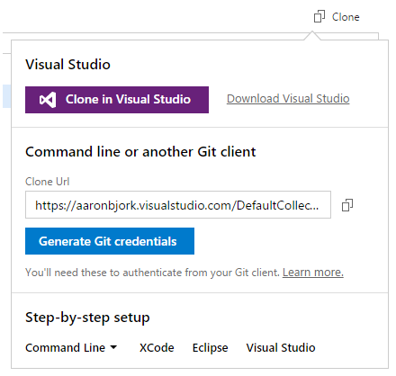
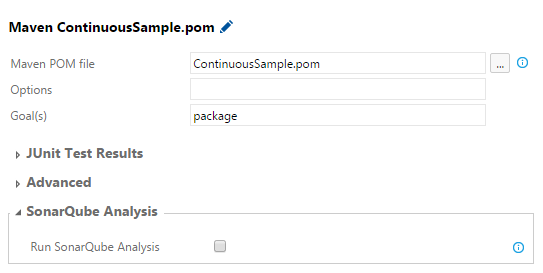
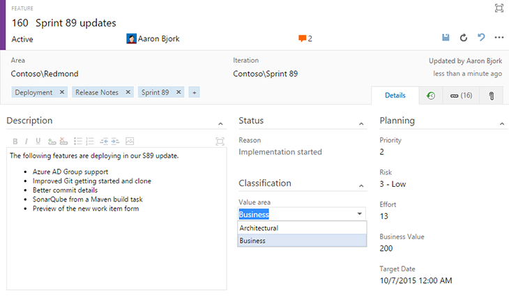

# AAD Group Support – Oct 8

## Azure Active Directory Group support

I’m excited to announce that we now have support for [Azure Active Directory](https://azure.microsoft.com/services/active-directory/) (Azure AD) Groups across Visual Studio Online, giving you an easier way to control who can access your team's resources and business assets. If you already use Microsoft services like Office 365 or Azure AD, you can use the same identities now with your VSO account. Azure AD [works with your VSO account](https://visualstudio.microsoft.com/get-started/setup/manage-organization-access-for-your-account-vs) to control access and authenticate users through your organization's directory.

When you use [Azure AD groups](https://azure.microsoft.com/documentation/articles/active-directory-manage-groups) to organize directory members, you can reuse those groups to manage permissions in bulk for your VSO account. Just add the Azure AD group to the VSO group that you want, for example, built-in VSO groups like Project Collection Administrators or Contributors, or manually-created VSO groups like your project management team. Azure AD group members will inherit the same permissions from that VSO group, so you don't have to manage VSO group members one at a time. When you add an Azure AD group to a VSO group, we will also auto-assign the best available license when a member of that Azure AD group logs into the VSO account. You can learn more about adding Azure AD groups in VSO under [Manage account access with Azure AD groups](https://visualstudio.microsoft.com/get-started/setup/manage-organization-access-for-your-account-vs).

## Starting with Git, made easy

We made a set of changes this sprint to make it easier for you to get started with an empty Git repository, or to clone an existing repo. From the clone command you’ll now see a menu with a bunch of helpful information and actions including creating credentials, cloning in Visual Studio, the full repo URL, and step-by-step instructions for various clients. You’ll also see a similar experience when creating a brand new repo. We’re keen on making it easy to get started here, so let us know if we got it right.

## Improved commit details

The commit details summary experience has been improved to show the commit message at the top with the extended message below it. It also defaults to showing a diff with parent 1, which works well with the new pull request experience that always creates a merge commit.

## SonarQube analysis from a Maven build task

With this week’s deployment you now can perform a SonarQube analysis simply by checking a new option provided on Maven build tasks.

## PREVIEW: New Work Item form

And finally, we’ve turned on a preview of our new work item experience that we’d like you to try out. The new form doesn’t just bring a new look and feel, but is one of the key building blocks toward:

- Work item customization, including states, fields, and types
- A rich work item discussion experience
- Improved code and build integration

Over the next few weeks we’ll be blogging about more of the upcoming changes; in the meantime we’d love to hear from you about your initial reaction to the new form. Know that we’ve already heard from early adopters that data density needs to be improved, so look for that to come very soon. As you’re evaluating for yourself, you can switch back and forth to the old form by clicking the ellipsis (…) in the command bar.

Please reach out on [Twitter]((https://twitter.com/AzureDevOps)  if you have thoughts, comments, or questions about anything described here. And please help us prioritize by heading over to [Azure DevOps Developer Community](https://developercommunity.visualstudio.com/spaces/21/index.html) to add your idea or vote for an existing one.

Thanks,

Aaron Bjork
