# New Release Definition Editor and improved pull request workflows – July 14

Last sprint we talked about the continuing refresh of our web experience.  The big thing we’re excited about this sprint is the new __Release Definition Editor__ going into preview.  It is based off the new CI editor we released not long ago, and it’s a good example of the overall direction that we are going.  It’s not just a cleaner experience, it is structurally different in that it lets you visualize your release process.  It lets you work with Release in the way you think about your system.  We are going to be bringing this same approach to the runtime views as well so that you can visualize a release as it progresses.  Unlocking all of your data with richer, easier to consume visualizations is something we are trying to do across the product. Read more about the new [__Release Definition Editor__ preview](#new-release-definition-editor-preview) below.

And of course, there are lots of other improvements across the product this sprint.  Let’s jump in!

## Work
### Migrate team projects between two inherited processes with the same parent
We have improved the experience to migrate your team projects between processes within the same system process. If you previously wanted to let a team project use __MyScrum B__ instead of __MyScrum A__, you had to move the team project to the __Scrum__ system process first. Not only was that causing confusion, it was not possible to do this when your inherited process included a custom work item type. In the improved experience, we will allow you to change the process of a team project as long as they have the same custom work item types. 

Many customers have asked us how to prepare and test changes of a process without affecting existing customers. This feature is a critical piece of that experience. With the next deployment, we will allow you to create a copy of an inherited process. Once that is done, you can create a copy of a process, make modifications to the copied process. Then create a temporary team project based on the modified process to test your changes. Once you have validated the changes, you can change the process of the production team projects.

### Filtering on Backlogs, Sprints, and Queries
All of our existing work item tracking grid experiences (queries, backlogs, sprints backlogs, and test case management) now make use of our common, consistent filtering component. Beyond applying a keyword filter across displayed columns and selecting tags, with this new component, you can also filter on work item types, states, and assigned to in order quickly to get to the work items you are looking for. Here’s a sneak peek:

Over the next couple of sprints, we will be bringing this same filtering experience into our Kanban board, our task board, and our Delivery Plans extension so stay tuned!

### Expand to show empty fields on a Kanban card
Today, you have the option to add additional fields to a card and then __hide empty fields__ in board settings to remove unnecessary clutter from the board. The drawback to this feature was that once an empty field was hidden, the only way to update the field was to open the work item form. With the newly available expand option on Kanban cards, you can now benefit from hiding empty fields across the board, but still have single click access to update a particular field on a card. Simply hover over the card and look for the down chevron at the bottom of the card to update the hidden field. 

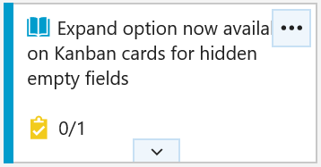

Click the down chevron at the bottom of the card to update the field.

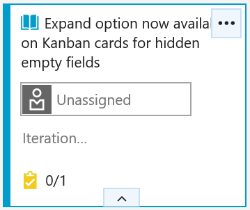

## Code
### Automatically complete work items when completing pull requests
If you’re linking work items to your PRs, keeping everything up to date just got simpler. Now, when you complete a PR, you’ll have the option to automatically complete the linked work items after the PR has been merged successfully. If you’re using policies and set PRs to auto-complete, you’ll see the same option. No more remembering to revisit work items to update the state once the PR has completed - VSTS will do it for you.  

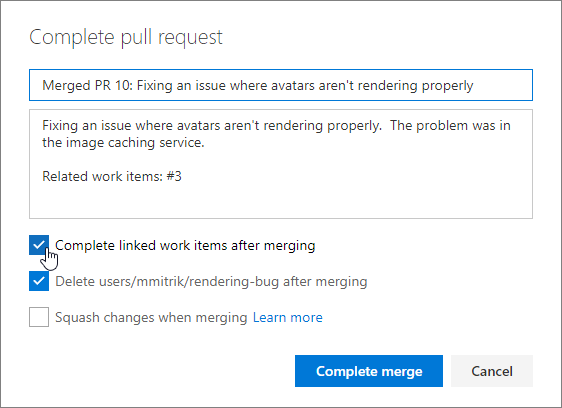

### Policies: Reset votes on push/new iteration
Teams opting for a more strict approval workflow in PRs can now opt-in to a new feature - the ability to reset votes when new changes are pushed. The new setting is an option under the policy to __Require a minimum number of reviewers__.

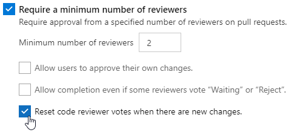

When set, this option will cause all votes from all reviewers to be reset any time the source branch of the PR is updated. The PR timeline will record an entry any time the votes are reset as a result of this option.

### Notifications: Great email templates for pull request workflows
Pull request email alerts have been refreshed to make them clear, concise, and actionable. The subject line will begin with the PR title and secondary information, like the repo name, and ID will be deferred to the end.  The name of the author has been added to the subject to make it simpler to apply rules and filters based on the person that’s created the PR.  

The body of the alert emails has a refreshed template that first summarizes why the alert was sent, followed by the critical metadata (title, branch names, and description), and a main call-to-action button. Additional details like the reviewers, files, and commits are included further down the email.

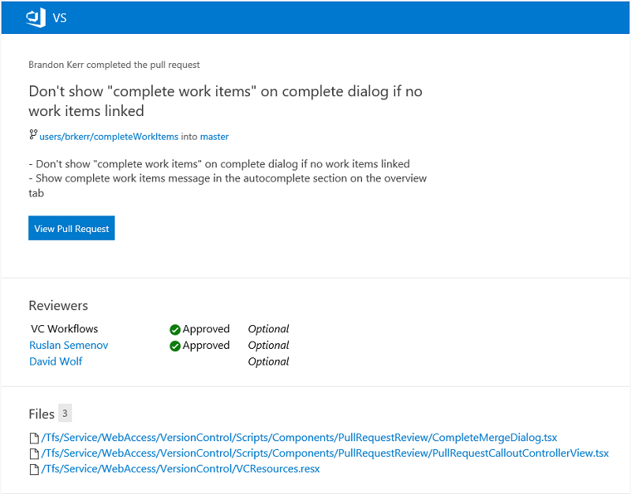

For most alerts, the call-to-action will be to view the pull request in the web. However, when you’re notified about a specific comment, the call-to-action will __link directly to that comment__ so you can easily find the code and prior conversation for context.  

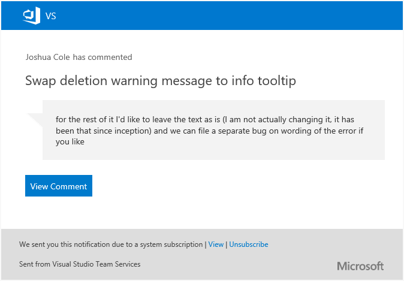

### Pull request details: View original diff for code comments
Sometimes, it’s hard to make sense out of a PR comment after the code it’s referencing has changed (many times, when a requested change has been made).  

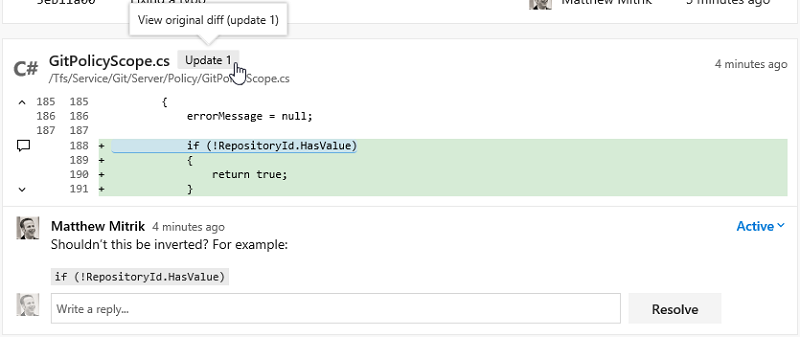

When this happens, you’ll now see a badge with an update number that you can click to see what the code looked like at the time the comment was originally created.  

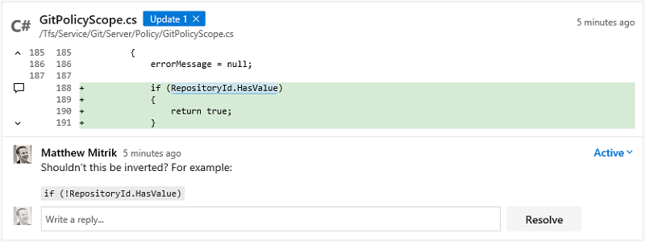

### Task lists in pull request descriptions and comments
When preparing a PR or commenting you sometimes have a short list of things that you want to track but then end up editing the text or adding multiple comments. Lightweight task lists are a great way to track progress on a list of todos as either a PR creator or reviewer in the description or a single, consolidated comment. Click on the Markdown toolbar to get started or apply the format to selected text.

Once you’ve added a task list, you can simply check the boxes to mark items as completed. These are expressed and stored within the comment as `[ ]` and `[x]` in Markdown. See [Markdown guidance](https://visualstudio.microsoft.com/docs/reference/markdown-guidance#checklist-or-task-list) for more information.

### Ability to “Like” comments in pull requests
Show your support for a PR comment with a single click on the __like__ button. You can see the list of all people that liked the comment by hovering over the button.  

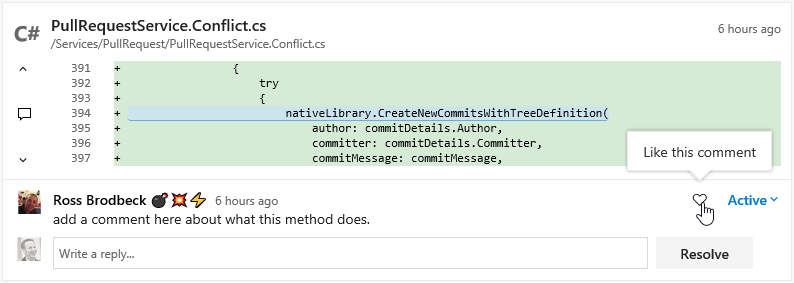

## Build
### Pull request build variables
You can now get the pull request ID, source branch, and target branch from  [build variables](https://visualstudio.microsoft.com/docs/build/define/variables).

### Faster publishing of artifacts from Windows agents to file shares
We’ve added an option to make it faster to publish artifacts from Windows agents to file shares. In the __Publish Build Artifacts__ task arguments, select **Enable Copy Concurrency** to enable multi-threaded mode and copy multiple files at the same time. This is equivalent to `robocopy /mt`. Optionally you can specify the number of threads in the **Copy Concurrency Value** (the default is 8).

## Release
### New Release Definition Editor (Preview)
> **Preview feature**
>
> To use this capability, enable [**New Release Definition Editor**](https://blogs.msdn.microsoft.com/devops/2017/05/26/new-release-definition-editor-in-team-services/) for yourself or your account. See [Enable preview features](/azure/devops/project/navigation/preview-features) for more details.

Have you ever struggled to create a mental model of how the deployments to your environments would progress? We are introducing the pipeline view for your release definitions that will show how your deployments flow. Approvals, environment and deployment settings are now in-context and easily configurable.

#### Visualization of the pipeline
The pipeline in the editor provides a graphical view of how deployments will progress in a release. The artifacts will be consumed by the release and deployed to the environments. The layout and linking of the environments reflects the trigger settings defined for each environment.

#### In context configuration UI
Artifacts, release triggers, pre deployment / post deployment approvals, environment properties and deployment settings are now in-context and easily configurable.

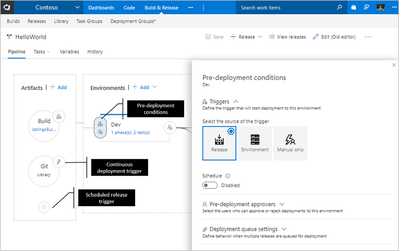
 
#### Applying deployment templates
The list of featured templates are shown when creating a new environment. 

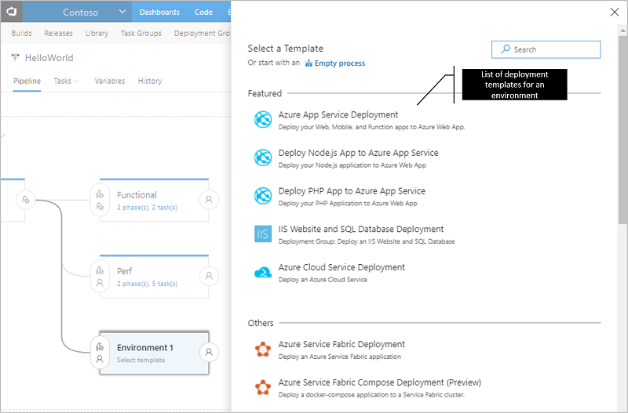
  
#### Improved task and phase editor
All the enhancements in the new build definition editor are now available in the release definition editor, too. You can search for tasks and add them either by using the __Add__ button or by using drag/drop. You can reorder or clone tasks using drag/drop. 

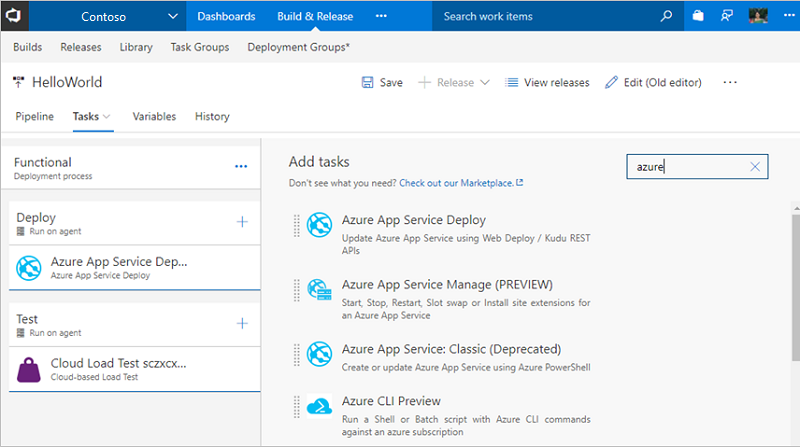

### Task group references
Task groups are created for use across multiple release and build definitions but we’ve heard that there is confusion with not knowing which definitions are impacted by a task group change. This feature adds the __References__ tab to show the list of build and release definitions using the task group so that you can make changes with confidence.

### Task group versioning
When making changes to task groups, it can feel risky because the change is effective to all definitions that use the task group. With task group versioning, now you can draft and preview task group versions while still offering stable versions to your most important definitions until you are ready to switch. After some drafting and iteration, you can publish a stable version and, while publishing, if the changes are breaking in nature, you can choose to publish the task group as preview (a new major version). Alternatively you can publish it directly as an updated stable version.

When a new major (or preview) version of the task group is available, the definition editor will advise you that there is a new version. If that major version is preview, you even see a “try it out” message. When the task group comes out of preview, definitions using it will be auto-updated, sliding along that major channel.

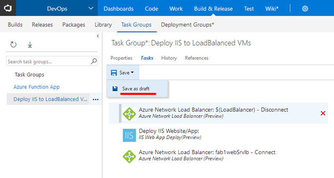

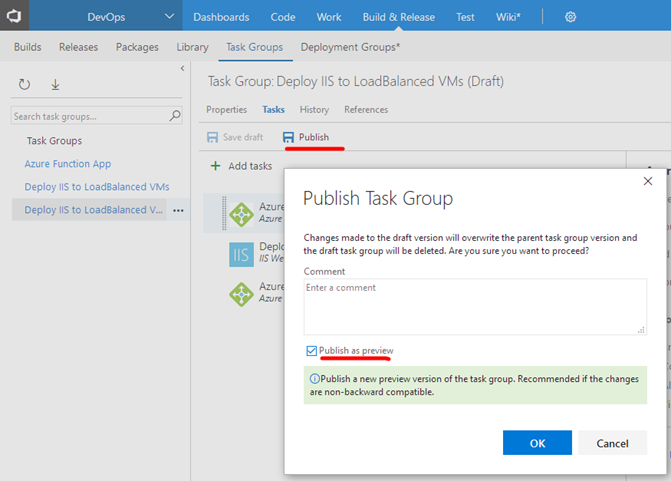

### Task group import and export
Although task groups have enabled reuse within a project, we know that recreating a task group across projects and accounts can be painful. With task group import/export, as we’ve done for release definitions, now you can export as a JSON file and import where you want it. We’ve also enabled nested task groups, which first expand when they are exported.

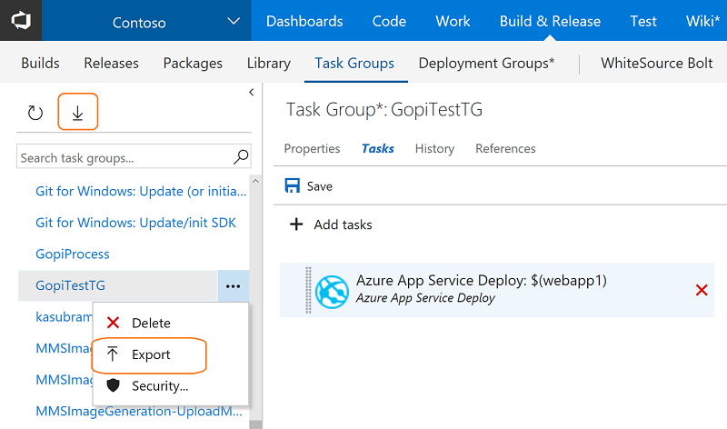

### Multi Configuration support in Server Side (Agentless) tasks
By specifying variable multipliers for server side (agentless) tasks, you can now run the same set of tasks in a phase on multiple configurations, which run in parallel. 

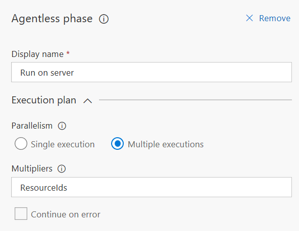

### Code information in Release with Jenkins CI
In __Release__, we want to have better integration with popular CI systems like Jenkins. Today, in the __release summary__ tab, we show code commits only if the CI build is coming from VSTS. This feature enables code information for Jenkins CI artifacts as well when the Jenkins server is reachable by the agent executing the release.

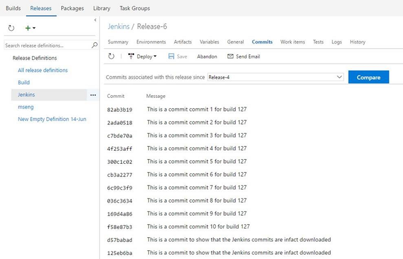

## Insights
### Velocity Widget for the Analytics Extension

The [Marketplace Extension for Analytics](https://marketplace.visualstudio.com/items?itemName=ms.vss-analytics) now supports the __Velocity__ widget.

With this powerful widget, you can chart your team’s velocity by Story Points, work item count, or any custom field.
With advanced options, you can compare what your team delivered as compared to plan, as well as highlighting work that was completed late. 

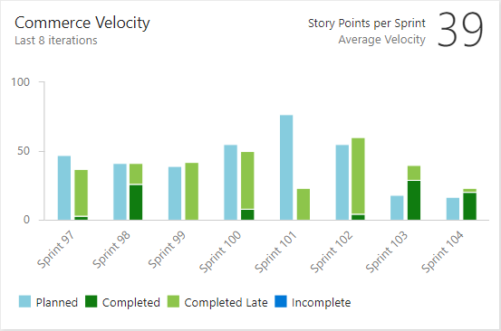

## Shared
### Notifications: Give team admins control over the delivery of notifications targeting the team
A team admin can now control how notifications targeting the team are delivered. The options are send email notifications to each team member, send one notification to a specific email address, or do not send any notifications. This feature is particularly useful for pull request notifications where a team can be added as a reviewer. Previously, the team would not be notified.

A team admin can configure their team’s default delivery preference via the team’s __Notification settings__ hub.

## Marketplace
### Constraints on SVG images, screenshots and badges
Due to security concerns, we have added SVG constraints to make extensions safer.
* The icons and screenshot can no longer be SVG.
* The badges provided in the manifest can not be SVGs unless they are from [approved badge providers](https://visualstudio.microsoft.com/docs/integrate/extensions/develop/manifest#approvedbadges).
* Images in README.md and CHANGELOG.md can not be SVGs unless they are from approved badge providers.

## Feedback
We would love to hear what you think about these features. Report a problem or provide a suggestion if you have ideas on things you’d like to see us prioritize through the new feedback menu. 

You can also get advice and your questions answers by the community on [Stack Overflow](https://stackoverflow.com/questions/tagged/vs-team-services). 

Thanks,

Jamie Cool
