#VM deployment and Delivery Plans – May 11

This sprint has our //Build conference deliverables in it, so it’s a big one, especially in the CI/CD space. 

One of our goals is to keep lowering the barrier to entry for  automating your application deployment. The ease with which teams can deploy and validate their application is a huge part of how quickly they are able to ship. While our CI/CD system is completely open, by doing deep integrations with Azure we can make setting up deployments extremely simple.  It also unlocks many opportunities for richer workflows that span both development and operations.  To that end, we are continuing to strive to make VSTS + Azure the best end-to-end DevOps experience.  

This sprint brings a bunch of new capabilities toward realizing that goal. We have significantly expanded the breadth of app type we support:
* We now support using the automation agent on the VMs to which you deploy and using it to drive your application deployment. This has easily been our most requested feature for Release Management and we’re excited for it go live.
* We continue to give more and more focus to containers. This sprint, we introduce native support for Kubernetes and Service Fabric, the latter being a great option for Windows containers. 
* We already have great support for deploying to Azure Web Apps, but we’ve expanded the app types we support with our native task to include Node, PHP & Linux Web Apps with containers. We’ve also expanded the entry point for setting up CI/CD with more options in the Azure portal configuration UI and introduced the ability to set up CI/CD for Azure Web Apps from the AZ CLI.  

Let’s dive in!

##VM Deployment (Public Preview)
Release Management now supports robust out-of-the-box multi-machine deployment. You can now orchestrate deployments across multiple machines and perform rolling updates while ensuring high availability of the application throughout.

Agent-based deployment capability relies on the same build and deployment agents. However, unlike the current approach where you install the build and deployment agents on a set of proxy servers in an agent pool and drive deployments to remote target servers, you install the agent on each of your target servers directly and drive rolling deployment to those servers. You can use the full task catalog on your target machines.  

A deployment group is a logical group of targets (machines) with agents installed on each of them. Deployment groups represent your physical environments, such as single-box Dev, multi-machine QA, and a farm of machines for UAT/Prod. They also specify the security context for your physical environments.


You can use this against any VM that you register our agent with. We’ve also made it very easy to register with Azure with support for a Azure VM extension that auto-installs the agent when the VM spins up. We will automatically inherit the tags on the Azure VM when it’s registered in VSTS.  

Once you have a deployment group, you simply configure what you want us to execute on that deployment group. You can control what gets run on which machines using tags and control how fast or slow the rollout happens.


When the deployment is run, the logs show the progression across the entire group of machines you are targeting.


This feature is now an integrated part of Release Management.  There are no additional licenses required to use it. 

##Azure virtual machine scale set deployment
Another common pattern being use for deployment is to create a full machine image for each version of the application and then deploy that.  To make that easier we have anew __Build immutable machine image__ task uses Packer to generate a machine image after deploying applications and all the required prerequisites. The tasks takes either deployment script or packer configuration template to create the machine image and stores it in an Azure Storage account. This image can than be used for Azure Virtual Machine Scale Set deployments that work well for this type of immutable image deployment.

##Built-in tasks for building and deploying container based applications
With this release we have pulled most of the tasks in our Docker extension into the product by default, improved them, and introduced a set of new tasks and templates for making a set of container scenarios easier.
* __Docker:__ Build, push, or run Docker images, or run a Docker command. This task can be used with Docker or Azure Container registry. You can now use our built-in service principal authentication with ACR to make it even easier to use.
* __Docker-Compose:__ Build, push, or run multi-container Docker applications. This task can be used with Docker or Azure Container registry. 
* __Kubernetes:__ Deploy, configure, or update your Kubernetes cluster in Azure Container Service by running kubectl commands.
* __Service Fabric:__ Deploy containers to a Service Fabric Cluster. Service Fabric is the best choice today for running Windows Containers in the cloud. In fact, this is where more and more of VSTS itself is running each sprint.
 
##Azure Web App deployment updates
We have made many enhancements for Azure Web Applications:
* Azure App Service deployment task supports Node.js, Python applications to be deployed.
* Azure App Service deployment task supports deploying to Azure Web App for Linux using containers.
* Azure portal Continuous Delivery is expanded now support Node applications.

We have also introduced CI/CD support into the latest version of the Azure CLI for configuring CI/CD.  Here is an example:

```
az appservice web source-control config --name mywebapp --resource-group mywebapp_rg --repo-url https://myaccount.visualstudio.com/myproject/_git/myrepo --cd-provider vsts --cd-app-type AspNetCore
```
##Install an SSH key during a build or release
A new preview task, __Install SSH Key (Preview)__, installs an SSH key prior to a build or release and removes it from the agent when the build or release completes. The installed key can be used for fetching code from a Git repository or submodules, running deployment scripts, or other activities that require SSH authentication. It will be improved in the future to support passphrases and other capabilities.

## Retiring the old editor
Over the next few weeks we'll be retiring the old build definition editor. We’ve designed the new editor to provide a more intuitive experience, fix some pain points, and add new capabilities. We hope that you’ll find it easier to use templates, add tasks, and change settings. And now you can use process parameters to make it easier to specify the most important bits of data without having to go deep into your tasks. Learn more in this [blog post](https://blogs.msdn.microsoft.com/visualstudioalm/2017/05/10/announcing-general-availability-of-the-new-build-editor/).

## Heads up: The hosted XAML controller is going away
On July 1st, 2017, we will stop supporting XAML Build controllers in our Team Services hosted build pool. You will still be able to do XAML-based builds, but you will need to set up your own (private) controller/agent. You can do this either in a cloud VM (such as Azure) or on your own on-premises hardware. To use private XAML controllers and agents, you need to have sufficient private pipelines in your account. For details, see the topic [I’m looking for the hosted XAML build controller. Where did it go?](https://visualstudio.microsoft.com/docs/build/concepts/agents/hosted#im-looking-for-the-hosted-xaml-build-controller-where-did-it-go).

Over time, you should be planning to migrate to our newer pipeline/task-based build version, where you will have access to the full range of capabilities, including hosted builds.

## Tasks fail if Visual Studio 2017 is specified but not present on agent
The [Visual Studio Build](https://visualstudio.microsoft.com/docs/build/steps/build/visual-studio-build) and [MSBuild](https://visualstudio.microsoft.com/docs/build/steps/build/msbuild) tasks enable you to select a specific version of Visual Studio. Until now, if the **Visual Studio 2017** version was not available, these tasks would automatically pick the next available version.

We’re changing this behavior. Now the build will fail if you select **Visual Studio 2017** but it is not present on the agent.

We made this change for the following reasons:

* Newer app types such as .NET Core do not compile with older build tools. They explicitly require Visual Studio 2017 or newer.

* You get more consistent and predictable results when you use the same exact version of Visual Studio.

* Whenever build tasks fall back, you may get compilation errors that are difficult to understand.

> [!TIP]
> 
> If you're using hosted agents on Team Services, make sure to select the **Hosted VS2017** queue. If you're using private agents, make sure to use a queue connected with a pool that has agents with Visual Studio 2017, and no agents that have only earlier versions of Visual Studio.


##Automatic linking from work items to builds
With this new setting in the build definition, users can track the builds that have incorporated their work without having to search through a large set of builds manually. Each successful build associated with the work item automatically appears in the development section of the work item form.

To enable this feature, toggle the setting under __Options__ in your build definition. 

Note: the feature is only available for definitions building Team Services Git or TFVC repos and only through the new build definition editor.


##Delivery Plans general availability
We are excited to announce that Delivery Plans is out of preview and is now included in the basic access level of VSTS. Delivery Plans is an organizational tool that helps users drive cross-team visibility and alignment by tracking work status on an iteration-based calendar. Users can tailor their plan to include any team or backlog level from across projects in the account. Furthermore, __Field Criteria__ on Plans enables users to further customize their view, while __Markers__ highlight important dates. 

Delivery Plans is currently only available for VSTS; however, it will be included in the upcoming TFS 2017 Update 2 release. 

Check out the marketplace page for [Delivery Plans](https://marketplace.visualstudio.com/items?itemName=ms.vss-plans) to learn more and install the extension.

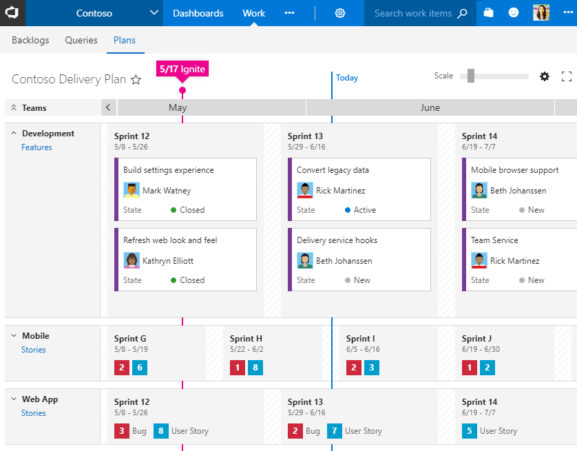

##Work item search general availability
Thank you all for installing and using the [Work Item Search preview](https://marketplace.visualstudio.com/items?itemName=ms.vss-workitem-search) from the marketplace. It has been one of our most highly rated extensions. With this release, we are making it easier for you to use work item search by making it a built-in feature of VSTS.

You can get started with work item search using the search box:

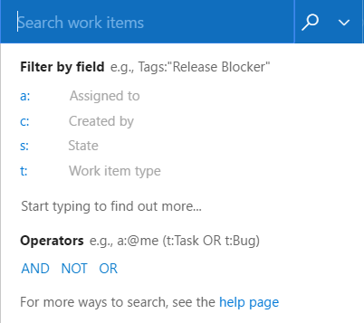

##Updated process customization experience
We have modernized our pages when customizing your process. The page now includes a breadcrumb in the top to clearly show the context you are in when editing the process or the work item types inside the process.

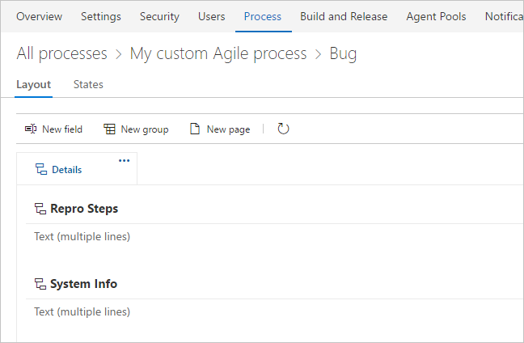

Also, it’s much easier to start customizing your work item form. When you select __Customize__ from the context menu in a work item, we automatically create an inherited process for you (if you are not already using one) and bring you into the layout editor. 

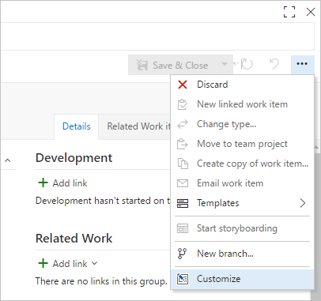

Lastly, we have added a page that shows all fields in the collection. Previously, you could remove a field from a process, but that wouldn’t delete the field from your collection. You can now go to the Fields page, pick your field, and permanently delete it from the collection.

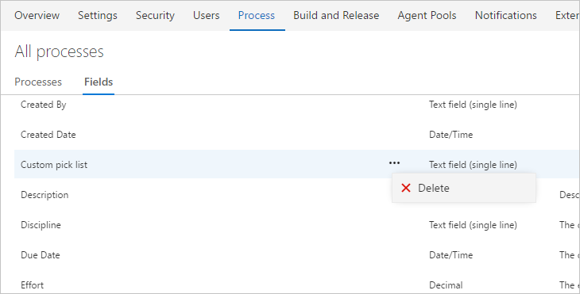

##Modify out-of-the-box fields
We have made it possible for users to set a field from one of the OOB processes (Agile, Scrum, or CMMI) as required or set its default value. Previously, when the user edited one of these fields (such as Priority, Description, or Business Value), there were only two tabs on the Edit dialog: Definition and Layout. With the new release, we have added a new tab, __Options,__ that allows users to make these fields required, or give them default values. For example, users can make the __Business Value__ field required or default the __Priority__ field to "3".

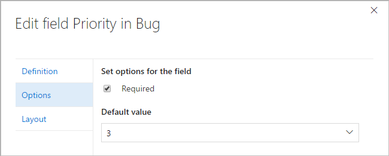

##Files hub improvements
We’ve made several updates to the __Files__ hub to improve the viewing and editing experiences.

For viewing, we’ve added pivots that let you view the README in the current folder, preview Markdown files, compare a file to a previous version, and view blame.


For editing, you can now preview your changes, easily add a comment, commit to a new branch, and link work items.


##Git LFS file locking
We have added the Git LFS [file locking](https://github.com/git-lfs/git-lfs/blob/master/docs/api/locking.md) feature. This allows teams working with large, undiffable files to avoid losing work when two or more people attempt to edit the same file at once. Before anyone can begin editing the file, they take a lock, which notifies the server. When anyone else attempts to take a lock, the server rejects the request, letting the second person know that someone else is already working on that file. Please upgrade to [Git LFS 2.1](https://github.com/git-lfs/git-lfs/releases) or higher to use this feature.

##New branch policies configuration experience
We’ve redesigned the branch policies configuration experience and added some great new capabilities. One of the most powerful features is the ability to configure policies for branch folders. You can do this from the __Branches__ view by selecting a branch folder and choosing __Branch policies__ from the context menu.  

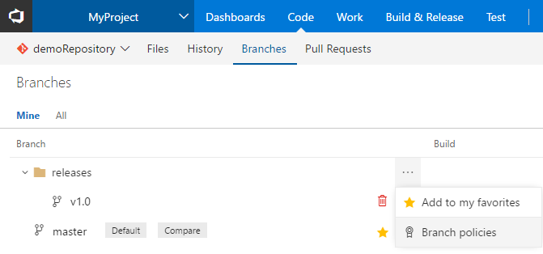

This will open the new policies configuration UX, where you can configure policies that apply to all of the branches in the branch folder.  

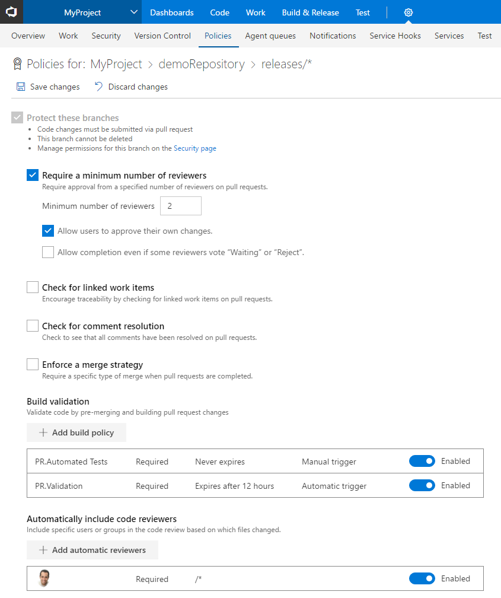

If you’re using the build policy, you can now configure multiple builds for a single branch. There are also new options to specify the type of trigger&mdash;automatic or manual. Manual triggers are useful for things like automated test runs that might take a long time to run, and you only really need to run once before completing the pull request. The build policy also has a display name that is useful if you’re configuring multiple builds.

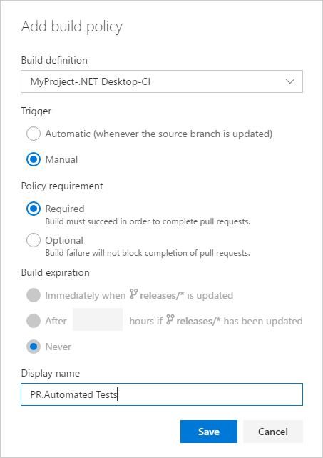

Once you’ve configured a manually triggered policy, users can run it by selecting the __Queue build__ option in the __Policies__ section for the pull request.

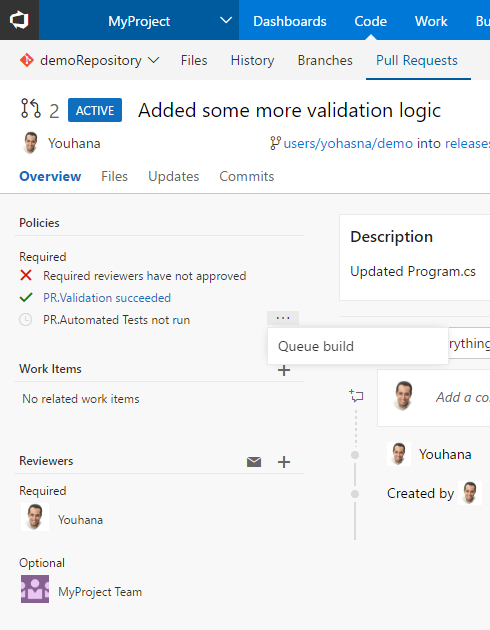

For required reviewer policies, we added the ability for administrators to specify a note that will be appended to the pull request timelime when the policy applies.

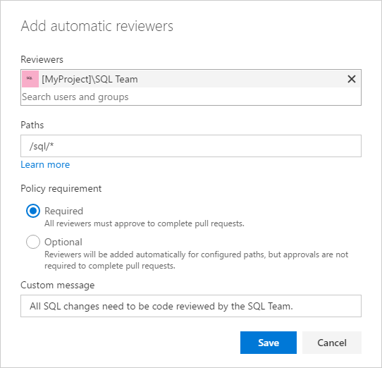


##Share pull requests with teams
The __Share Pull Request__ action is a handy way to notify reviewers. In this release, we’ve added support for teams and groups, so you can notify everyone involved the pull request in a single step.

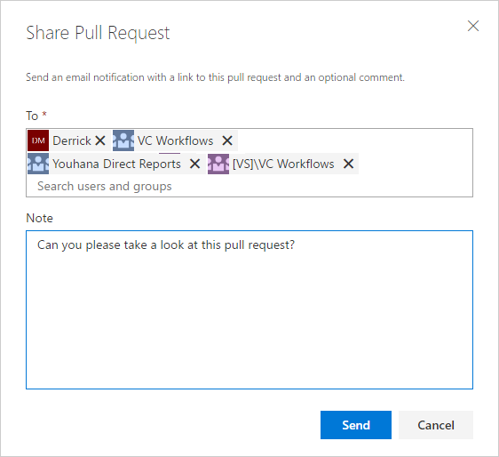

##Default notifications for PR comments
Stay up to date with the conversations happing in your PRs with the new comment notifications. For PRs that you've created, you will automatically be notified any time a user adds a new comment thread or replies to an existing thread. When you comment on another user's PR, you'll be notified about any future replies to comment threads that you create or reply to.  

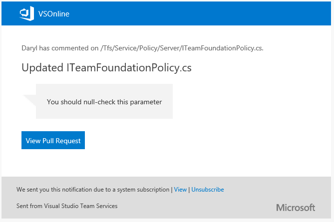

These notifications are available as part of the out of the box subscriptions, and are configurable on the __Notifications__ settings page. 

##Improved team pull request notifications
Teams that are using Azure Active Directory (Azure AD) with Team Services to manage their groups will now have the option to use those groups with pull requests. When you create a pull request, you can assign Azure AD groups to it. They’re added just like any other reviewer or group.

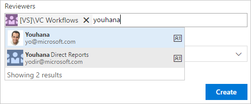

Azure AD groups behave like other groups when voting on pull requests. Any member of the group who votes on a pull request will have their vote counted as a vote for the group. If you’re using branch policies and have configured specific reviewers for the repo, you can now use Azure AD groups in addition to Team Services groups.

When an Azure AD group is added to review a pull request, that group will also be notified about the pull request activity using the group’s email address.  

##New tree view control
The Pull Request Files view, Git commit details, Git push details, TFVC Shelveset details, TFVC Changeset details, TFVC Changesets hub and Git history hub have been updated with a new tree view control. The tree view has a few usability improvements. First, we’ve changed the view to show a condensed tree view that automatically collapses empty folder nodes, maximizing the number of files that are in view.  

The tree also shows comments in a more compact way. Files with comments show a child item for each comment thread, with the avatar indicating the user that created the thread. New comment threads and those with replies are indicated by the blue dot, and the count of replies is summarized with a count.

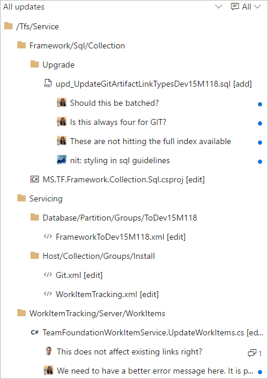

##Maven for Package Management (Public Preview)
Java developers share components by packaging up their code in Maven artifacts (the Java equivalent of a NuGet package). Team Services customers needing a place to host Maven artifacts used to have to use third-party services, like Nexus or Artifactory, to meet their needs.  We’re proud to announce that [Team Services Package Management](https://marketplace.visualstudio.com/items?itemName=ms.feed) now supports hosting Maven artifacts! Check out our [getting started guide](https://visualstudio.microsoft.com/docs/package/preview/maven-docs).

##NuGet Restore, Command, and Tool Installer build tasks
We’ve made major updates to the __NuGet Installer__ (now called __NuGet Restore__) task, and added two new NuGet tasks: __NuGet Command__ and __NuGet Tool Installer__. Most notably, the __NuGet Command__ and __NuGet Restore__ tasks now use nuget.exe 4.0.0 by default.

The __NuGet Tool Installer__ puts you in control of the version of NuGet used by both the __NuGet Restore__ and __NuGet Command__ tasks. By default, the tasks will use a well-known, tested version. If you want to override that, simply add a __NuGet Tool Installer__ step before your other NuGet build steps.

__NuGet Restore__ is now optimized for the most common scenario of restoring packages before a Visual Studio Build step. It also has better support for small projects that share a single NuGet feed: you can now pick a Team Services feed and have it added to an auto-generated NuGet.Config.

##Combined email recipients for notifications now enabled by default
Recipients for the same email notification are now included together on the to: line and sent a single email. Previously, individual emails were sent to each recipient. This made it difficult to know who else received the notification and to have a conversation about the event over email. This feature applies to out-of-the-box as well as team subscriptions that are capable of targeting multiple recipients. For example, all reviewers of a pull request are now sent a single email when a change is made to the pull request.

This feature is on by default, but can be disabled by an account administrator by switching off the account-level __Combine email recipients__ feature via the __Preview features__ panel under the user profile menu. 

Learn more about [combining email recipients](/azure/devops/notifications/howto-manage-team-notifications).

##Out-of-the-box notifications out of preview
The out-of-the-box notifications feature is now out of preview and available on all accounts. Users and teams are now automatically notified via email when there is activity in the account directly relevant to them, such as:

* when a work item is assigned to a user
* when a user or team is added as a reviewer to a pull request
* when a user or team is a reviewer on a pull request that is updated
* when another user responds to a pull request comment
* when a build requested by a user completes
* when an extension is installed or requested (admins only)

Users can unsubscribe from any of these subscriptions by going to Notification settings under the user profile menu and then switching off the appropriate toggle(s). Note: These default subscriptions apply to the current account only.

An account admin can disable one or more of these automatic subscriptions by navigating to the account-level __Notifications__ hub under the settings gear. Any of these subscriptions can be disabled by clicking __Disable__ under the "..." action. Once a subscription is disabled, it will no longer appear for users in their personal notification settings page.

Learn more about [out-of-the-box notifications](/azure/devops/notifications/manage-personal-notifications#out-of-the-box-notifications).

##Enhanced publisher experience in the Marketplace
Publishers of free extensions will now have access to new acquisition data, including aggregated acquisition in the selected time period to overall acquisition, daily trend on extension page views with acquisition, uptake on Team Services and TFS Connected, and conversion from page views to acquisition. This data is also available for download in XLS format to help you create your own custom reports. 

The __Q&amp;A__ tab will give you a snapshot of all questions by your users, with the nonresponded queries on the top. You can take actions by replying or editing a previous response and better manage engagement with your extension users.  

##Owner and contributor roles can purchase through the Marketplace
We added the ability for Azure subscription owner and contributor roles to purchase through the Visual Studio Marketplace. Previously, only Azure subscription admins and co-admins could purchase. This required delegating full subscription admin rights and was only possible via the [classic Azure portal](https://manage.windowsazure.com/). Now, by adding a user as an owner or contributor from the [new Azure portal](https://portal.azure.com/), they can make purchases for your team through the Marketplace.

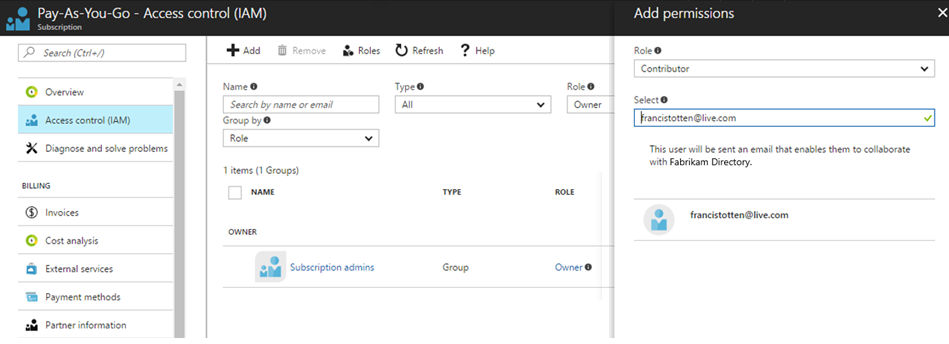

We would love to hear what you think about these features. Please don’t hesitate to send a smile or frown through the web portal, or send other comments through the [Team Services Developer Community](https://developercommunity.visualstudio.com/spaces/21/index.html). As always, if you have ideas on things you’d like to see us prioritize, head over to [UserVoice](https://visualstudio.uservoice.com/forums/330519-vso) to add your idea or vote for an existing one.

Thanks,

Jamie Cool
