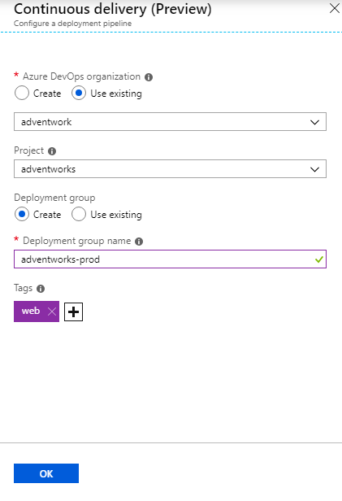
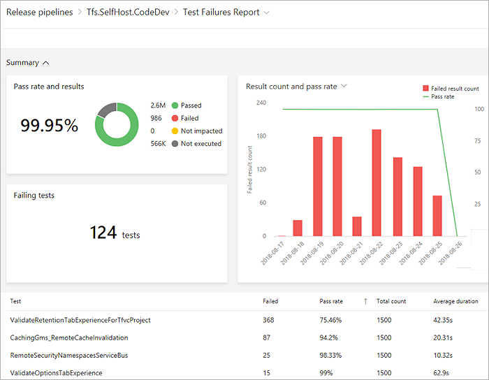

# Pipeline compliance and security validations - Sprint 141 Update

In the **Sprint 141 Update** of Azure DevOps Services, you can now include [compliance and security validations in your Azure Pipelines](#azure-policy-compliance-and-security-validations-in-pipelines). In Azure Repos, you can [change the target branch of pull requests](#change-the-target-branch-of-a-pull-request).

Check out the [Features](#features) list below for more.

## Features

General:

- [Navigation update](#navigation-update)
- [Expanded search box](#expanded-search-box)

Azure Pipelines:

- [Azure Policy compliance and security validations in Pipelines](#azure-policy-compliance-and-security-validations-in-pipelines)
- [Simplified continuous delivery to Azure VMs](#simplified-continuous-delivery-to-azure-vms)
- [The Xcode task supports newly released Xcode 10](#the-xcode-task-supports-newly-released-xcode-10)
- [Performance improvements when queuing a build](#performance-improvements-when-queuing-a-build)
- [Create Azure service connection with service principal that authenticates with a certificate](#create-azure-service-connection-with-service-principal-that-authenticates-with-a-certificate)
- [View test analytics in Pipelines](#view-test-analytics-in-pipelines)

Azure Repos:

- [Change the target branch of a pull request](#change-the-target-branch-of-a-pull-request)- [Protect Git repos with cross platform compatibility settings](#protect-git-repos-with-cross-platform-compatibility-settings)
- [Protect Git repos with cross platform compatibility settings](#protect-git-repos-with-cross-platform-compatibility-settings)

Administration:

- [Support AAD users in MSA accounts](#support-aad-users-in-msa-accounts)

## Next steps

> [!NOTE]
> These features will be rolling out over the next two to three weeks.

Read about the new features below and head over to Azure DevOps Services to try them for yourself.

> [!div class="nextstepaction"]
> [Go to Azure DevOps Services](https://go.microsoft.com/fwlink/?LinkId=307137&campaign=o~msft~docs~product-vsts~release-notes)

## General

### Navigation update

Back in June of this year, we rolled out the first iteration of our [new navigation model](https://blogs.msdn.microsoft.com/devops/2018/06/19/new-navigation/). We’ve spent the summer improving that experience based on the feedback many of you have provided. Thank you! Our next step is to move from the new model being a preview, to becoming _the_ navigation for the product. Please read [our blog post](https://aka.ms/azuredevopsnav) describing the recent changes along with our schedule for bringing the new model to all organizations.

### Expanded search box

We understand the importance of search and are bringing back the expanded search box on the product header. In addition, you can now invoke the search box by just clicking "/" on any service page in Azure DevOps. This feature was prioritized based on a user voice suggestion.

Here is the default search box:

> [!div class="mx-imgBorder"]
> 

Once you type a "/", you'll see the expanded search box:

> [!div class="mx-imgBorder"]
> 

## Azure Pipelines

### Azure Policy compliance and security validations in Pipelines

We want ensure stability and security of software early in the development process while bringing development, security, and operations together. ​​ To do so, we have added support for [Azure Policy](https://azure.microsoft.com/services/azure-policy/). 
 
Azure Policy helps you manage and prevent IT issues with policy definitions that enforce rules and effects for your resources. When you use Azure Policy, resources stay compliant with your corporate standards and service level agreements.​
 
To comply with compliance and security guidelines as part of release process, we have enhanced our Azure resource group deployment experience. Now, we are failing the Azure Resource Group deployment task with relevant policy related errors in case of any violations while deploying ARM templates. 

> [!div class="mx-imgBorder"]
> 

Additionally, we have added Azure Policy Release definition template. This will allow users to create Azure policies and assign these policies to resources, subscriptions, or management groups from the release definition itself. 

> [!div class="mx-imgBorder"]
> 

### Simplified continuous delivery to Azure VMs

In this release, we added a new wizard to simplify the process of setting up continuous delivery to Azure Virtual Machines. Once you specify an Azure DevOps organization and a deployment group to register the virtual machine, a release pipeline will automatically be created with a sample script step. If you need to provision additional Azure resources, run scripts, upgrade your application, or run additional validation tests, you can easily customize this release pipeline. 

> [!div class="mx-imgBorder"]
> 

### The Xcode task supports newly released Xcode 10

Coinciding with Apple's release of Xcode 10, you can now set your projects to build or be tested specifically with Xcode 10. Your pipeline can also run jobs in parallel with a [matrix](https://docs.microsoft.com/azure/devops/pipelines/yaml-schema?view=azure-devops#matrix) of Xcode versions. You can use the Microsoft-hosted macOS agent pool to run these builds. See the [guidance](https://docs.microsoft.com/azure/devops/pipelines/ecosystems/xcode?view=azure-devops) for using Xcode in Azure Pipelines.

> [!div class="mx-imgBorder"]
> 

### Performance improvements when queuing a build

When you use a hosted agent, you get a fresh VM for each job. This provides an extra layer of security and control. You never have to worry about a previous build leaving around outputs or doing something malicious to the machine. However, first time startup activities previously meant delays between when you click **Queue a build** and when the pipeline is actually running. We investigated and fixed many of these delays and are now seeing a 5X speedup in queue-to-start time across the hosted pools. You can now get your builds started faster, meaning you can iterate faster.

### Create Azure service connection with service principal that authenticates with a certificate

You can now define an Azure service connection in Azure Pipelines or Team Foundation Server (TFS) with a service principal and certificate for authentication. With the Azure service connection now supporting service principal that authenticates with a certificate, you can now deploy to [Azure Stack](https://docs.microsoft.com/azure/devops/pipelines/targets/azure-stack?view=azure-devops) configured with [AD FS](https://docs.microsoft.com/azure/azure-stack/azure-stack-identity-overview). To create a service principal with certificate authentication, refer to the article on [how to create a service principal that authenticates with a certificate](https://docs.microsoft.com/azure/azure-resource-manager/resource-group-authenticate-service-principal#create-service-principal-with-self-signed-certificate). 

> [!div class="mx-imgBorder"]
> 

### View test analytics in Pipelines

Tracking test quality over time and improving test collateral is key to maintaining a healthy pipeline. The test analytics feature provides near real-time visibility into your test data for builds and release pipelines. It helps improve the efficiency of your pipeline by identifying repetitive, high impact quality issues. 

You can group test results by various elements, identify key tests for your branch or test files, or drill down to a specific test to view trends and understand quality issues such as flakiness. 

View test analytics for [builds](https://docs.microsoft.com/azure/devops/pipelines/test/test-analytics?view=azure-devops#view-test-analytics-for-builds) and [release](https://docs.microsoft.com/azure/devops/pipelines/test/test-analytics?view=azure-devops#view-test-analytics-for-releases), preview below:

> [!div class="mx-imgBorder"]
> 

For more information, see our [documentation](https://docs.microsoft.com/azure/devops/pipelines/test/test-analytics?view=azure-devops).

## Azure Repos

### Change the target branch of a pull request

For most teams, nearly all pull requests target the same branch, such as `master` or `develop`. However, in the case where you do need to target a different branch, it's easy to forget to change the target branch from the default. With the new feature to change the target branch of an active pull request, this is now a simple action. Just click on the pencil icon near the target branch name in the pull request header.

> [!div class="mx-imgBorder"]
> 

Beyond just correcting mistakes, the feature to change target branches also makes it easy to "retarget" a pull request when the target branch has been merged or deleted. Consider a scenario where you have a PR targeting a feature branch which contains some feature your changes are dependent upon. You want to review your dependent changes in isolation from other changes in the feature branch, so you initially target `features/new-feature`. Reviewers can then see just your changes and leave the appropriate comments. 

Now, consider what would happen if the feature branch also had a PR active, and was merged into `master` before your changes? Previously, you'd have to abandon your changes and create a new PR into `master`, or merge your PR into `features/new-feature`, and then create another PR from `features/new-feature` to `master`. With this new action to update the target branch, you can simply change the target branch of the PR from `features/new-feature` into `master`, preserving all of the context and comments. Changing the target branch even creates a new update to the PR which makes it easy to look back at prior diffs before the target branch change.  

> [!div class="mx-imgBorder"]
> 

### Protect Git repos with cross platform compatibility settings

Since Git is a cross-platform technology, it is possible for files or directories to find their way to a file system where they may be incompatible on a specific platform. You can see details about these incompatibilities in [our documentation](https://docs.microsoft.com/azure/devops/repos/git/os-compatibility?view=azure-devops).

To help teams protect their repo and its developers, we have added new repository settings to block pushes containing commits with files/directories that are incompatible with one or more OS platforms. Read more about [these settings](https://docs.microsoft.com/azure/devops/repos/git/repository-settings?view=azure-devops).

## Administration

### Support AAD users in MSA accounts

Azure DevOps now supports AzureAD (AAD) users accessing organizations that are backed by MSA. For administrators, this means that if your Azure DevOps organization uses MSAs for corporate users, you can now have new employees access using their AAD credentials instead of creating a new MSA identity solely for use with Azure DevOps. 

We still believe that the best experience is for corporate users to [connect Azure DevOps to AAD](https://aka.ms/DevOpsAADConnect), but we learned earlier this year that administrators needed more time to make that conversion. By allowing AAD users into MSA backed organizations, new users will be able to access Azure DevOps once Azure DevOps has prevented creation of new MSA users with custom domain names backed by AzureAD at the end of the month. 

For organizations that already use AAD identities with Azure DevOps, this feature does not apply. For organizations that currently use MSA identities, please note that all existing users can continue to sign in with their MSA identities as they do today. This only applies for users added in the future (who potentially can't create an MSA with their corporate email address).

Here's an example scenario where this experience may be useful: Dorothy is the Azure DevOps organization owner for her company, Fabrikam. She and her team of 10 team members all sign into Azure DevOps with MSA identities that use their corporate email address, e.g. Dorothy@fabrikam.com. Sam is a new team member who joined the company today. Dorothy invites him to Azure DevOps by using his email, sam@fabrikam.com. When he clicks on the join now link in the email, he can sign into Azure DevOps with the same AAD identity he was given to access his email with O365. This allows Sam to collaborate with his 11 colleagues and gives Dorothy the freedom to connect her Azure DevOps organization to AAD when she's ready.

See our [blog post](https://blogs.msdn.microsoft.com/devops/2018/09/27/using-azuread-identities-in-azure-devops-organizations-backed-by-microsoft-accounts/) for more information.

## Feedback

We would love to hear what you think about these features. Use the feedback menu to report a problem or provide a suggestion.

> [!div class="mx-imgBorder"]
> 

You can also get advice and your questions answered by the community on [Stack Overflow](https://stackoverflow.com/questions/tagged/vsts).

Thanks,

Gopinath Chigakkagari ([Twitter](https://twitter.com/gopinach))
